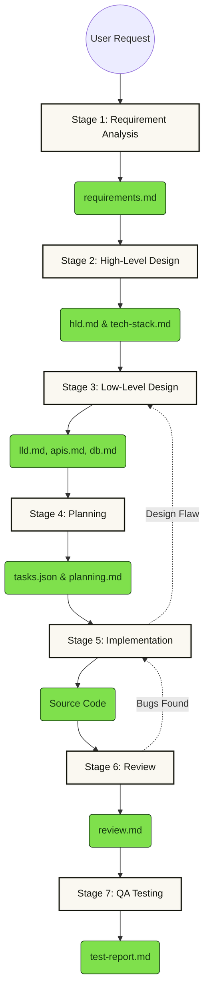

# Enterprise SDLC Architecture & Guide

Welcome to the `.ai/` directory! This folder powers an autonomous, AI-driven, 7-Stage Software Development Life Cycle (SDLC). It uses the **Google Antigravity** orchestration system to route requests through specialized architect skills, ensuring that every feature goes from raw requirement to production-ready code seamlessly.

---

## 1. The 7-Stage Workflow Architecture

The engine is built on a Directed Acyclic Graph (DAG) that enforces rigorous requirements analysis and architectural design *before* code is generated.

---

## 2. Skill Directory

This workflow leverages specialized skills located in the `.ai/skills/` directory. Depending on the stage, the agent dynamically swaps into these roles:

### Core Master Skills
- **`prd-generator`**: (Stage 1) Systematically reviews ambiguous inputs and generates a rigorous, engineering-ready Product Requirements Document (PRD).
- **`fullstack-fintech-architect`**: (Stages 2, 3, 5) A master skill combining fintech domain knowledge, frontend OS (Next.js/React), backend architectures (Rust/Go), and rigorous test protocols.

### Architectural & Review Skills
- **`backend-hld-architect` / `frontend-hld-designer`**: Maps out the system context, APIs, and micro-services.
- **`backend-lld-design` / `frontend-lld-designer`**: Designs precise component states, Redux/Zustand flows, and database schemas.
- **`hld-reviewer` / `lld-reviewer` / `frontend-lld-review`**: Independent "red team" skills that challenge and validate the architectural plans before any code is generated.

---

## 3. Extreme Agility & Iteration

This workflow is **fully flexible**. You do not have to start at Stage 1. 

**Entry Point Resolution:**
Tell the AI: *"I already have a PRD, start from HLD"* and the AI will verify the required inputs and immediately jump to Stage 2.

**Iterative Feedback Loops:**
If you are in Stage 5 (Implementation) and discover a technical roadblock, the AI is instructed to halt and jump backward to Stage 3 (LLD) to redesign the schema before proceeding. It does this by appending/patching existing state rather than destroying it.

---

## 4. How to Replicate This Workflow

This highly structured AI workflow can be easily ported to any other computer running Google Antigravity. 

### Method A: Project-Specific (Easiest)
Because everything lives in this `.ai/` directory, it is fully tied to the codebase. 
1. `git commit -am "Add enterprise AI workflow"`
2. Clone the repository on a new machine.
3. Antigravity will automatically detect `.ai/workflows/prd-to-prod.md` and load the entire pipeline!

### Method B: Global Installation
If you want to use this pipeline across *all* projects on a new computer:
1. Create a global plugin folder: `~/.gemini/config/plugins/enterprise-sdlc/`
2. Copy `.ai/skills/` into `~/.gemini/config/plugins/enterprise-sdlc/skills/`
3. Copy `.ai/workflows/` into `~/.gemini/config/plugins/enterprise-sdlc/workflows/`
4. Antigravity will now load this master workflow regardless of which project folder you are working in.
