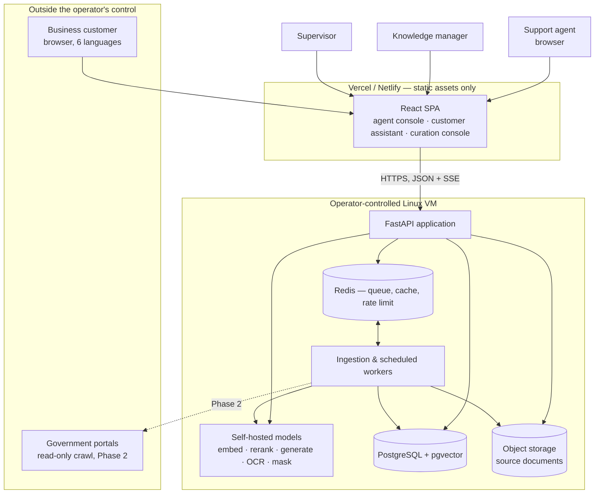
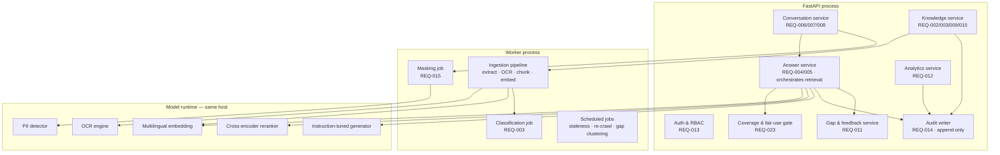
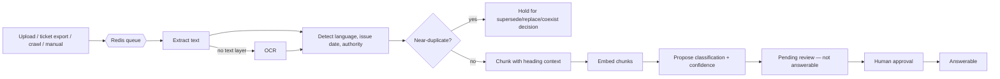
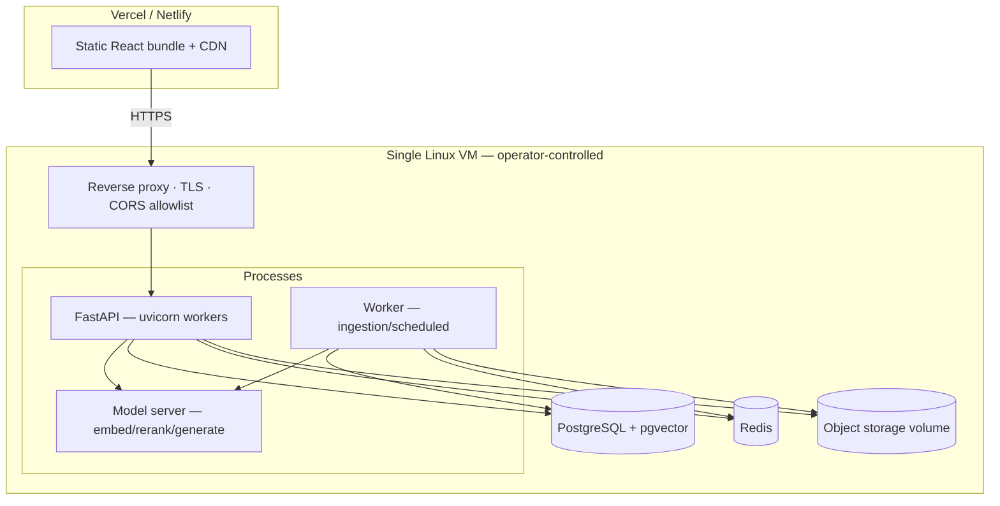

# Backend HLD

> **Process note.** `backend-hld-architect/SKILL.md` directs the reader to `references/hld_template.md` and `references/domain_notes.md` for its 29-section structure. Neither file exists in the installed skill folder. Rather than halt the pipeline over a missing reference, this document follows the section topics enumerated inside SKILL.md itself (Steps 2–4) and marks every section the detection step ruled out as `N/A — reason`, which is what the missing template asks for. Flagged here so the deviation is visible rather than silent.

## 1. Stated Constraints and Assumptions

Gathered at the Stage 3a gate, not inferred:

| Dimension | Value | Source |
|---|---|---|
| Deployment | React frontend on Vercel/Netlify; all backend on a single-region Linux VM under the operator's control | User decision at Stage 3a |
| Runtime | Python 3.12 / FastAPI | User decision |
| Team | Full engineering org — the design may carry more operational surface than a hackathon build would | User decision |
| Scale | 200 concurrent conversations, 50 agents, 50,000 knowledge items | requirements.md NFR Scalability |
| Latency | Agent assist ≤ 5 s p95; self-serve ≤ 8 s p95; ingest ≤ 15 min for 200 pages | requirements.md NFR Performance |
| Availability | 99.5% in support hours | requirements.md NFR Reliability |
| Cost & data control | No per-query licence cost; no query, conversation or document content may leave the operator's control | requirements.md NFR Cost & data control |
| Compliance | Immutable audit, 3-year audit retention, 12-month transcript retention, deletion on request, ≥98% masking recall | REQ-014, REQ-015, NFR Compliance |
| Languages | Six target, per-language enablement gate; English + Hindi guaranteed | REQ-001 |

**Assumptions stated explicitly because they shape the design and are not yet confirmed:**

- **AS-1:** The VM has a GPU or, failing that, enough CPU and RAM to run a 7–8B-parameter generation model at usable latency. Without a GPU the 5-second p95 target is not reachable for generation and the answer path must degrade to extractive-only (see §12 and §24). This is the single largest technical unknown in the design.
- **AS-2:** The corpus is majority digital-text PDFs, with a minority of scanned images. Estimation Blocker 1 in the PRD says this is unmeasured; if the majority is scanned, OCR dominates ingestion cost and §7's job design needs revisiting, not the architecture.
- **AS-3:** Single region, single availability zone. 99.5% in support hours does not justify multi-AZ; see §26 for what would.
- **AS-4:** The frontend being on a different origin from the backend is permanent, so cross-origin auth is a first-class concern, not an afterthought (see §11).

## 2. Detection Step — Which Sections Apply

| Concern | Present? | Consequence |
|---|---|---|
| AI/LLM features | **Yes** — core | §12 AI Components is the largest section in this document |
| Search relevance | **Yes** — retrieval quality *is* the product | §13 Retrieval design |
| Multi-channel notifications | Partial | Callback requests only; no push/SMS at MVP. §14 kept short |
| Background/scheduled jobs | **Yes** | §7 Ingestion pipeline, §17 Scheduled work |
| High-security/compliance surface | **Yes** — PII in conversations, government service | §11 Auth, §18 Audit, §19 Privacy |
| Analytics/BI | **Yes** — REQ-012 | §15 Analytics |
| i18n/l10n | **Yes** — six languages, Indic scripts | Cross-cutting; §12.4 |
| Real-time / low-latency | Moderate | Conversation updates need push; §16 |
| Multi-tenancy | **No** | N/A — one operator, one contact center. Revisit only if the platform is offered to a second ministry |
| Payments / money movement | **No** | N/A — explicitly Out of Scope in the PRD |
| Streaming media | **No** | N/A — voice is Out of Scope this phase |
| IoT / device fleets | **No** | N/A — no devices |
| Offline-first sync | **No** | N/A — both consoles are online-only, staffed from a contact-center floor |
| Edge computing | **No** | N/A — single region; the frontend CDN is the only edge concern and it is static assets |

## 3. System Context



The trust boundary that matters: the SPA is public and untrusted; everything inside the VM is the operator's. No content crosses from the VM to any third party — that is the cost-and-data-control NFR expressed as a topology, and it is why no hosted inference API appears anywhere in this diagram.

## 4. Architecture Style — Decision and Alternatives

**Chosen: modular monolith (FastAPI) plus a separate worker process, on one VM.**

Drivers, each traceable to §1:
- 200 concurrent conversations and 50 agents is small. The entire request load fits comfortably in one process with async I/O.
- The data-control constraint pins model inference to the same operator-controlled host, so there is no distribution benefit to gain by splitting services — the heavy component cannot move anyway.
- The dominant latency cost is model inference, not service coordination. Splitting the API into services would add hops to a budget that has no room for them.

Alternatives considered and rejected:

| Alternative | Why rejected |
|---|---|
| Microservices (ingestion, retrieval, conversation, analytics as separate deployables) | Adds network hops inside a 5-second budget where inference already consumes most of it, and multiplies the operational surface for a single-VM deployment. The team size would support it; the traffic does not justify it. Deferred to §26 with a named trigger. |
| Fully serverless on Vercel/Netlify functions | Cannot hold a loaded model in memory between invocations, caps execution duration below OCR and ingestion needs, and would force a hosted inference API, breaking the data-control NFR outright. This is the constraint that produced the split-hosting decision at the gate. |
| Single process including workers | An 8-minute OCR job starving the event loop would breach the 5-second assist target. Workers must be a separate process; this is the one split that earns itself. |

**The one non-negotiable split:** request path and background work never share a process. Everything else stays together.

## 5. Component Architecture



Every component maps to at least one requirement, and every Must-Have requirement lands in at least one component — that mapping is recorded in `traceability.md`'s HLD column rather than repeated here.

**Deliberate design rules across components:**
1. **The Answer service is the only component that may produce an answer.** Both consoles and the public assistant call it. One enforcement point for BR-1 (citation required), the answer bar, and conflict handling means those rules cannot drift between surfaces — the failure the PRD's review was most worried about.
2. **The Audit writer is append-only and has no update or delete path in code.** REQ-014 requires immutability even from administrators; the cheapest way to guarantee that is to never write the capability (see §18).
3. **The Coverage & fair-use gate sits in front of the public surface only.** Agent assist bypasses it entirely — REQ-023 makes assist live from item one.

## 6. Answer Path — Sequence

```mermaid
sequenceDiagram
    participant U as Agent or customer
    participant API as Answer service
    participant G as Coverage/fair-use gate
    participant DB as pgvector + Postgres
    participant R as Reranker
    participant L as Generator
    participant A as Audit writer

    U->>API: query + conversation context
    API->>G: public surface? check floor + rate limit
    G-->>API: allowed
    API->>API: detect language; reject if not enabled (REQ-001)
    API->>DB: hybrid search — vector + lexical, approved & non-retired only
    DB-->>API: ~50 candidate chunks
    API->>R: rerank candidates against query
    R-->>API: top 8 with scores
    API->>API: conflict detection BEFORE answer bar (BR-6)
    alt sources conflict
        API-->>U: both sources, dates, authorities; no chosen answer
        API->>A: record conflict; log gap entry type=conflict
    else confidence < answer bar
        API-->>U: no reliable answer + related reading + handover offer
        API->>A: record no-answer; log gap entry
    else confidence >= answer bar
        API->>L: generate grounded answer from top chunks, target language
        L-->>API: answer text
        API->>API: verify every claim spans a retrieved chunk; strip uncited output
        API-->>U: answer + citations (passage in source language, BR-3)
        API->>A: record answer, citations, confidence, text shown
    end
```

Two things in this flow are load-bearing and worth naming:

- **Conflict detection precedes the answer bar**, exactly as BR-6 was amended to require in v1.1. Implementing it the other way round would silently drop conflicts below the bar, which is the failure mode the review caught.
- **The post-generation citation check is not optional.** The generator can produce a fluent sentence unsupported by any retrieved chunk. BR-1 makes an uncited answer unshowable, so the service verifies grounding after generation and suppresses anything that fails, falling back to extractive quoting. This is what makes the citation guarantee structural rather than aspirational.

## 7. Ingestion Pipeline



Design points:
- **Nothing becomes answerable without human approval** (REQ-009). The pipeline's terminal state is *pending*, never *live*.
- **Failure is explicit, never partial.** A document that fails extraction is retained with its failure reason and offered for manual entry (REQ-002); it is never published half-extracted. Each stage records its outcome, so a failure names the stage that failed.
- **Chunking carries heading context** into each chunk, because a tariff schedule clause is meaningless without the heading above it — and because the citation must be a passage a human can recognise in the source document.
- **The 15-minute/200-page target is a queue-throughput problem, not a request-latency problem.** Priority is by submission time, with manual FAQ entries jumping the queue since they are seconds of work.

## 8. Data Model — Store-Level View

Detailed schemas belong in Stage 5a. At HLD level, the stores and what lives in each:

| Store | Holds | Why this store |
|---|---|---|
| PostgreSQL | Knowledge items and versions, chunks, classifications, taxonomy, conversations, messages, answers shown, feedback, gap entries and groups, users and roles, thresholds, audit records | One transactional store keeps a knowledge item's approval, its version history and its audit record in a single transaction. Splitting them would create a window where an item is answerable but unaudited. |
| pgvector (in the same PostgreSQL) | Chunk embeddings | 50,000 items at a realistic chunk count is well inside pgvector's comfortable range. A dedicated vector database would add a second store to keep consistent with the first for no capability this system needs at this scale. |
| Object storage (filesystem or S3-compatible, on the VM) | Original uploaded documents | Documents are large, immutable and rarely read; they do not belong in a transactional store. Citations reference them for display of the passage in context. |
| Redis | Job queue, rate-limit counters, hot-query answer cache, session revocation list | Ephemeral, all rebuildable. Nothing here is a source of truth. |

**Consistency stance:** strong within PostgreSQL for everything governance-related (approval, retirement, audit). Eventual is acceptable only for analytics aggregates and the gap-group clustering, both of which are recomputed on a schedule and neither of which can make a wrong answer reachable.

**The one hard invariant across stores:** an item's answerability is decided by its row in PostgreSQL at query time, never by the presence of its embedding. Retirement (REQ-010, BR-8) takes effect immediately because the retrieval query filters on status in the same statement that searches vectors. Deleting embeddings asynchronously would open exactly the window BR-8 forbids.

## 9. API Surface — Shape Only

Exact signatures are Stage 5a's job. The surface divides into five groups:

| Group | Consumers | Notes |
|---|---|---|
| Conversation & answer | Agent console, public assistant | Includes the streaming answer channel (§16) |
| Knowledge | Curation console | Upload, list, classify, approve, retire, supersede, version history |
| Gap & feedback | Agent console, curation console | Feedback submission is agent-side; queue management is manager-side |
| Analytics | Supervisor console | Period queries and export |
| Administration | Administrator | Thresholds, language enablement, coverage-floor declaration, fair-use limits, deletion requests |

Public (unauthenticated) surface is deliberately minimal: start a conversation, ask, request handover. Everything else requires identification (REQ-013).

## 10. Deployment Topology



The frontend platform holds no data and runs no application logic — it serves a bundle. That keeps the split-hosting decision from leaking into the trust model: there is exactly one place where content lives.

## 11. Authentication and Authorisation

- **Staff (agent, knowledge manager, supervisor, administrator):** identified before any role-bound action (REQ-013, v1.1 addition). Short-lived access token plus refresh, with a revocation list in Redis so a removed user loses access within seconds rather than at token expiry.
- **Customers:** anonymous by default, holding an opaque conversation token. OQ-6 in the PRD leaves identified access open; the design keeps the customer identity model behind a single boundary so resolving OQ-6 later changes one component, not the surface.
- **Cross-origin:** the frontend origin differs permanently from the API origin (AS-4). Tokens are held in memory by the SPA, not in cookies, and the reverse proxy carries an explicit origin allowlist. This is the design cost of split hosting, and it is small but must not be improvised at Stage 5.
- **Authorisation is enforced server-side per endpoint, never by the frontend hiding controls.** Every refusal is recorded (REQ-013).

## 12. AI Components

### 12.1 Model roles

| Role | Requirement served | Selection criteria |
|---|---|---|
| Multilingual embedding | REQ-001, REQ-004 — cross-language retrieval | Must place a Tamil query near a Hindi or English passage of the same meaning. This is what makes "search all knowledge regardless of item language" true. |
| Cross-encoder reranker | REQ-004, REQ-005 — precision and honest confidence | Reranking is where confidence becomes meaningful; raw vector distance is a poor confidence signal and would make the answer bar meaningless. |
| Instruction-tuned generator | REQ-004 — answer phrasing | Only ever summarises retrieved passages. Never asked to recall facts. |
| OCR | REQ-002 — scanned documents | Must handle Indic scripts, not just Latin. |
| PII detector | REQ-015 — ≥98% masking recall | Must cover Indian identifier formats. Recall matters far more than precision: over-masking costs a little readability, under-masking is a data breach. |

All are freely licensed and run on the operator's host. Model *choices* — specific weights and versions — belong in `tech-stack.md`, not here; what belongs here is that each role exists and why.

### 12.2 Why retrieval-grounded, not fine-tuned

Fine-tuning a model on the corpus was considered and rejected. Trade knowledge is amended continuously; a fine-tuned model cannot be retired at the moment a circular is superseded, which makes BR-8 unimplementable — and it cannot cite. Retrieval keeps the knowledge in the database where governance can reach it. This is the single most consequential decision in the AI design, and it follows directly from the PRD's own invariants rather than from fashion.

### 12.3 Confidence, honestly

Confidence combines reranker score, agreement across retrieved chunks, and post-generation grounding coverage. It is deliberately *not* the generator's own self-reported certainty, which is uncorrelated with correctness. The answer bar (0.70, per Decision Thresholds) is applied to this composite. §24 records that the composite must be calibrated against the acceptance question set in Phase 1d before the number means anything.

### 12.4 Language handling

Query and answer are in the user's language; the cited passage always stays in its source language (BR-3). Concretely: retrieval is cross-lingual via the shared embedding space, generation is instructed to answer in the target language using passages that may be in another, and the quoted passage is passed through untouched. Per-language quality is measured separately, which is what makes the REQ-001 enablement gate enforceable rather than decorative.

### 12.5 Degradation path

If generation is unavailable or too slow (AS-1 materialising), the Answer service falls back to extractive answering — returning the top reranked passage with its citation and no generated prose. Slower and blunter, but still cited, still bar-checked, still useful. The system never falls back to an uncited answer; that path does not exist in code.

## 13. Retrieval Design

Hybrid: dense vector search for meaning, lexical search for exact identifiers — notification numbers, tariff codes, scheme names — which vector search handles poorly and which this domain is full of. Results fuse before reranking. Filters (status, language enablement, taxonomy scope) apply inside the search query, not after, so retirement is immediate (§8).

## 14. Notifications

Callback requests (REQ-008) and stale-item review notices (REQ-010) are the only notification needs at MVP, both delivered in-app to a staff queue. No email, SMS or push at this phase — `N/A, deferred`, because every external channel is a third party in a design whose defining constraint is that content stays inside.

## 15. Analytics

Computed from the audit and conversation records rather than a separate event pipeline — the tracking-event table in the PRD is satisfied by what §18 already records. Period aggregates are materialised on a schedule; drill-down reads live rows, which is what makes REQ-012's "show me the underlying conversations" cheap. The low-volume threshold and the guardrail metrics are computed here, and the guardrails are surfaced alongside the KPIs rather than in a separate report, since a guardrail nobody looks at guards nothing.

## 16. Real-Time Channel

Answers stream token-by-token over server-sent events. Not decoration: with a 5-second p95 budget and generation dominating it, first-token latency is what the agent actually perceives. SSE over WebSocket because the traffic is one-directional and SSE survives proxies with less ceremony. Conversation assignment updates use the same channel.

## 17. Scheduled Work

| Job | Cadence | Requirement |
|---|---|---|
| Staleness sweep — mark items past review date | Daily | REQ-010 |
| Gap clustering — regroup and rank gap entries | Hourly | REQ-011 |
| Analytics aggregation | Hourly | REQ-012 |
| Masking verification sample | Weekly | REQ-015 |
| Retention enforcement — transcripts past 12 months | Daily | NFR Compliance |
| Portal re-crawl | Per registered interval | REQ-017, Phase 2 |

## 18. Audit Design

One append-only table, written in the same transaction as the action it records. No update or delete path exists in the application; the database role the application uses lacks those grants on that table. Records: knowledge lifecycle events, answers shown (including the text shown), replies sent by agents with their derivation (the v1.1 addition), threshold changes, language enablement, access refusals, deletions.

This is the section that makes the PRD's central promise — "a wrong answer can be traced" — real. Everything else is a feature; this is the guarantee.

## 19. Privacy

Masking runs before conversation content is stored for analytics, gap entries or reuse (REQ-015). Raw transcripts live under the 12-month retention window and are never a source for knowledge without explicit approval. Deletion executes across transcripts and derived unresolved gap entries, retains the audit record of the deletion itself, and leaves published knowledge intact — precisely the semantics v1.1 specified.

## 20. Observability

Structured logs with a correlation identifier spanning SPA request through model call; latency histograms per pipeline stage (retrieval, rerank, generation) because a p95 breach needs to name its stage; queue depth and job outcome counters; and answer-quality counters (answers shown, no-answers, conflicts, below-bar rate) which double as the early warning that the corpus or a threshold has drifted.

## 21. Failure Modes and Handling

| Failure | Behaviour | Requirement |
|---|---|---|
| Model runtime down | Assist reports unavailable; conversations continue fully usable; public assistant returns no-answer with handover | REQ-006, NFR Reliability |
| Generation slow or OOM | Extractive fallback, still cited | §12.5 |
| Database unavailable | Hard failure, stated plainly; no cached answers served, because a cached answer cannot be checked against current retirement status | BR-8 |
| Queue backlog | Ingestion slows, request path unaffected — the reason workers are a separate process | §4 |
| Redis down | Rate limiting fails closed on the public surface, open for staff; answer cache bypassed | REQ-023 |
| Vercel/Netlify down | Backend unaffected; staff can be pointed at a fallback bundle served from the VM | §10 |

## 22. Security Posture

TLS terminated at the reverse proxy; strict origin allowlist; per-endpoint authorisation; uploads scanned for type and size before processing; no user-supplied content ever interpolated into a model prompt without delimiting, since the public surface accepts arbitrary text and prompt injection aimed at extracting unapproved content is a real attack on a system like this. The mitigation that matters most is structural, not textual: the generator only ever sees chunks the retrieval filter already deemed approved and answerable, so a successful injection still cannot surface an unapproved item.

## 23. Multi-Region / DR

`N/A for MVP` — single region per AS-3. Backups: nightly full plus continuous write-ahead archiving of PostgreSQL, and object storage snapshots. Recovery target: restore within 4 hours, losing at most 15 minutes of writes. `[PROPOSED: pending eng confirmation]`

## 24. Known Bottlenecks and Weakest Links

Named honestly, in order of how much they would hurt:

1. **Generation latency on a CPU-only host (AS-1).** If no GPU is available, the 5-second p95 is unreachable with generation in the path, and the system runs extractive-only. This does not break any requirement — every answer is still cited and bar-checked — but it changes the product's feel substantially. This must be settled before Stage 8, not discovered during it.
2. **Confidence calibration is unproven.** The answer bar of 0.70 is a starting value. Until it is calibrated against the acceptance question set, both the no-answer rate and the wrong-answer rate are unknown. The whole trust model rests on this number being right.
3. **Single VM is a single point of failure.** 99.5% in support hours tolerates it; anything stricter does not. See §26.
4. **Retrieval quality in regional languages is the product's quality ceiling.** No amount of generation quality compensates for retrieving the wrong passage — and this is exactly what the per-language enablement gate (REQ-001) exists to catch before users do.
5. **OCR quality on scanned Indic-script documents** is the widest-variance component in ingestion, and AS-2 says its share of the corpus is unknown.

## 25. Cost Posture

Dominated by the VM — CPU/GPU, RAM, disk. Zero per-query cost by construction, which is the constraint stated. Ingestion is a one-time cost per document; answering is a recurring compute cost bounded by conversation volume.

## 26. Scaling Roadmap

| Trigger | Response |
|---|---|
| p95 assist latency breaches 5 s under normal load | Move the model server to its own host with a GPU before splitting anything else — inference is the bottleneck, not the API |
| Knowledge base passes ~500k chunks or vector search dominates retrieval latency | Move embeddings to a dedicated vector store; revisit index type before revisiting the store |
| Availability requirement rises above 99.5% or extends beyond support hours | Second host, managed PostgreSQL with a replica, load balancer |
| Ingestion backlog persists beyond one working day | Scale workers horizontally — already possible, since they are a separate process sharing a queue |
| A second ministry or contact center is onboarded | Multi-tenancy, currently N/A per §2, becomes a genuine redesign — flagged now so nobody assumes it is a configuration flag |

## 27. What This Design Defers

Stated so deferral is visible rather than accidental: microservice decomposition, multi-region, multi-tenancy, external notification channels, voice, and a dedicated event-streaming pipeline for analytics. Each has a trigger in §26 or an explicit N/A in §2.

## 28. Open Technical Questions for Stage 4 Review

- **T-1:** Is a GPU available on the target VM? (AS-1 — largest open risk in this document.)
- **T-2:** Does the chosen embedding model actually place Tamil/Bengali/Marathi queries near English passages well enough to serve REQ-001, and is that measured per language before enablement?
- **T-3:** Is pgvector's recall at 50,000 items with metadata filtering sufficient, or does filtering degrade the index enough to need a different approach?
- **T-4:** What is the acceptable first-token latency for the streaming channel, given that p95 total is 5 s?
- **T-5:** Does the PII detector reach 98% recall on Indian identifier formats, and who measures it?
