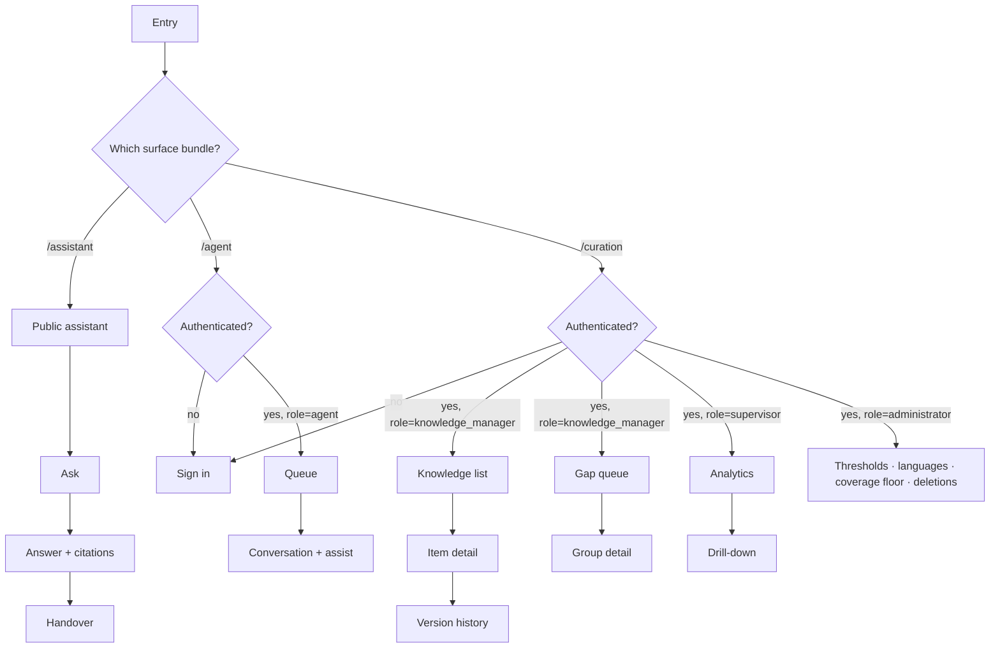

# Frontend HLD

> **Process note.** `frontend-hld-designer/SKILL.md` orchestrates a reference repo — `knowledge/`, `decision-matrices/`, `templates/hld-template.md`, `diagrams/mermaid-guide.md`, `checklists/self-review-checklist.md`. None of those folders exist in the installed skill; only `SKILL.md` shipped. This document therefore follows the five-phase workflow described inside SKILL.md (understand → decide → design → diagram → self-review) and its stated section expectations, with the deviation flagged here rather than hidden.

## 1. Requirements Extracted and Inferred

Mined from `requirements.md` v1.1 and `hld-backend.md` rather than asked again.

| Dimension | Value | Source |
|---|---|---|
| Surfaces | Three, with genuinely different characters: agent console (authenticated, dense, all-day), customer assistant (public, sparse, occasional), curation + analytics console (authenticated, document-heavy, deliberate) | REQ-006, REQ-007, REQ-009, REQ-012 |
| Audience skill | Agents: moderate, trained, repetitive use. Customers: variable digital literacy, sometimes first-time. Managers: domain experts, not technical | Personas |
| Languages | Six target, per-language enablement; Devanagari, Bengali, Tamil, Telugu scripts alongside Latin | REQ-001 |
| a11y | WCAG 2.1 AA on customer-facing surfaces | NFR Usability |
| Latency perceived | Assist ≤ 5 s p95, self-serve ≤ 8 s p95 — both dominated by backend inference, so the frontend's job is to make waiting legible, not to shave milliseconds | NFR Performance |
| Real-time | SSE for streamed answers and conversation assignment | hld-backend.md §16 |
| Auth | Short-lived access token + refresh, cross-origin, token held in memory | hld-backend.md §11 |
| Hosting | Vercel/Netlify static bundle; API on a different origin, permanently | Stage 3a gate decision |
| Offline | Not required — staffed contact-center floor and an online public portal | requirements.md §2 detection |
| SEO | Not required for MVP — the assistant is a support tool reached from a helpdesk link, not a content site | Inferred; stated as AS-F3 below |
| Team | Full engineering org | Stage 3a gate decision |

**Assumptions stated because they drive decisions and are not confirmed:**

- **AS-F1:** Agents work on desktop, 1366×768 or larger, one or two monitors. The agent console is therefore designed desktop-first with no phone layout. If agents work from phones, the console's two-pane layout is wrong and needs revisiting — cheap to discover now, expensive at Stage 8.
- **AS-F2:** Customers reach the assistant predominantly from a phone. The customer surface is designed mobile-first, which is the opposite default from the other two, and that difference is deliberate rather than accidental.
- **AS-F3:** The public assistant does not need search-engine visibility. This is the single assumption that decides CSR over SSR (§3). If the ministry later wants the assistant's answers indexed as public help content, the rendering decision must be re-opened, not patched.
- **AS-F4:** Browser support is evergreen Chrome/Edge/Firefox/Safari, last two versions. No IE, no legacy Android WebView below 8.

## 2. Framework Decision

**Chosen: React 18 + TypeScript + Vite.** Stated by the user at the Stage 3a gate, and the reasoning holds independently:

| What | Why it wins here | Real alternative rejected |
|---|---|---|
| React | Three surfaces share a citation renderer, a language switcher, an Indic-script text component and a streaming-answer component. React's ecosystem for accessible primitives and for internationalised text rendering is the widest, which matters more than raw runtime performance for a workload that spends its time waiting on a model | Vue 3 — smaller bundles, comparable DX; loses on accessible-primitive libraries and on the team-hiring argument for a full engineering org |
| TypeScript | The backend generates an OpenAPI schema (tech-stack.md). Typed clients generated from it are what stop Stage 8 drifting from the Stage 5a LLD — this is a governance mechanism, not a preference | Plain JS — would forfeit the one automatic check the workflow's Stage 9 review would otherwise perform by eye |
| Vite | Fast dev loop, first-class SSE-friendly dev proxy for the cross-origin split, trivial static output for Vercel/Netlify | Next.js — see §3; its strengths are SSR strengths this system has decided it does not need |

**What breaks at 10×:** nothing about React. What breaks first is the agent console's conversation list if it renders unvirtualised, and the curation console's item table at 50,000 rows. Both are addressed in §8.

## 3. Rendering Strategy

**Chosen: client-side rendering, static bundle on Vercel/Netlify.**

This is the decision most worth defending, because Next.js is the reflexive answer and it is wrong for this system specifically:

- Two of the three surfaces are **authenticated internal tools**. SSR buys nothing behind a login — no SEO, no shareable first paint, and every request would need the session forwarded server-side, which for a cross-origin token-in-memory auth model is a genuine complication rather than a convenience.
- The public surface's first meaningful content is **an answer that takes seconds to generate**. Server-rendering the shell earlier does not move the number a customer actually experiences. The perceived-performance lever here is streaming and honest progress, not time-to-first-byte.
- The backend is a Python API on a different host. Adding a Node server tier on Vercel would create a second place where request handling lives, and — critically — a place where query text could transit a third-party platform. §11 of the backend HLD forbids exactly that. **CSR keeps every byte of user content on the operator's host.** That is the decisive argument, and it is a constraint argument rather than a taste argument.

**What we give up:** slower first paint on a cold cache for the public assistant, and no SEO. AS-F3 says SEO does not matter; if it starts to, this decision is re-opened rather than worked around.

**Mitigation for the cost we accepted:** aggressive route-level code splitting (§8) so a customer downloads the assistant only, never the agent console — roughly the difference between a small bundle and a large one for the least-capable device on the worst connection.

## 4. Application Structure

Three surfaces, one repository, one build pipeline, three entry points.

```
src/
  surfaces/
    agent/            # authenticated, desktop-first
    assistant/        # public, mobile-first
    curation/         # authenticated, document + analytics
  features/           # vertical slices, shared where genuinely shared
    answer/           # citation card, confidence display, conflict display, streaming renderer
    conversation/     # transcript, composer, handover controls
    knowledge/        # item view, classification editor, version history
    gaps/             # queue, grouping, resolution
    analytics/        # period selection, KPI + guardrail tiles, drill-down
    auth/
  shared/
    i18n/             # locale loading, script-aware text primitives
    ui/               # accessible primitives, layout, typography scale
    api/              # generated OpenAPI client, SSE client, error normalisation
    observability/
  app/                # routing, providers, error boundaries per surface
```

**Why one repo and not three apps:** the citation renderer, the confidence display, the conflict display and the language switcher must behave identically on all three surfaces. The PRD's single most important guarantee is that an answer always carries its source; three separately-maintained implementations of the citation card is precisely how that guarantee quietly diverges. Shared code enforces it. The cost is a build that produces three bundles instead of one — handled by three Vite entry points, not by a monorepo tool.

**Micro-frontends: rejected.** Considered because a full engineering org can afford the coordination overhead, and rejected because the surfaces share the components that matter most; splitting them across independently-deployed apps would put a network boundary between the citation card and its three consumers. Revisit only if the surfaces end up owned by separate teams with separate release cadences — a team-topology trigger, not a scale one.

## 5. Routing



React Router with data-router APIs. Route-level role guards mirror REQ-013's four roles, and the guard is a **usability affordance only** — the backend enforces authorisation independently (backend HLD §11). The frontend never being the enforcement point is stated here so that no Stage 8 implementer treats a hidden button as a permission.

## 6. State Management

Deliberately split by the *nature* of the state, not by convenience:

| State | Mechanism | Reasoning |
|---|---|---|
| Server data — conversations, knowledge items, gap groups, analytics | TanStack Query | This is cached remote state with staleness semantics, which is exactly what the library models. Retirement of a knowledge item (BR-8) must invalidate any view showing it, and query-key invalidation makes that one line rather than a manual propagation |
| Streaming answer in flight | Local component state fed by the SSE client | It is transient by nature; putting a token stream into a global store buys nothing and re-renders everything |
| Session, role, enabled languages, chosen language | Zustand store | Small, global, read almost everywhere, written rarely |
| Composer drafts, panel sizes, table filters | URL search params where shareable, local storage where personal | A supervisor sending a colleague a link to a filtered period is a real workflow; that means the filter belongs in the URL |

**Redux rejected**: the genuinely global state here is a handful of fields, and the server-cache problem — which is the actual complexity — is solved better by a purpose-built cache than by reducers over fetched data. **Context-only rejected**: the enabled-language set changes rarely but is read by nearly every component; Context would re-render broadly on each change, and Zustand's selector subscriptions avoid it for no added ceremony.

## 7. Data Fetching, Real-Time and Error Semantics

- **Typed client generated from the backend's OpenAPI schema**, regenerated in CI. A Stage 8 implementation that drifts from the Stage 5a contract fails the build rather than failing in front of a customer.
- **SSE for streamed answers.** The answer arrives token-by-token; the citation block renders only when the backend emits it, because BR-1 means an answer without its citation must never be visible even momentarily. **The stream must not paint text that could later turn out to be uncited** — so the renderer holds a generated answer in a "verifying" state until the grounding check result arrives, then either commits it with citations or replaces it with the extractive fallback. This is the frontend's share of the citation guarantee, and it is the single most important behavioural rule in this document.
- **Errors are normalised into three user-visible classes**, because the personas need different things from each: *assist unavailable* (keep working, banner, conversation fully usable — REQ-006), *no reliable answer* (not an error at all; a first-class result with related reading and handover — REQ-005), and *request failed* (retry affordance). Conflating the first two would be a serious product failure: a system that says "error" when it means "I don't know" teaches agents to distrust both.

## 8. Performance

The honest framing: the backend owns the seconds; the frontend owns whether those seconds feel broken.

| Lever | Applied where |
|---|---|
| Route-level code splitting per surface | A customer never downloads the agent console or the curation console. This is the largest single win available and it is free |
| Streamed first token as the perceived-latency signal | Replaces a spinner with visible progress on the one interaction users wait for |
| Virtualised lists | Agent conversation queue and the curation item table — the two places that break at 50,000 items (§2's "what breaks at 10×") |
| Font subsetting per script, loaded on demand | Indic script fonts are large. A customer working in Tamil should not download Bengali glyphs. This matters far more on the public surface's assumed mobile connection than any JS optimisation |
| Optimistic UI, deliberately limited | Applied to feedback ratings and filter changes only. Never to knowledge approval or retirement — a governance action must not appear to have succeeded before the server says it did (REQ-009, REQ-010) |

## 9. Internationalisation

- Six locales, loaded per-locale rather than bundled together, with the enabled-language set fetched from the backend so a language held back by the REQ-001 gate simply never appears in the switcher.
- **Script-aware typography**: line-height and font-size scale per script, because Devanagari and Bengali need more vertical space than Latin at the same nominal size, and a layout tuned only on English text breaks visibly in Hindi. This is a component-level concern baked into the shared text primitive, not a per-screen fix.
- **Citations render in their source language regardless of interface language** (BR-3), which means the citation component must handle mixed-script content in one view as a normal case, not an edge case.
- Numbers, dates and document references formatted per locale; issue dates always shown alongside citations, so their formatting is a correctness concern rather than a cosmetic one.
- No right-to-left script in the launch six. Urdu would introduce RTL, so the layout primitives use logical properties from the start — cheap now, a rewrite later.

## 10. Accessibility

WCAG 2.1 AA on the customer surface, and the same primitives used everywhere because retrofitting the internal consoles later would cost more than building them right once.

Specific to this system rather than generic:
- **The streaming answer is a live region**, announced when complete rather than per token — a screen reader reading a token stream character by character is unusable.
- **Confidence and staleness are never colour-only.** A review-pending indication carries text; a confidence level carries a label. Colour-only status on a government service fails both AA contrast expectations and the substantial share of users who cannot rely on it.
- **The citation is a first-class landmark**, reachable and readable independently of the answer, because for a low-vision user verifying a source is the whole point of the interaction.
- Keyboard-complete agent console — agents work fast and repetitively; a mouse-only flow costs handle time on every contact, so this is a performance requirement as much as an accessibility one.

## 11. Security

- **Access token in memory, refresh token in an HttpOnly cookie scoped to the API origin.** Token-in-memory costs a silent refresh on page load and buys immunity to XSS token theft, which is the right trade for a console holding customer conversations.
- **Strict CSP** with no inline scripts; the static host serves the bundle, and the API origin is the only permitted connect target — which also means a compromised dependency cannot exfiltrate query text to a third party. That is the same data-control constraint from the backend HLD, enforced a second time at the edge that Vercel/Netlify controls.
- **All rendered knowledge content is treated as untrusted.** Uploaded documents are attacker-influenced in the general case; the citation renderer displays text, never HTML from a source document.
- **Role guards are UX, not security** (§5), stated twice on purpose.

## 12. Observability

Correlation identifier generated per user interaction and sent with every request, so a slow assist can be traced from the click through retrieval, rerank and generation in the backend's logs (backend HLD §20). Client error reporting goes to the self-hosted GlitchTip instance — a hosted error tracker would receive query text in breadcrumbs, which the data-control NFR forbids. Core Web Vitals collected for the public surface only, where device and network variance is real.

## 13. Testing Strategy

| Layer | Approach |
|---|---|
| Component | Vitest + Testing Library, queried by accessible role — which makes the a11y contract a test failure rather than an audit finding |
| Contract | Generated client re-generated in CI; a schema change that breaks the frontend fails there |
| Flow | Playwright over the six PRD user flows, including their error paths — the no-answer path and the assist-unavailable path especially, since both are states the product is *supposed* to reach |
| i18n | Snapshot the three surfaces in each enabled script to catch layout breakage; this is where script-aware typography either holds or does not |

## 14. Deployment

Static bundle to Vercel/Netlify, three entry points, immutable hashed assets, environment-specific API origin injected at build. Preview deployments per pull request pointed at a staging API. The frontend platform holds no secrets beyond the API origin, because it holds no data at all — which is what makes the split-hosting decision safe.

## 15. Weakest Links

1. **The streaming-answer renderer is the highest-risk component in the frontend.** It must never paint an answer that later fails the grounding check (§7). Getting this subtly wrong produces exactly the failure mode the entire PRD was written to prevent, and it would be invisible in a demo where every answer happens to be grounded.
2. **Indic-script layout across three surfaces** is genuinely hard to get right and easy to declare done. Snapshot coverage (§13) is the only thing that will catch it.
3. **Cross-origin auth with token-in-memory** costs a silent-refresh dance on every page load; done carelessly it produces intermittent sign-outs that agents will report as "the tool logged me out again" and that are miserable to reproduce.
4. **CSR first-paint on a low-end phone** for the public assistant is the one place AS-F2 and §3's decision are in tension. Bundle discipline is the mitigation; if it proves insufficient in the field, that is the trigger to re-open the rendering decision honestly rather than to add a workaround.

## 16. Open Questions for Stage 4 Review

- **F-1:** Is AS-F1 right — do agents work on desktop only? A phone-using agent invalidates the console layout.
- **F-2:** Does the ministry expect the public assistant's answers to be publicly indexable? A yes re-opens §3.
- **F-3:** Which script fonts are licensed and available for embedding, and at what weight coverage? Affects §8's subsetting plan.
- **F-4:** Is there an existing government design system or accessibility standard (beyond WCAG) that this must conform to? Cheaper to adopt now than to retrofit.
