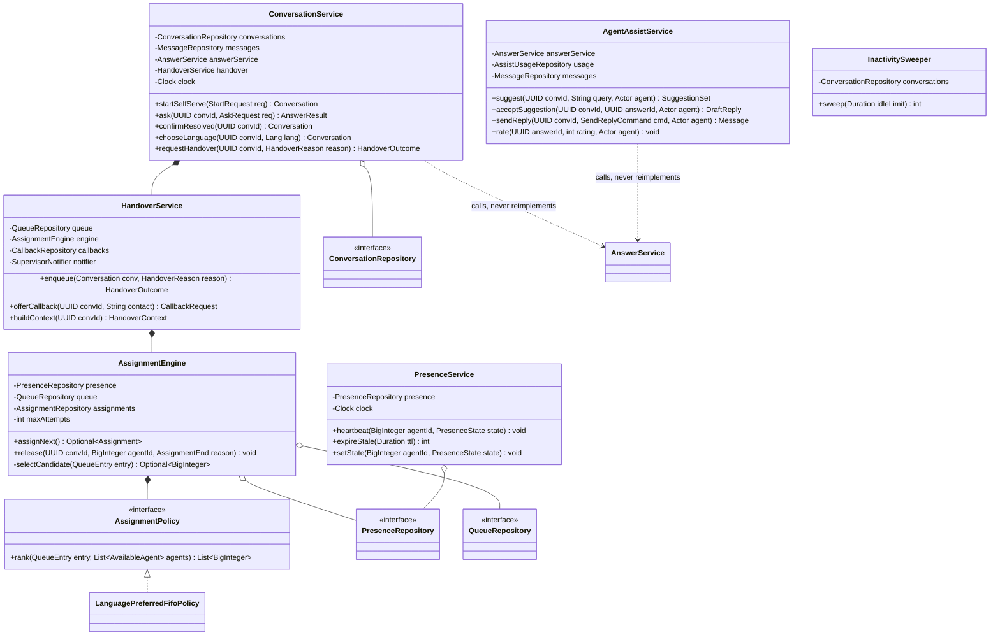

# Backend LLD — Pass 2: Conversation, Handover and Assignment

## 1. Requirements & Scope

### 1.1 Functional scope

| Req | What this pass must make implementable |
|---|---|
| REQ-006 | In-conversation assist; ranked suggestions with citations and confidence; accept-into-reply; record which items were used and whether the text was edited; ratings; dual-language display; assist-unavailable degradation |
| REQ-007 | Self-serve conversation with follow-up context; language switch preserving citations; exactly one recorded outcome from four; automatic handover offer after two below-bar answers; out-of-domain refusal |
| REQ-008 | Full-context handover; language-preferred assignment; any-agent fallback with dual-language transcript; callback when no agent; open-conversation retention on assignment failure with supervisor escalation; handover on request at any time, including before asking anything |
| **High-2** | The presence, queue and assignment subsystem the Stage 4 review found entirely absent |

### 1.2 Out of scope for this pass

Gap entries, analytics, roles/provisioning, audit schema, masking (Pass 3). Answer production itself (Pass 1 — this pass *calls* `AnswerService`, never reimplements it, per the Stage 4 review's explicit endorsement §5.1).

### 1.3 Open assumptions

- **AS-P2-1:** One agent handles one conversation at a time at MVP. Concurrent multi-conversation handling is a real contact-center pattern but no requirement asks for it, and assuming it would change the assignment model from "assign to a free agent" to "assign within a per-agent capacity budget". Stated because it is the assumption most likely to be wrong in the field; §7.6 records what changes if it is.
- **AS-P2-2:** Agent working languages are a stored attribute of the agent, maintained by an administrator. REQ-008 requires language-preferred routing and nothing upstream says where the agent's languages come from.
- **AS-P2-3:** The published queue-wait threshold (REQ-008's "exceeds the published threshold") is an administrator-set value; a starting value of 5 minutes is proposed and marked as such.
- **AS-P2-4:** Callback capture stores a contact detail supplied by the customer. This is personal data, so it is masked-on-read everywhere except the agent working the callback (Pass 3 owns masking; the field is marked here).

## 2. Core Entities & Data Modeling

### 2.1 Entities

| Entity | Is |
|---|---|
| `Conversation` | One continuous exchange with one customer, on one surface, with exactly one terminal outcome |
| `Message` | One turn in a conversation, attributed to customer, assistant or agent |
| `AgentPresence` | An agent's current availability, heartbeat-maintained, expiring on silence |
| `QueueEntry` | A conversation waiting for assignment, with its language and enqueue time |
| `Assignment` | The binding of a conversation to an agent, with how it ended |
| `AssistUsage` | One suggestion shown to an agent and what the agent did with it |
| `CallbackRequest` | A recorded question with contact details when no agent was available |

### 2.2 Conversation lifecycle

`Conversation.state` — the field REQ-007 requires to end in exactly one outcome:

| From | To | Trigger | Guard |
|---|---|---|---|
| `active_self_serve` | `self_resolved` | Customer confirms resolved | — |
| `active_self_serve` | `queued` | Handover accepted or requested | Queue entry created in the same transaction |
| `active_self_serve` | `abandoned` | Inactivity sweep, 15 min | No message in window (REQ-007) |
| `active_self_serve` | `callback_recorded` | Customer accepts callback | Contact detail captured |
| `queued` | `assigned` | Assignment succeeds | Agent presence still `available` |
| `queued` | `callback_recorded` | Customer accepts callback after wait threshold | — |
| `queued` | `abandoned` | Inactivity sweep while queued | — |
| `queued` | `escalated` | Assignment repeatedly fails | Surfaced in the supervisor view (REQ-008) |
| `escalated` | `assigned` | Supervisor or later attempt assigns | — |
| `escalated` | `callback_recorded` | Supervisor records callback | — |
| `assigned` | `agent_resolved` | Agent closes | — |
| `assigned` | `queued` | Agent releases (shift end, escalation) | Prior assignment closed with a reason |
| `assigned` | `abandoned` | Inactivity sweep, customer silent | Agent notified |
| `active_agent` (started with an agent) | `agent_resolved` / `abandoned` | As above | Conversations that never used self-serve (REQ-008: handover before asking anything) |

**Terminal states:** `self_resolved`, `agent_resolved`, `callback_recorded`, `abandoned`. Exactly four, matching REQ-007's amended outcome set, and every non-terminal state has a path to one — checked by test 24.

**Deflection counts `self_resolved` only.** `abandoned` is excluded explicitly (REQ-007's third criterion), which is why it must be a state rather than an absence.

### 2.3 Schema

```sql
CREATE TYPE conversation_surface AS ENUM ('self_serve','agent');
CREATE TYPE conversation_state AS ENUM
    ('active_self_serve','active_agent','queued','assigned','escalated',
     'self_resolved','agent_resolved','callback_recorded','abandoned');

CREATE TABLE conversation (
    id                  UUID        PRIMARY KEY,
    surface             conversation_surface NOT NULL,
    state               conversation_state   NOT NULL,
    detected_language   CHAR(3)     NOT NULL,
    chosen_language     CHAR(3),                       -- explicit customer choice (REQ-007)
    customer_token_hash BYTEA,                         -- opaque; anonymous customers (HLD §11)
    started_at          TIMESTAMPTZ NOT NULL DEFAULT now(),
    last_activity_at    TIMESTAMPTZ NOT NULL DEFAULT now(),
    ended_at            TIMESTAMPTZ,
    end_reason          TEXT,
    below_bar_streak    SMALLINT    NOT NULL DEFAULT 0, -- REQ-007: two in a row offers handover
    retired_source_flag BOOLEAN     NOT NULL DEFAULT FALSE, -- BR-12 mid-conversation retirement

    CONSTRAINT ck_terminal_has_end CHECK (
        state NOT IN ('self_resolved','agent_resolved','callback_recorded','abandoned')
        OR ended_at IS NOT NULL
    )
) PARTITION BY RANGE (started_at);
-- Monthly partitions: the 12-month transcript retention (NFR Compliance) becomes a
-- partition DROP rather than a mass DELETE, consistent with answer_record in pass 1.

CREATE INDEX idx_conv_active_inactivity ON conversation (last_activity_at)
    WHERE state IN ('active_self_serve','active_agent','queued','assigned');
-- Serves: the inactivity sweep. Partial, so it stays small as terminal rows accumulate.

CREATE INDEX idx_conv_state_started ON conversation (state, started_at DESC);

CREATE TYPE message_author AS ENUM ('customer','assistant','agent');

CREATE TABLE message (
    id              BIGINT GENERATED ALWAYS AS IDENTITY,
    conversation_id UUID        NOT NULL,
    author          message_author NOT NULL,
    agent_id        BIGINT,                            -- set iff author='agent'
    body            TEXT        NOT NULL,              -- masked before write (Pass 3)
    language        CHAR(3)     NOT NULL,
    answer_id       UUID,                              -- set iff author='assistant'
    created_at      TIMESTAMPTZ NOT NULL DEFAULT now(),
    PRIMARY KEY (id, created_at),
    CONSTRAINT ck_agent_attribution CHECK (
        (author = 'agent') = (agent_id IS NOT NULL)
    )
) PARTITION BY RANGE (created_at);

CREATE INDEX idx_message_conv ON message (conversation_id, created_at);

-- ============ Presence, queue, assignment (resolves hld-review High-2) ============
CREATE TYPE presence_state AS ENUM ('available','busy','away','offline');

CREATE TABLE agent_presence (
    agent_id        BIGINT      PRIMARY KEY,           -- app_user(id), FK in Pass 3
    state           presence_state NOT NULL DEFAULT 'offline',
    last_heartbeat  TIMESTAMPTZ NOT NULL DEFAULT now(),
    current_conversation_id UUID,                      -- AS-P2-1: at most one
    updated_at      TIMESTAMPTZ NOT NULL DEFAULT now()
);
CREATE INDEX idx_presence_available ON agent_presence (state, last_heartbeat)
    WHERE state = 'available';
-- Serves: candidate selection in §6.2. Partial index keeps it to the agents who can take work.

CREATE TABLE agent_language (
    agent_id        BIGINT      NOT NULL,
    language        CHAR(3)     NOT NULL,
    PRIMARY KEY (agent_id, language)
);
-- AS-P2-2. Serves the language-preferred join in §6.2.

CREATE TABLE queue_entry (
    conversation_id UUID        PRIMARY KEY,
    language        CHAR(3)     NOT NULL,
    enqueued_at     TIMESTAMPTZ NOT NULL DEFAULT now(),
    attempts        SMALLINT    NOT NULL DEFAULT 0,
    last_attempt_at TIMESTAMPTZ,
    escalated       BOOLEAN     NOT NULL DEFAULT FALSE
);
CREATE INDEX idx_queue_fifo ON queue_entry (enqueued_at)
    WHERE escalated = FALSE;
-- Serves: FIFO selection. Deliberately no priority column — REQ-008 specifies no priority
-- scheme, and inventing one would be scope creep with real fairness consequences.

CREATE TYPE assignment_end AS ENUM ('resolved','released','abandoned','failed');

CREATE TABLE assignment (
    id                  BIGINT GENERATED ALWAYS AS IDENTITY PRIMARY KEY,
    conversation_id     UUID        NOT NULL,
    agent_id            BIGINT      NOT NULL,
    language_matched    BOOLEAN     NOT NULL,          -- feeds the REQ-012 language-staffing view
    wait_seconds        INTEGER     NOT NULL,          -- enqueue → assignment
    assigned_at         TIMESTAMPTZ NOT NULL DEFAULT now(),
    ended_at            TIMESTAMPTZ,
    end_state           assignment_end
);
CREATE INDEX idx_assignment_conv ON assignment (conversation_id, assigned_at DESC);
CREATE INDEX idx_assignment_agent_open ON assignment (agent_id) WHERE ended_at IS NULL;
-- Serves: "is this agent actually free" as a cross-check against presence (§7.2).

CREATE TABLE assist_usage (
    id                  BIGINT GENERATED ALWAYS AS IDENTITY PRIMARY KEY,
    conversation_id     UUID        NOT NULL,
    agent_id            BIGINT      NOT NULL,
    answer_id           UUID        NOT NULL,          -- answer_record(id) from pass 1
    accepted            BOOLEAN     NOT NULL,
    edited_before_send  BOOLEAN,                       -- NULL when not accepted
    sent_message_id     BIGINT,                        -- the reply actually sent (REQ-014 v1.1)
    rating              SMALLINT CHECK (rating IN (-1, 1)),
    rated_at            TIMESTAMPTZ,
    created_at          TIMESTAMPTZ NOT NULL DEFAULT now()
);
CREATE INDEX idx_assist_answer ON assist_usage (answer_id);
CREATE INDEX idx_assist_agent_created ON assist_usage (agent_id, created_at DESC);
-- Serves: adoption and engagement KPIs, and the wrong-answer-versus-adoption guardrail.

CREATE TABLE callback_request (
    id              UUID        PRIMARY KEY,
    conversation_id UUID        NOT NULL UNIQUE,
    contact_detail  TEXT        NOT NULL,              -- AS-P2-4: personal data, masked on read
    language        CHAR(3)     NOT NULL,
    promised_window TEXT        NOT NULL,              -- the window stated to the customer
    fulfilled_at    TIMESTAMPTZ,
    fulfilled_by    BIGINT,
    created_at      TIMESTAMPTZ NOT NULL DEFAULT now()
);
CREATE INDEX idx_callback_open ON callback_request (created_at) WHERE fulfilled_at IS NULL;
```

### 2.4 Why `below_bar_streak` is a column and not a computed value

REQ-007 requires an automatic handover offer after two consecutive below-bar answers. Deriving that by scanning recent messages on every turn is both slower and ambiguous about what "consecutive" means once a customer interleaves an unrelated message. A counter incremented on a below-bar answer and reset on any answered outcome makes the rule exactly what the requirement says, and makes test 12 trivial to write.

## 3. Class Diagram & Design Patterns



### 3.1 Patterns

| Pattern | Where | Why here |
|---|---|---|
| **Strategy** | `AssignmentPolicy` | REQ-008 fixes one policy (language-preferred, then any available). AS-P2-1 says per-agent capacity may be needed later, and skill-based routing is the obvious Phase 2 ask. A policy interface means that arrives as a new class, not as a rewrite of the engine's locking |
| **State machine (explicit table)** | `Conversation.state`, §2.2 and §7.5 | Nine states, four terminal, and REQ-007 hangs on "exactly one outcome". Same mechanism as pass 1's item lifecycle, deliberately — one enforcement idiom across the codebase |
| **Facade** | `ConversationService` over answer + handover + messages | The public surface has one coherent flow; without a facade, the API layer would orchestrate three services and the ordering rules in §6.1 would leak into HTTP handlers |
| **Repository** | All `*Repository` | As pass 1: the queue's `SELECT ... FOR UPDATE SKIP LOCKED` lives in exactly one method, so no caller can accidentally dequeue without it |

**Not used:** no Observer for assignment events — the supervisor escalation is a direct call after commit (§6.2), and making it event-driven would add an at-least-once delivery problem to a path whose whole purpose is that nothing gets silently lost.

## 4. API Contract & Edge Layer

Conventions inherited from pass 1 §4.1 unchanged (URI versioning, keyset pagination, `Idempotency-Key`, `If-Match`, problem+json).

### 4.1 Endpoints

| Verb & path | Purpose | Auth | Authorisation |
|---|---|---|---|
| `POST /api/v1/public/conversations` | Start a self-serve conversation | none | Coverage gate (pass 1 §6.5) |
| `POST /api/v1/public/conversations/{id}/ask` | Ask; returns an answer or a no-answer with a handover offer | Conversation token | Token matches conversation; fair-use gate |
| `POST /api/v1/public/conversations/{id}/language` | Choose a conversation language | Conversation token | Language enabled |
| `POST /api/v1/public/conversations/{id}/resolve` | Customer confirms resolved | Conversation token | State is `active_self_serve` |
| `POST /api/v1/public/conversations/{id}/handover` | Request a human at any point | Conversation token | Any non-terminal state |
| `POST /api/v1/public/conversations/{id}/callback` | Accept a callback instead of waiting | Conversation token | State ∈ {`queued`,`escalated`,`active_self_serve`} |
| `GET /api/v1/public/conversations/{id}/stream` | SSE: streamed answer tokens, queue position, assignment | Conversation token | — |
| `POST /api/v1/conversations` | Start a conversation directly with an agent (REQ-008: handover before asking) | Bearer | agent |
| `GET /api/v1/conversations/{id}` | Full transcript plus handover context | Bearer | Assigned agent, or supervisor/administrator |
| `POST /api/v1/conversations/{id}/assist` | Request suggestions inside a conversation | Bearer | Assigned agent |
| `POST /api/v1/conversations/{id}/assist/{answerId}/accept` | Accept a suggestion into a draft reply | Bearer | Assigned agent |
| `POST /api/v1/conversations/{id}/reply` | Send a reply to the customer | Bearer | Assigned agent |
| `POST /api/v1/assist/{answerId}/rating` | Rate a suggestion helpful/unhelpful | Bearer | agent |
| `POST /api/v1/conversations/{id}/close` | Close as resolved | Bearer | Assigned agent |
| `POST /api/v1/conversations/{id}/release` | Release back to the queue with a reason | Bearer | Assigned agent |
| `PUT /api/v1/agents/me/presence` | Heartbeat and set availability | Bearer | agent |
| `GET /api/v1/queue` | Queue depth, waits, escalations | Bearer | supervisor, administrator |
| `GET /api/v1/queue/escalations` | Conversations stuck unassigned | Bearer | supervisor, administrator |
| `POST /api/v1/queue/{convId}/assign` | Supervisor forces an assignment | Bearer | supervisor, administrator |
| `GET /api/v1/callbacks` | Open callback requests | Bearer | agent, supervisor, administrator |
| `POST /api/v1/callbacks/{id}/fulfil` | Mark a callback handled | Bearer | agent |
| `GET /api/v1/agents/me/stream` | SSE: assignment notifications, retired-source flags | Bearer | agent |

### 4.2 DTOs

```python
class StartConversationRequest(BaseModel):
    model_config = ConfigDict(extra="forbid")
    initial_query: str | None = Field(default=None, max_length=2000)
    preferred_language: Lang | None = None

class StartConversationResponse(BaseModel):
    conversation_id: UUID
    conversation_token: str          # opaque; the only credential a public customer holds
    detected_language: Lang | None
    supported_languages: list[Lang]  # enabled set only (REQ-001 gate)

class AskRequest(BaseModel):
    model_config = ConfigDict(extra="forbid")
    query: str = Field(min_length=1, max_length=2000)

class AskResponse(BaseModel):
    answer: AnswerResponse           # pass 1 §4.3, reused unchanged
    conversation_state: str
    handover_offered: bool
    below_bar_streak: int            # surfaced so the client need not infer the REQ-007 rule

class HandoverOutcomeResponse(BaseModel):
    outcome: Literal["queued", "assigned", "callback_offered", "escalated"]
    queue_position: int | None
    estimated_wait_seconds: int | None
    wait_threshold_exceeded: bool    # drives the callback offer (REQ-008)

class HandoverContext(BaseModel):
    """Everything REQ-008 requires the receiving agent to see."""
    conversation_id: UUID
    detected_language: Lang
    chosen_language: Lang | None
    agent_working_language: Lang
    language_matched: bool
    transcript: list["TranscriptTurn"]
    attempted_answers: list["AttemptedAnswer"]
    retired_source_flag: bool

class TranscriptTurn(BaseModel):
    author: Literal["customer", "assistant", "agent"]
    body: str
    body_in_agent_language: str | None   # populated only when language_matched is False
    language: Lang
    created_at: datetime

class AttemptedAnswer(BaseModel):
    answer_id: UUID
    outcome: Literal["answered", "no_answer", "conflict"]
    confidence: Decimal | None
    rejection_reason: str | None     # 'below_bar' | 'no_match' | 'grounding_failed' | 'conflict'
    citations: list[Citation]

class SuggestionSet(BaseModel):
    suggestions: list["Suggestion"]
    assist_available: bool           # False → the console keeps working (REQ-006)

class Suggestion(BaseModel):
    answer_id: UUID
    rank: int
    answer_text: str
    answer_text_in_agent_language: str | None
    confidence: Decimal
    citations: list[Citation]

class SendReplyCommand(BaseModel):
    model_config = ConfigDict(extra="forbid")
    body: str = Field(min_length=1, max_length=8000)
    from_answer_id: UUID | None = None   # set when derived from a suggestion
    edited: bool = False                 # client asserts; server verifies against the suggestion

class PresenceHeartbeat(BaseModel):
    model_config = ConfigDict(extra="forbid")
    state: Literal["available", "busy", "away"]
```

### 4.3 Validation split

| Edge | Domain |
|---|---|
| Shape, lengths, enum membership | Whether a conversation-state transition is legal (§7.5) |
| Conversation token matches the path id | Whether the requesting agent is the *assigned* agent |
| Presence state is one of three settable values (`offline` is set only by expiry, never by a client) | Whether an agent may take another conversation (AS-P2-1 capacity) |
| `rating ∈ {-1, 1}` | Whether that answer belongs to a conversation this agent handled |

**`edited` is verified, not trusted.** The client asserts it; the server compares the sent body against the accepted suggestion's text and stores its own determination. A client that lies about this would corrupt the REQ-014 audit trail and the wrong-answer guardrail simultaneously.

### 4.4 Error mapping

| Exception | Status | `code` |
|---|---|---|
| `ConversationNotFound` | 404 | `conversation.not_found` |
| `InvalidConversationTransition` | 409 | `conversation.invalid_transition` |
| `NotAssignedAgent` | 403 | `conversation.not_assigned` |
| `ConversationAlreadyTerminal` | 409 | `conversation.already_ended` |
| `NoAgentAvailable` | 200 | not an error — returns `outcome: "callback_offered"` |
| `AssignmentRaceLost` | 409 | `assignment.race_lost` (internal; retried, never surfaced) |
| `SuggestionNotInConversation` | 403 | `assist.foreign_answer` |
| `AssistUnavailable` | 200 | `SuggestionSet(assist_available=False)` — REQ-006 forbids blocking the conversation |

Two entries there are deliberate non-errors. "No agent available" is an expected operating condition with a defined product response, and assist being down must not read as a failed request, or the console will show an error banner over a conversation that is working fine.

## 5. SOLID Breakdown

- **SRP** — `AssignmentEngine` decides *who*; `PresenceService` decides *who is available*; `HandoverService` decides *what happens when nobody is*. Merging presence into the engine is the tempting simplification and it is the wrong one: presence expiry is a scheduled sweep with its own failure mode, and burying it inside assignment would mean a stalled sweep silently degrades routing with no separate signal.
- **OCP** — `AssignmentPolicy` absorbs skill-based routing, per-agent capacity (AS-P2-1) or priority queues without touching the engine's `SKIP LOCKED` dequeue, which is the part that is hard to get right and must not be re-derived per policy.
- **LSP** — any `AssignmentPolicy` must return a ranked subset of the agents it was given, never invent an id and never return an agent it was not offered. Stated as a contract because a policy that returns an unavailable agent would pass type-checking and fail in production as a lost conversation.
- **ISP** — `PresenceRepository` (heartbeat, expire, read) is split from `AssignmentRepository` (create, close) because the sweeper touches only presence and the engine only reads it. A combined interface would give the sweeper write access to assignments for no reason.
- **DIP** — `ConversationService` depends on `AnswerService`'s interface, and this is the structural guarantee behind the Stage 4 review's endorsement: the public surface *cannot* produce an answer by another route, because it holds no other collaborator that can.

## 6. Interface & Skeleton Code

### 6.1 `ConversationService.ask` — public self-serve turn

```
ask(conv_id, req, token):
    conv = conversations.get_for_update(conv_id)          # row lock: turn ordering matters
    if conv is None: raise ConversationNotFound
    if conv.state in TERMINAL: raise ConversationAlreadyTerminal
    assert token matches conv.customer_token_hash

    lang = conv.chosen_language or conv.detected_language
    messages.append(conv, author='customer', body=req.query, language=lang)
    conv.last_activity_at = now()

    # Delegate. This service never retrieves, ranks, or generates (Stage 4 review §5.1).
    result = answer_service.answer(
        AnswerRequest(query=req.query, conversation_id=conv_id,
                      preferred_language=lang,
                      context_turns=messages.recent(conv_id, limit=10)),
        actor=public_actor(token))

    if result.outcome == 'answered':
        messages.append(conv, author='assistant', body=result.answer_text,
                        language=result.answer_language, answer_id=result.answer_id)
        conv.below_bar_streak = 0                          # reset on any real answer
        handover_offered = False
    elif result.outcome == 'conflict':
        messages.append(conv, author='assistant', body=render_conflict(result),
                        language=lang, answer_id=result.answer_id)
        conv.below_bar_streak = 0                          # a conflict is not a failure to answer
        handover_offered = True                            # but it does warrant a human
    else:                                                  # no_answer / blocked_*
        conv.below_bar_streak += 1
        messages.append(conv, author='assistant', body=render_no_answer(result),
                        language=lang, answer_id=result.answer_id)
        # REQ-007: after two consecutive below-bar answers, offer handover unprompted.
        handover_offered = True

    auto_handover = (conv.below_bar_streak >= 2)
    conversations.save(conv)                               # commits with the messages
    return AskResponse(answer=result, conversation_state=conv.state,
                       handover_offered=handover_offered or auto_handover,
                       below_bar_streak=conv.below_bar_streak)
```

Note the deliberate asymmetry: a conflict resets the streak but still offers handover. A conflict means the corpus disagrees with itself, which a human must resolve — but it is not evidence that the system cannot answer, so counting it toward the two-strike rule would trigger the automatic escalation for the wrong reason.

### 6.2 `AssignmentEngine.assignNext` — the core of the missing subsystem (High-2)

```
assignNext():
    with transaction():
        # Dequeue exactly one entry without blocking parallel workers.
        entry = queue.claim_next()          # SELECT ... FOR UPDATE SKIP LOCKED LIMIT 1
        if entry is None: return None

        candidates = presence.available_agents(fresh_within=HEARTBEAT_TTL)
        # Freshness is checked in the query, not after: an agent whose browser died
        # 40 seconds ago is not available regardless of what the row's state column says.

        ranked = policy.rank(entry, candidates)             # language-preferred, then FIFO fairness
        for agent_id in ranked:
            locked = presence.get_for_update(agent_id)
            if locked.state != 'available' or locked.current_conversation_id is not None:
                continue                                    # someone else took them; try the next
            conv = conversations.get_for_update(entry.conversation_id)
            assert_transition(conv.state -> 'assigned')

            locked.state = 'busy'
            locked.current_conversation_id = conv.id
            conv.state = 'assigned'
            assignment = assignments.create(
                conversation_id=conv.id, agent_id=agent_id,
                language_matched=(entry.language in agent_languages(agent_id)),
                wait_seconds=seconds_since(entry.enqueued_at))
            queue.delete(entry)
            presence.save(locked); conversations.save(conv)
            audit.write(action='assign', conv.id, agent_id)
            return assignment                               # commit

        # No candidate could be locked. Do NOT drop the entry.
        entry.attempts += 1
        entry.last_attempt_at = now()
        if entry.attempts >= MAX_ATTEMPTS:                  # REQ-008: escalate, never lose
            entry.escalated = True
            conversations.transition(entry.conversation_id, to='escalated')
        queue.save(entry)
        return None
    # after commit:
    if entry.escalated: notifier.raise_to_supervisor(entry.conversation_id)
```

Three properties this method must have, and how each is obtained:
- **No conversation is lost.** The entry is only deleted on a successful assignment; every other path saves it back with an incremented attempt count. REQ-008's "if assignment fails, keep the conversation open and raise it to the supervisor" is this branch.
- **No double assignment.** The agent row is locked and re-checked *after* the lock, because `available_agents` read a snapshot that another worker may already have invalidated. Checking before the lock and trusting it is the classic version of this bug.
- **No worker contention.** `SKIP LOCKED` means two workers processing the queue concurrently take different entries rather than serialising on the head.

### 6.3 `HandoverService.buildContext` — REQ-008's context transfer

```
buildContext(conv_id):
    conv = conversations.get(conv_id)
    agent = current_assignment(conv_id).agent
    matched = conv.detected_language in agent.languages

    turns = []
    for m in messages.all(conv_id, order='asc'):
        translated = None
        if not matched:
            # REQ-008: show the transcript in both languages when the agent does not
            # read the customer's. Rendered on demand and never stored — a stored
            # translation would become stale against an edited message and would
            # double the masking surface for no benefit.
            translated = translate(m.body, source=m.language, target=agent.primary_language)
        turns.append(TranscriptTurn(..., body_in_agent_language=translated))

    attempts = [AttemptedAnswer(a) for a in answers.for_conversation(conv_id)]
    # Includes rejected attempts and WHY each was rejected — REQ-008 requires the agent
    # to see what was tried, not only what succeeded.

    return HandoverContext(transcript=turns, attempted_answers=attempts,
                           language_matched=matched,
                           retired_source_flag=conv.retired_source_flag)
```

### 6.4 `AgentAssistService.sendReply` — the REQ-014 v1.1 write point

```
sendReply(conv_id, cmd, agent):
    with transaction():
        conv = conversations.get_for_update(conv_id)
        assert_assigned(conv, agent)                        # NotAssignedAgent otherwise

        actually_edited = None
        if cmd.from_answer_id is not None:
            suggestion = answers.get(cmd.from_answer_id)
            if suggestion.conversation_id != conv_id: raise SuggestionNotInConversation
            actually_edited = normalise(cmd.body) != normalise(suggestion.answer_text)
            # Server-determined, never the client's claim (§4.3).

        msg = messages.append(conv, author='agent', agent_id=agent.id,
                              body=cmd.body, language=agent.primary_language)
        if cmd.from_answer_id is not None:
            usage.record(conversation_id=conv_id, agent_id=agent.id,
                         answer_id=cmd.from_answer_id, accepted=True,
                         edited_before_send=actually_edited, sent_message_id=msg.id)
        audit.write(action='reply_sent', conv_id, agent.id,
                    sent_text=cmd.body, derived_from=cmd.from_answer_id,
                    edited=actually_edited)
        # This is the audit gap the Stage 2 review found (critical C-3): the record now
        # distinguishes what was suggested from what the customer was actually told.
        conv.last_activity_at = now()
        conversations.save(conv)
    return msg
```

### 6.5 `PresenceService` and `InactivitySweeper`

```
heartbeat(agent_id, state):
    presence.upsert(agent_id, state=state, last_heartbeat=now())
    # Called every 20 s by the console. TTL is 60 s — three missed beats before an agent
    # is treated as gone, which tolerates a slow network without holding a conversation
    # for a browser that closed.

expireStale(ttl):
    # Agents whose heartbeat lapsed become 'offline'. If they held a conversation, it
    # returns to the queue rather than sitting with someone who is not there.
    for p in presence.lapsed(ttl):
        with transaction():
            if p.current_conversation_id is not None:
                engine.release(p.current_conversation_id, p.agent_id, reason='failed')
            p.state = 'offline'; p.current_conversation_id = None
            presence.save(p)

sweep(idle_limit):        # InactivitySweeper — REQ-007's abandoned outcome
    # Resolves hld-review Medium-2: without this job the 'abandoned' state is unreachable
    # and the deflection denominator is silently wrong.
    for conv in conversations.idle_longer_than(idle_limit, states=NON_TERMINAL):
        with transaction():
            conv.state = 'abandoned'; conv.ended_at = now(); conv.end_reason = 'inactivity'
            if conv.state was 'assigned': engine.release(conv.id, agent_id, reason='abandoned')
            if conv.state was 'queued': queue.delete(conv.id)
            conversations.save(conv)
```

### 6.6 Repository contracts

```python
class QueueRepository(Protocol):
    def claim_next(self) -> QueueEntry | None:
        """SELECT ... FOR UPDATE SKIP LOCKED ORDER BY enqueued_at LIMIT 1, excluding
        escalated entries. Precondition: caller holds an open transaction; the claim is
        held until that transaction ends. Returns None on an empty queue — never blocks,
        never raises. This method is the ONLY dequeue path; a plain read would let two
        workers assign the same conversation."""

    def enqueue(self, conversation_id: UUID, language: str) -> QueueEntry:
        """Idempotent on conversation_id (PK). Re-enqueueing an already-queued
        conversation returns the existing entry rather than duplicating it — which is
        what makes agent release and heartbeat expiry safe to retry."""

class PresenceRepository(Protocol):
    def available_agents(self, fresh_within: timedelta) -> list[AvailableAgent]:
        """state='available' AND last_heartbeat > now() - fresh_within AND
        current_conversation_id IS NULL. Freshness is in the predicate deliberately:
        the state column alone is a lie the moment a browser closes without notice.
        Read-committed; results are a snapshot and MUST be re-verified under lock."""

    def get_for_update(self, agent_id: int) -> AgentPresence | None:
        """SELECT ... FOR UPDATE. Precondition: open transaction. The assignment engine
        re-checks state and current_conversation_id after acquiring this lock."""

    def lapsed(self, ttl: timedelta) -> list[AgentPresence]:
        """state <> 'offline' AND last_heartbeat < now() - ttl. Read-only."""

class ConversationRepository(Protocol):
    def get_for_update(self, conversation_id: UUID) -> Conversation | None:
        """Row lock for turn ordering: two rapid customer messages must not interleave
        their state updates. Returns None when absent."""

    def idle_longer_than(self, limit: timedelta,
                         states: set[str]) -> Iterator[Conversation]:
        """Streams rather than materialises — the sweep may touch many rows and must not
        hold them all in memory. Uses idx_conv_active_inactivity."""

class AssistUsageRepository(Protocol):
    def record(self, **fields) -> None:
        """Insert-only within the caller's transaction. The application role holds no
        UPDATE on this table except for the rating columns, which are set once by a
        separate method — an assist record must not be rewritten after the fact, since
        it is evidence for the wrong-answer-versus-adoption guardrail."""
```

## 7. Concurrency, Thread-Safety & Edge Cases

### 7.1 Races and mechanisms

| Race | Mechanism | Why this one |
|---|---|---|
| Two assignment workers dequeue the same conversation | `FOR UPDATE SKIP LOCKED` on `queue_entry` | Lets workers proceed in parallel on different entries rather than serialising, which a plain `FOR UPDATE` would do |
| Two workers assign different conversations to the same agent | Re-check `presence` **under row lock** after ranking | The candidate list is a snapshot; trusting it is the defect this guards |
| Agent closes the browser mid-conversation | Heartbeat TTL 60 s → `expireStale` releases the conversation to the queue | A conversation must not be stranded with an absent agent. Chosen over an explicit disconnect signal, which a crashed tab never sends |
| Customer sends two messages in rapid succession | `get_for_update` on the conversation row | Turn ordering and `below_bar_streak` are both order-dependent |
| Assignment commits while the inactivity sweep marks the same conversation abandoned | Both take the conversation row lock; the state machine rejects the losing transition | Whichever commits second sees a state its transition is illegal from, and raises rather than corrupting the outcome |
| Customer accepts callback while assignment succeeds | Conversation row lock; `assigned` → `callback_recorded` is not a legal transition, so the callback is refused with a message that an agent has joined | REQ-007's "exactly one outcome" requires exactly this arbitration |
| Two agents rate the same answer | Separate `assist_usage` rows per agent; no contention | Ratings are per-agent evidence, not a shared counter |
| Supervisor force-assigns while the engine assigns | Both lock presence and conversation; second attempt raises `AssignmentRaceLost` and is retried once | Rare, and cheaper to retry than to prevent |

### 7.2 Presence as advisory, assignment as authoritative

`agent_presence.current_conversation_id` is a fast path, not the source of truth — `idx_assignment_agent_open` (open assignments per agent) is. A reconciliation job compares the two hourly and repairs drift, because a crash between the presence write and the assignment insert would otherwise leave an agent permanently "busy" with a conversation nobody holds. Naming this explicitly matters: the fast path is the one that will be wrong, and without reconciliation the failure is a slow leak of unavailable agents.

### 7.3 Isolation

`READ COMMITTED` throughout. Every conflicting path takes explicit row locks in a fixed order — **queue entry → presence → conversation** — and that order is documented here because acquiring conversation before presence anywhere would create a deadlock cycle with `expireStale`, which naturally takes presence first.

### 7.4 SSE and delivery

Answer streaming, queue-position updates and assignment notifications share one SSE channel per actor. Reconnection carries a `Last-Event-ID`; the server replays state (current queue position, current assignment), not a token backlog — a customer reconnecting mid-answer gets the completed answer, not a partial replay. This resolves hld-review Low-2, which asked for defined reconnection semantics.

### 7.5 State machine enforcement

```python
_LEGAL_CONV: dict[str, set[str]] = {
    "active_self_serve": {"self_resolved", "queued", "abandoned", "callback_recorded"},
    "active_agent":      {"agent_resolved", "abandoned", "queued"},
    "queued":            {"assigned", "callback_recorded", "abandoned", "escalated"},
    "escalated":         {"assigned", "callback_recorded", "abandoned"},
    "assigned":          {"agent_resolved", "queued", "abandoned"},
    "self_resolved":     set(),
    "agent_resolved":    set(),
    "callback_recorded": set(),
    "abandoned":         set(),
}
```

Four terminal states with no outgoing transitions — which is how "exactly one recorded outcome" (REQ-007) becomes structurally true rather than a convention.

### 7.6 What changes if AS-P2-1 is wrong

If agents handle several conversations at once, `current_conversation_id` becomes a count against a capacity limit, `available_agents` filters on `open_assignments < capacity`, and `LanguagePreferredFifoPolicy` gains a load-balancing tiebreak. The engine's locking, the queue's `SKIP LOCKED` dequeue and every state machine stay as they are. Recorded so the cost of the assumption being wrong is visible rather than discovered.

### 7.7 Exception hierarchy

```
ConversationDomainError
├── ConversationNotFound
├── InvalidConversationTransition
├── ConversationAlreadyTerminal
└── NotAssignedAgent

AssignmentError
├── AssignmentRaceLost          # internal, retried
├── NoAgentAvailable            # expected condition, mapped to callback_offered
└── PolicyReturnedUnknownAgent  # LSP contract violation; fail loudly, never assign
```

## 8. Test Strategy

### 8.1 Unit scenarios

1. Answered turn → `below_bar_streak` reset to 0.
2. Below-bar turn → streak incremented, handover offered.
3. Two consecutive below-bar turns → `handover_offered=True` **without the customer asking** (REQ-007).
4. Below-bar, then answered, then below-bar → streak is 1, not 2. The reset-semantics boundary.
5. Conflict outcome → streak reset **and** handover offered. The asymmetry in §6.1.
6. Handover requested with an empty transcript → queued successfully (REQ-008's "before asking anything").
7. `sendReply` with `from_answer_id` and identical text → `edited_before_send=False`.
8. `sendReply` with `from_answer_id` and altered text → `edited_before_send=True` **even when the client claims `edited=false`**. The trust boundary in §4.3.
9. `sendReply` referencing an answer from another conversation → `SuggestionNotInConversation`.
10. Every illegal pair in §7.5 → `InvalidConversationTransition`. Table-driven, all 81 pairs.
11. Policy returning an agent not in the candidate list → `PolicyReturnedUnknownAgent`, no assignment made. The LSP contract from §5.
12. `buildContext` with a language-mismatched agent → every turn carries `body_in_agent_language`; with a matched agent → all None.
13. `buildContext` includes rejected attempts with their reasons, not only successful answers.

### 8.2 Integration scenarios (real PostgreSQL, real Redis, faked models)

14. **Two workers, one queued conversation** → exactly one assignment row; the other worker returns None. The `SKIP LOCKED` assertion.
15. **Two workers, two conversations, one available agent** → exactly one assignment; the other entry remains queued with `attempts=1`. The under-lock re-check assertion.
16. **Heartbeat lapse mid-conversation** → conversation returns to the queue, agent goes `offline`, and a second agent can pick it up.
17. **`MAX_ATTEMPTS` exhausted** → conversation reaches `escalated`, appears in `GET /queue/escalations`, and is **still open** — the REQ-008 "never lose it" assertion.
18. **Callback race**: assignment and callback acceptance submitted concurrently → exactly one terminal outcome; the loser receives a 409 explaining which won.
19. **Inactivity sweep** on an `active_self_serve` conversation → `abandoned` with `ended_at` set, and it does **not** appear in the self-resolved count. The Medium-2 regression test.
20. **Inactivity sweep racing an assignment** → one commits, the other raises; the conversation ends in exactly one state.
21. **Deadlock probe**: `expireStale` and `assignNext` run concurrently under load → no deadlock, asserting the documented lock order (§7.3).
22. **Presence reconciliation**: force a presence row to claim a conversation with no open assignment → the hourly job repairs it and the agent becomes assignable again (§7.2).
23. **Full handover flow**: self-serve → two below-bar answers → auto-offer → accept → queue → assign to a language-matched agent → agent sees the transcript, both attempted answers and their rejection reasons → replies with an edited suggestion → audit shows suggestion and sent text differing.
24. **Reachability**: from every non-terminal state, at least one path reaches a terminal state. Property test over §7.5's table — the structural guarantee behind REQ-007's "exactly one outcome".
25. **Retired-source flag**: retire an item cited in an open assigned conversation (pass 1 §6.2) → the assigned agent's SSE channel receives the flag and `conversation.retired_source_flag` is set (BR-12).
26. **SSE reconnection** mid-answer → the client receives the completed answer once, not a duplicated partial stream (§7.4).

### 8.3 Mocking boundaries

Unit tests mock every repository and `AnswerService` — the orchestration asymmetries (streak semantics, edit verification, policy contract) are the point and must run in milliseconds. Integration tests use a real database precisely because `SKIP LOCKED`, lock ordering and the transition arbitration in tests 14–22 exist only in the database; mocking them would test nothing. Models stay faked throughout this pass — no scenario here depends on answer quality.

### 8.4 Concurrency mechanisms traced to tests

`SKIP LOCKED` dequeue → 14; under-lock presence re-check → 15; heartbeat TTL release → 16; escalation without loss → 17; outcome arbitration → 18, 20; documented lock order → 21; presence/assignment reconciliation → 22; conversation row lock for turn ordering → covered by 1–5 under concurrent submission in 20.
