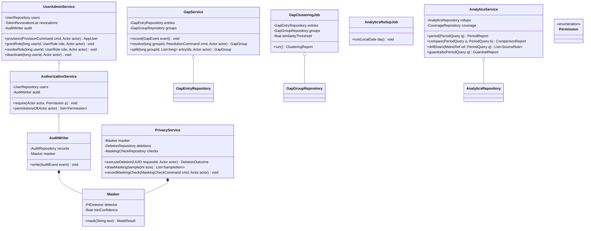

# Backend LLD — Pass 3: Gaps, Analytics, Roles, Audit and Privacy

## 1. Requirements & Scope

### 1.1 Functional scope

| Req | What this pass must make implementable |
|---|---|
| REQ-011 | Gap entries from no-answer, unhelpful ratings and edited replies; grouping by meaning across six languages; frequency ranking; four resolution types; group splitting; resolved groups stop counting |
| REQ-012 | Deflection, resolution time, assist usage, quality ratings, language mix, top unanswered topics; drill-down to source rows; period comparison; low-volume warning; named missing intervals; export |
| REQ-013 | Four roles with enforced permissions; identification before any role-bound action; refused attempts recorded; **user provisioning and deactivation** (Stage 4 Medium-5) |
| REQ-014 | Immutable audit of knowledge lifecycle, answers shown, replies sent, threshold changes, language enablement, access refusals, deletions; 3-year retention |
| REQ-015 | ≥98% masking recall; masking before storage for analytics/gaps/reuse; withhold when uncertain; periodic verification sample; deletion on request with defined survivors |
| **Medium-1** | The repeat-contact guardrail that is not computable against anonymous customers |

### 1.2 Out of scope

Should-Have and Could-Have features (Phase 2/3). The frontend's rendering of any of this (Stage 5b).

### 1.3 Open assumptions

- **AS-P3-1:** Gap grouping uses the same multilingual embedding space already computed for retrieval (pass 1). Stage 4's Medium-3 called this the obvious approach; adopting it means cross-language grouping falls out for free — a Tamil and an English phrasing of the same question land in one group without a translation step.
- **AS-P3-2:** Analytics periods are day-aligned in the operator's timezone, stored UTC. Stated because "average resolution time for last week" is ambiguous otherwise, and a silent UTC-day boundary would make figures disagree with the supervisor's intuition every single week.
- **AS-P3-3:** The masking model is recall-tuned, so over-masking is expected and accepted. REQ-015 weights recall over precision explicitly; this assumption is what makes §6.5's "withhold when uncertain" rule cheap rather than crippling.

## 2. Core Entities & Data Modeling

### 2.1 Entities

| Entity | Is |
|---|---|
| `GapEntry` | One recorded failure to answer, with its query and cause |
| `GapGroup` | A cluster of gap entries meaning the same thing, with a resolution state |
| `AppUser` / `UserRole` | An identified person and what they are permitted to do |
| `AuditRecord` | An immutable statement that something happened, who did it, and when |
| `AnalyticsDaily` | A materialised per-day rollup, the unit every period figure sums from |
| `MaskingCheck` | The result of one manual verification sample (REQ-015's evidence) |
| `DeletionRequest` | A customer's erasure request and what it removed |

### 2.2 Schema

```sql
-- ============ Users and roles (REQ-013; resolves Stage 4 Medium-5) ============
CREATE TYPE user_role AS ENUM ('agent','knowledge_manager','supervisor','administrator');

CREATE TABLE app_user (
    id              BIGINT GENERATED ALWAYS AS IDENTITY PRIMARY KEY,
    external_id     TEXT        NOT NULL UNIQUE,     -- identity-provider subject
    display_name    TEXT        NOT NULL,
    email           TEXT        NOT NULL UNIQUE,
    primary_language CHAR(3)    NOT NULL,
    is_active       BOOLEAN     NOT NULL DEFAULT TRUE,
    deactivated_at  TIMESTAMPTZ,
    deactivated_by  BIGINT      REFERENCES app_user(id),
    created_at      TIMESTAMPTZ NOT NULL DEFAULT now(),
    CONSTRAINT ck_deactivation_complete CHECK (
        is_active OR (deactivated_at IS NOT NULL AND deactivated_by IS NOT NULL)
    )
);
-- Deactivation, never deletion: every audit record references an actor, and a deleted
-- user would orphan the attribution that REQ-014 exists to preserve.

CREATE TABLE user_role_grant (
    user_id     BIGINT      NOT NULL REFERENCES app_user(id),
    role        user_role   NOT NULL,
    granted_by  BIGINT      NOT NULL REFERENCES app_user(id),
    granted_at  TIMESTAMPTZ NOT NULL DEFAULT now(),
    PRIMARY KEY (user_id, role)
);
-- Multiple roles per user allowed: a knowledge manager who also takes conversations is
-- a real staffing pattern, and forcing a second account would break attribution.

-- Backfill the FKs pass 1 and pass 2 deferred:
ALTER TABLE source_document   ADD CONSTRAINT fk_sd_user   FOREIGN KEY (uploaded_by) REFERENCES app_user(id);
ALTER TABLE knowledge_item    ADD CONSTRAINT fk_ki_sub    FOREIGN KEY (submitted_by) REFERENCES app_user(id);
ALTER TABLE agent_presence    ADD CONSTRAINT fk_pres_user FOREIGN KEY (agent_id) REFERENCES app_user(id);

-- ============ Gap entries and groups (REQ-011) ============
CREATE TYPE gap_cause AS ENUM ('no_match','below_bar','grounding_failed','conflict','rated_unhelpful','edited_before_send');
CREATE TYPE gap_resolution AS ENUM ('open','resolved_with_item','retrieval_failure','out_of_domain','pending_external');

CREATE TABLE gap_entry (
    id              BIGINT GENERATED ALWAYS AS IDENTITY,
    group_id        BIGINT      REFERENCES gap_group(id),   -- NULL until clustered
    conversation_id UUID,
    answer_id       UUID,
    query_text      TEXT        NOT NULL,          -- ALREADY MASKED at write (§6.5)
    query_language  CHAR(3)     NOT NULL,
    cause           gap_cause   NOT NULL,
    embedding       VECTOR(1024),                  -- reused from the answer's query embedding
    created_at      TIMESTAMPTZ NOT NULL DEFAULT now(),
    PRIMARY KEY (id, created_at)
) PARTITION BY RANGE (created_at);

CREATE INDEX idx_gap_ungrouped ON gap_entry (created_at) WHERE group_id IS NULL;
-- Serves: the hourly clustering job, which only ever looks at unclustered entries.
CREATE INDEX idx_gap_group ON gap_entry (group_id);

CREATE TABLE gap_group (
    id              BIGINT GENERATED ALWAYS AS IDENTITY PRIMARY KEY,
    centroid        VECTOR(1024) NOT NULL,
    label           TEXT        NOT NULL,          -- representative query, masked
    entry_count     INTEGER     NOT NULL DEFAULT 0,
    language_spread JSONB       NOT NULL DEFAULT '{}',   -- {"tam": 12, "eng": 3}
    resolution      gap_resolution NOT NULL DEFAULT 'open',
    resolved_item_id UUID       REFERENCES knowledge_item(id),
    resolution_owner BIGINT     REFERENCES app_user(id),  -- required for pending_external
    resolved_by     BIGINT      REFERENCES app_user(id),
    resolved_at     TIMESTAMPTZ,
    updated_at      TIMESTAMPTZ NOT NULL DEFAULT now(),

    CONSTRAINT ck_resolution_complete CHECK (
        resolution <> 'resolved_with_item' OR resolved_item_id IS NOT NULL
    ),
    CONSTRAINT ck_pending_has_owner CHECK (
        resolution <> 'pending_external' OR resolution_owner IS NOT NULL
    )
);
CREATE INDEX idx_gap_group_open ON gap_group (entry_count DESC)
    WHERE resolution = 'open';
-- Serves: the ranked actionable queue. Partial so resolved groups leave the hot index
-- (REQ-011: a resolved group stops counting as an open gap).

-- ============ Audit (REQ-014) ============
CREATE TABLE audit_record (
    id              BIGINT GENERATED ALWAYS AS IDENTITY,
    action          TEXT        NOT NULL,          -- 'approve','retire','reply_sent',...
    actor_user_id   BIGINT      REFERENCES app_user(id),   -- NULL for system actions
    actor_kind      TEXT        NOT NULL,          -- 'user','system','public'
    subject_type    TEXT        NOT NULL,          -- 'knowledge_item','conversation',...
    subject_id      TEXT        NOT NULL,
    detail          JSONB       NOT NULL,          -- action-specific; masked before write
    occurred_at     TIMESTAMPTZ NOT NULL DEFAULT now(),
    PRIMARY KEY (id, occurred_at)
) PARTITION BY RANGE (occurred_at);
-- Monthly partitions (resolves Stage 4 High-5 for this table): 3-year retention becomes
-- a partition DROP, and analytics scans stay bounded to the period selected.

CREATE INDEX idx_audit_subject ON audit_record (subject_type, subject_id, occurred_at DESC);
-- Serves: "reconstruct this conversation" and "what happened to this item" (REQ-014).
CREATE INDEX idx_audit_actor ON audit_record (actor_user_id, occurred_at DESC);
CREATE INDEX idx_audit_action ON audit_record (action, occurred_at DESC);

REVOKE UPDATE, DELETE, TRUNCATE ON audit_record FROM app_role;
REVOKE UPDATE, DELETE, TRUNCATE ON answer_record, answer_citation FROM app_role;
-- REQ-014 requires immutability from every role including administrator. Enforced by the
-- absence of the grant, not by application discipline. Partition drops for retention run
-- under the maintenance role, whose credentials are not present on the running host
-- (pass 1 §2.6) — which is what stops "retention" becoming a general delete capability.

-- ============ Analytics rollups (REQ-012) ============
CREATE TABLE analytics_daily (
    day                     DATE        NOT NULL,
    language                CHAR(3)     NOT NULL,
    surface                 conversation_surface NOT NULL,
    conversations_started   INTEGER     NOT NULL DEFAULT 0,
    self_resolved           INTEGER     NOT NULL DEFAULT 0,
    agent_resolved          INTEGER     NOT NULL DEFAULT 0,
    abandoned               INTEGER     NOT NULL DEFAULT 0,
    callback_recorded       INTEGER     NOT NULL DEFAULT 0,
    answers_shown           INTEGER     NOT NULL DEFAULT 0,
    no_answers              INTEGER     NOT NULL DEFAULT 0,
    conflicts               INTEGER     NOT NULL DEFAULT 0,
    assist_suggested        INTEGER     NOT NULL DEFAULT 0,
    assist_accepted         INTEGER     NOT NULL DEFAULT 0,
    assist_edited           INTEGER     NOT NULL DEFAULT 0,
    ratings_positive        INTEGER     NOT NULL DEFAULT 0,
    ratings_negative        INTEGER     NOT NULL DEFAULT 0,
    resolution_seconds_sum  BIGINT      NOT NULL DEFAULT 0,
    resolution_count        INTEGER     NOT NULL DEFAULT 0,
    handover_after_failed_self_serve INTEGER NOT NULL DEFAULT 0,
    handover_direct         INTEGER     NOT NULL DEFAULT 0,
    computed_at             TIMESTAMPTZ NOT NULL DEFAULT now(),
    PRIMARY KEY (day, language, surface)
);
-- Sums and counts, never pre-divided averages: averaging averages across a period is
-- simply wrong, and storing the numerator and denominator separately makes every period
-- aggregation exact.

CREATE TABLE analytics_gap_day (
    day             DATE        NOT NULL,
    computed_at     TIMESTAMPTZ NOT NULL,
    PRIMARY KEY (day)
);
-- Records which days HAVE been computed. Its absence is how §6.3 names a missing
-- interval instead of silently averaging across it (REQ-012).

-- ============ Privacy (REQ-015) ============
CREATE TABLE masking_check (
    id              BIGINT GENERATED ALWAYS AS IDENTITY PRIMARY KEY,
    sampled_at      TIMESTAMPTZ NOT NULL DEFAULT now(),
    sample_size     INTEGER     NOT NULL CHECK (sample_size > 0),
    misses_found    INTEGER     NOT NULL CHECK (misses_found >= 0),
    checked_by      BIGINT      NOT NULL REFERENCES app_user(id),
    notes           TEXT,
    CONSTRAINT ck_misses_within_sample CHECK (misses_found <= sample_size)
);
-- The evidence artefact behind the ≥98% recall claim. A claim with no stored measurement
-- is an assertion; this table is what makes it auditable.

CREATE TABLE deletion_request (
    id                  UUID        PRIMARY KEY,
    customer_key_hash   BYTEA       NOT NULL,
    requested_at        TIMESTAMPTZ NOT NULL DEFAULT now(),
    executed_at         TIMESTAMPTZ,
    executed_by         BIGINT      REFERENCES app_user(id),
    conversations_removed INTEGER,
    gap_entries_removed INTEGER,
    items_retained      INTEGER     -- published knowledge survives (REQ-015)
);
```

### 2.3 The repeat-contact guardrail (resolves Stage 4 Medium-1)

Stage 4 found this guardrail not computable: it needs two conversations linked to one customer, and customers are anonymous by default. Three options were on the table; the resolution is stated here rather than left to Stage 8.

**Chosen: a pseudonymous customer key, with the limitation published alongside every figure derived from it.**

```sql
ALTER TABLE conversation ADD COLUMN customer_key_hash BYTEA;
CREATE INDEX idx_conv_customer_key ON conversation (customer_key_hash, started_at DESC)
    WHERE customer_key_hash IS NOT NULL;
```

The public client holds a random key in browser storage and sends it with each conversation start; the server stores only its hash. This links a returning customer *on the same browser* and nothing else.

**What it cannot see, stated because a guardrail believed to be exact is worse than one known to be approximate:** a customer who switches device or browser, clears storage, or contacts by phone appears as a new person, so the measured repeat-contact rate is a **lower bound**. The API returns it with an explicit `is_lower_bound: true` and a coverage figure (share of conversations carrying a key), and the supervisor console must display both — a bare percentage here would be read as exact and would understate exactly the failure the guardrail exists to catch.

Rejected alternatives: scoping the guardrail to identified customers only (OQ-6 is unresolved, so that scopes it to nothing today); and heuristic linking on query similarity plus timing (invents a fuzzy identity for a privacy-sensitive population, which is a worse trade than an honest lower bound).

## 3. Class Diagram & Design Patterns



### 3.1 Patterns

| Pattern | Where | Why here |
|---|---|---|
| **Policy table (RBAC matrix)** | `AuthorizationService` + `Permission` enum | REQ-013 defines four roles against a fixed permission set. A declarative matrix checked in one place means adding a permission is a table row, and — more importantly — the matrix is directly readable against the requirement during Stage 9 review |
| **Decorator** | `AuditWriter` wrapping `Masker` | Every audit write is masked on the way in. Making masking a decorator rather than a call site rule means an audit write **cannot** bypass it, which is the whole point of REQ-015 |
| **Command** | `ResolutionCommand`, `ProvisionCommand`, `MaskingCheckCommand` | These are the operations that need actor, reason and validation as one unit; passing loose parameters is how a reason field goes missing on the one path that needed it |
| **Materialised rollup** (not a pattern name so much as a stance) | `analytics_daily` | Sums and counts per day; every period figure is a sum over days. This is what makes drill-down cheap and period comparison exact |

## 4. API Contract & Edge Layer

### 4.1 Endpoints

| Verb & path | Purpose | Authorisation |
|---|---|---|
| `GET /api/v1/gaps/groups` | Ranked open gap groups | knowledge_manager, administrator |
| `GET /api/v1/gaps/groups/{id}` | Group detail: entries, language spread, attempted answers | knowledge_manager, administrator |
| `POST /api/v1/gaps/groups/{id}/resolve` | Resolve as one of four types | knowledge_manager, administrator |
| `POST /api/v1/gaps/groups/{id}/split` | Split entries into a new group | knowledge_manager, administrator |
| `GET /api/v1/analytics/period` | KPI figures for a period | supervisor, administrator |
| `GET /api/v1/analytics/guardrails` | Guardrail figures with their caveats | supervisor, administrator |
| `GET /api/v1/analytics/compare` | Two periods and the difference | supervisor, administrator |
| `GET /api/v1/analytics/drill-down` | Underlying rows for one figure | supervisor, administrator |
| `GET /api/v1/analytics/export` | Export exactly the figures shown | supervisor, administrator |
| `POST /api/v1/admin/users` | Provision a user | administrator |
| `POST /api/v1/admin/users/{id}/roles` | Grant a role | administrator |
| `DELETE /api/v1/admin/users/{id}/roles/{role}` | Revoke a role | administrator |
| `POST /api/v1/admin/users/{id}/deactivate` | Deactivate, revoking tokens | administrator |
| `GET /api/v1/audit` | Query audit records | administrator, supervisor (own scope) |
| `GET /api/v1/audit/conversations/{id}` | Full sequence for one conversation | administrator, supervisor |
| `POST /api/v1/privacy/deletion-requests` | Record an erasure request | administrator |
| `POST /api/v1/privacy/deletion-requests/{id}/execute` | Execute it | administrator |
| `GET /api/v1/privacy/masking-sample` | Draw a verification sample | knowledge_manager, administrator |
| `POST /api/v1/privacy/masking-checks` | Record a check result | knowledge_manager, administrator |

There is **no** endpoint to edit or delete an audit record. That absence is the requirement.

### 4.2 DTOs

```python
class PeriodQuery(BaseModel):
    model_config = ConfigDict(extra="forbid")
    start: date
    end: date                                    # inclusive, operator timezone (AS-P3-2)
    language: Lang | None = None
    surface: Literal["self_serve", "agent"] | None = None

class MetricValue(BaseModel):
    value: Decimal | None                        # None when the denominator is zero
    numerator: int
    denominator: int
    low_volume: bool                             # denominator < low-volume threshold
    caveat: str | None = None                    # e.g. the lower-bound note in §2.3

class PeriodReport(BaseModel):
    period: PeriodQuery
    deflection_rate: MetricValue
    avg_resolution_seconds: MetricValue
    assist_usage_rate: MetricValue
    positive_rating_rate: MetricValue
    language_mix: dict[str, int]
    top_unanswered_topics: list["TopicGap"]
    low_volume_warning: bool
    missing_intervals: list["DateRange"]         # named, never averaged over (REQ-012)

class GuardrailReport(BaseModel):
    repeat_contact_rate: MetricValue             # is_lower_bound reflected in `caveat`
    repeat_contact_key_coverage: Decimal         # share of conversations carrying a key
    wrong_answer_rate_by_adoption: list["AdoptionBucket"]
    abandonment_rate: MetricValue
    handover_resolution_delta_seconds: MetricValue
    language_parity: list["LanguageParityRow"]
    breached: list[str]                          # names of breached guardrails

class ResolutionCommand(BaseModel):
    model_config = ConfigDict(extra="forbid")
    resolution: Literal["resolved_with_item","retrieval_failure","out_of_domain","pending_external"]
    item_id: UUID | None = None                  # required iff resolved_with_item
    owner_user_id: int | None = None             # required iff pending_external
    note: str | None = None

class ProvisionCommand(BaseModel):
    model_config = ConfigDict(extra="forbid")
    external_id: str
    display_name: str
    email: str
    primary_language: Lang
    roles: list[Literal["agent","knowledge_manager","supervisor","administrator"]]
    working_languages: list[Lang] = Field(default_factory=list)   # agents only (AS-P2-2)

class MaskResult(BaseModel):
    text: str
    entities_masked: int
    min_confidence: Decimal
    withheld: bool                               # True → the content must not be stored/reused
```

### 4.3 Permission matrix (REQ-013, declarative)

| Permission | agent | knowledge_manager | supervisor | administrator |
|---|---|---|---|---|
| `answer.use_assist` | ✅ | ✅ | ✅ | ✅ |
| `conversation.handle` | ✅ | — | — | ✅ |
| `feedback.submit` | ✅ | ✅ | ✅ | ✅ |
| `knowledge.read` | ✅ | ✅ | ✅ | ✅ |
| `knowledge.write` | — | ✅ | — | ✅ |
| `knowledge.approve` | — | ✅ | — | ✅ |
| `knowledge.retire` | — | ✅ | — | ✅ |
| `knowledge.classify` | — | ✅ | — | ✅ |
| `gaps.manage` | — | ✅ | — | ✅ |
| `analytics.read_all` | — | — | ✅ | ✅ |
| `queue.override` | — | — | ✅ | ✅ |
| `audit.read` | — | — | ✅ (scoped) | ✅ |
| `admin.users` | — | — | — | ✅ |
| `admin.thresholds` | — | — | — | ✅ |
| `admin.languages` | — | — | — | ✅ |
| `privacy.delete` | — | — | — | ✅ |
| `coverage.declare` | — | ✅ | — | ✅ |

The agent row is exactly REQ-013's "read approved knowledge, use assist, submit feedback and gap entries, and nothing else". The customer-facing assistant holds no role at all and reaches only the public endpoints, which is how REQ-013's "never any internal note, rating or gap entry" is enforced structurally rather than by filtering responses.

### 4.4 Error mapping

| Exception | Status | `code` |
|---|---|---|
| `PermissionDenied` | 403 | `auth.forbidden` — **always recorded** (REQ-013) |
| `UserNotFound` | 404 | `admin.user_not_found` |
| `LastAdministratorRemoval` | 409 | `admin.last_administrator` |
| `GroupNotFound` | 404 | `gaps.group_not_found` |
| `ResolutionIncomplete` | 422 | `gaps.resolution_incomplete` |
| `GroupAlreadyResolved` | 409 | `gaps.already_resolved` |
| `PeriodTooLarge` | 422 | `analytics.period_too_large` |
| `DeletionAlreadyExecuted` | 409 | `privacy.already_executed` |
| `MaskingUncertain` | internal | never surfaces; triggers withholding (§6.5) |

`LastAdministratorRemoval` exists because a system whose last administrator can be deactivated is a system that can be locked permanently — a small guard against a large, unrecoverable mistake.

## 5. SOLID Breakdown

- **SRP** — `Masker` decides *what is sensitive*; `AuditWriter` decides *what is recorded*; `PrivacyService` decides *what is removed*. Merging masking into the audit writer would be tempting (they always run together) and wrong: the same masker serves gap entries and analytics, and duplicating it per call site is how one path ends up unmasked.
- **OCP** — new audit actions are new `AuditEvent` values with no change to the writer; new recognisers (a new identifier format) plug into `PiiDetector` without touching anything that calls `mask`.
- **LSP** — every `PiiDetector` implementation must be recall-comparable and must report a confidence; a detector that returns high confidence on a miss violates the contract §6.5 depends on. Stated because a faster, less careful detector is exactly the kind of substitution someone would make under time pressure.
- **ISP** — `AuditRepository` exposes `append` and `query` and no mutation methods at all. The interface itself cannot express an update, which reinforces the missing database grant rather than relying on it alone.
- **DIP** — `AuthorizationService` is injected into every service that guards an action; no service consults the role enum directly, which keeps the matrix in §4.3 the single readable source of truth for a reviewer checking it against REQ-013.

## 6. Interface & Skeleton Code

### 6.1 `GapClusteringJob.run` (REQ-011, AS-P3-1)

```
run():
    # Only unclustered entries — this job never re-groups a resolved group's members,
    # which is what stops a manager's resolution being silently undone next hour.
    pending = entries.unclustered(limit=5000)
    report = ClusteringReport()

    for entry in pending:
        if entry.embedding is None: continue          # answer path failed before embedding
        nearest = groups.nearest_open(entry.embedding, limit=1)

        if nearest and cosine(nearest.centroid, entry.embedding) >= SIMILARITY_THRESHOLD:
            with transaction():
                entry.group_id = nearest.id
                nearest.entry_count += 1
                nearest.centroid = incremental_mean(nearest.centroid, entry.embedding,
                                                    nearest.entry_count)
                nearest.language_spread[entry.query_language] += 1
                # Cross-language grouping falls out here for free: a Tamil and an English
                # phrasing of one question sit close in the shared space (AS-P3-1).
                entries.save(entry); groups.save(nearest)
        else:
            with transaction():
                g = groups.create(centroid=entry.embedding, label=entry.query_text,
                                  entry_count=1,
                                  language_spread={entry.query_language: 1})
                entry.group_id = g.id; entries.save(entry)
        report.count += 1
    return report
```

Groups below the gap group-size threshold (5, per the PRD's Decision Thresholds) exist but are not surfaced as actionable — the threshold filters the *queue view*, not the clustering, so a group that later grows past 5 appears with its full history rather than starting from that moment.

### 6.2 `GapService.resolve`

```
resolve(group_id, cmd, actor):
    authz.require(actor, Permission.GAPS_MANAGE)
    with transaction():
        g = groups.get_for_update(group_id)
        if g is None: raise GroupNotFound
        if g.resolution != 'open': raise GroupAlreadyResolved

        if cmd.resolution == 'resolved_with_item':
            if cmd.item_id is None: raise ResolutionIncomplete('item_id required')
            item = items.get(cmd.item_id)
            if item is None or item.status not in ('approved','stale'):
                raise ResolutionIncomplete('linked item must be answerable')
                # Resolving against a pending or retired item would close the gap while
                # the question remains unanswerable — the exact self-deception this guards.
            g.resolved_item_id = cmd.item_id
        elif cmd.resolution == 'pending_external':
            if cmd.owner_user_id is None: raise ResolutionIncomplete('owner required')
            g.resolution_owner = cmd.owner_user_id
            # REQ-011: stays visible in reporting rather than closing (§6.3 counts it
            # as open for the unanswered-topics view, but out of the actionable queue).

        g.resolution = cmd.resolution
        g.resolved_by, g.resolved_at = actor.user_id, now()
        groups.save(g)
        audit.write(action='gap_resolve', subject=group_id, actor=actor, detail=cmd)
    return g
```

### 6.3 `AnalyticsService.period` and the missing-interval rule

```
period(q):
    if days_in(q) > MAX_PERIOD_DAYS: raise PeriodTooLarge
    days = rollups.range(q.start, q.end, language=q.language, surface=q.surface)
    computed = coverage.computed_days(q.start, q.end)      # analytics_gap_day
    missing  = date_range(q.start, q.end) - computed
    # REQ-012: name the gap, never average across it. Silently summing present days and
    # dividing by the full period length would understate every rate by the missing share.

    total_conv   = sum(d.conversations_started for d in days)
    self_res     = sum(d.self_resolved for d in days)
    abandoned    = sum(d.abandoned for d in days)
    # Deflection excludes abandoned from the numerator AND keeps it in the denominator,
    # per requirements v1.1: a customer who gave up is not a deflection.
    deflection   = metric(numerator=self_res, denominator=total_conv)

    res_sum      = sum(d.resolution_seconds_sum for d in days)
    res_count    = sum(d.resolution_count for d in days)
    avg_res      = metric(numerator=res_sum, denominator=res_count)
    # Sums divided once at the end — never a mean of daily means (§2.2 rationale).

    low_volume   = total_conv < thresholds.low_volume
    return PeriodReport(..., low_volume_warning=low_volume, missing_intervals=missing)
```

### 6.4 `AnalyticsService.guardrails` (Medium-1 made honest)

```
guardrails(q):
    # 1. Repeat contact — a LOWER BOUND, and labelled as one everywhere it appears.
    keyed        = rollups.conversations_with_customer_key(q)
    repeats      = rollups.customers_with_second_conversation_within(q, days=7)
    coverage_pct = keyed / total_conversations(q) if total > 0 else None
    repeat = metric(numerator=repeats, denominator=keyed,
                    caveat=f"Lower bound. Links same-browser contacts only; "
                           f"{coverage_pct:.0%} of conversations carried a key.")

    # 2. Wrong-answer rate against assist adoption — bucketed, because the guardrail is
    #    about the RELATIONSHIP ("must not rise as adoption rises"), not a single number.
    buckets = [adoption_bucket(b, q) for b in (0..25, 25..50, 50..75, 75..100)]

    # 3. Abandonment, 4. handover resolution delta, 5. language parity vs English.
    parity = [row for lang in enabled_languages()
              if correctness(lang, q) is not None]

    breached = names_of(g for g in all_guardrails if g.breaches_baseline())
    return GuardrailReport(..., breached=breached)
```

Guardrails are returned by the same call pattern as KPIs and are intended to be rendered beside them, per the HLD's stance that a guardrail nobody looks at guards nothing.

### 6.5 `Masker.mask` and the withholding rule (REQ-015)

```
mask(text):
    entities = detector.detect(text)              # Presidio + Indian recognisers
    if any(e.confidence < MIN_CONFIDENCE for e in entities):
        # AS-P3-3: the detector is recall-tuned, so a low-confidence hit means
        # "possibly sensitive, not sure". REQ-015 says withhold rather than store.
        return MaskResult(text='', entities_masked=0,
                          min_confidence=min_conf, withheld=True)
    masked = replace_spans(text, entities, placeholder_by_type)
    return MaskResult(text=masked, entities_masked=len(entities),
                      min_confidence=min_conf, withheld=False)
```

Call sites, all of them, and what withholding means at each:

| Call site | On `withheld=True` |
|---|---|
| Gap entry write (§6.1's input) | Entry recorded with `query_text = '[withheld: manual review required]'` and flagged; the *count* still contributes to its group, because losing the signal would hide a real gap |
| Audit `detail` | The field is replaced with a withheld marker; the audit record itself is still written — an unwritten audit record is a worse failure than a redacted one |
| Message body persisted for a conversation | **Not masked.** The live transcript is the working record the agent needs; masking applies when content is stored *for analytics, gap entries or reuse* (REQ-015's exact wording), and the transcript is protected by retention and access control instead |
| Ticket-derived knowledge (Phase 2) | Item is not citable (BR-7); it stays in manual review |

That third row is the distinction most likely to be implemented wrongly in either direction — masking the live transcript would make agents unable to help, and failing to mask the derived stores would breach REQ-015.

### 6.6 `PrivacyService.executeDeletion` (REQ-015's exact survivors)

```
executeDeletion(request_id, actor):
    authz.require(actor, Permission.PRIVACY_DELETE)
    with transaction():
        req = deletions.get_for_update(request_id)
        if req.executed_at is not None: raise DeletionAlreadyExecuted

        convs = conversations.by_customer_key(req.customer_key_hash)
        removed_msgs = messages.delete_for_conversations(convs)
        removed_convs = conversations.delete(convs)

        # Gap entries derived SOLELY from these conversations go; entries already merged
        # into a group keep their count contribution but lose their text and linkage.
        removed_gaps = gaps.delete_unresolved_derived_from(convs)

        # SURVIVES, deliberately, per requirements v1.1:
        #   - the audit record of this deletion itself
        #   - any approved knowledge item published from that content
        #   - aggregate counts already reported (analytics_daily rows are untouched)
        req.executed_at, req.executed_by = now(), actor.user_id
        req.conversations_removed = removed_convs
        req.gap_entries_removed = removed_gaps
        req.items_retained = items.count_published_from(convs)
        deletions.save(req)
        audit.write(action='privacy_deletion', subject=request_id, actor=actor,
                    detail={'conversations': removed_convs, 'gaps': removed_gaps})
```

Note the deliberate ordering: the audit write is the **last** statement in the transaction and is never conditional. A deletion that removed data without leaving a record of having done so would be indistinguishable from data loss.

### 6.7 `AuthorizationService.require`

```
require(actor, permission):
    if actor.user_id is None: raise PermissionDenied('unidentified')
    user = users.get(actor.user_id)
    if user is None or not user.is_active: raise PermissionDenied('inactive')
    if permission not in PERMISSIONS_BY_ROLE_UNION(user.roles):
        audit.write(action='access_refused', actor=actor,
                    subject_type='permission', subject_id=permission.name)
        raise PermissionDenied(permission.name)
    # REQ-013: every refusal is recorded. Note it is written BEFORE the raise, so a
    # refusal cannot be lost by an exception path that skips logging.
```

### 6.8 Repository contracts

```python
class AuditRepository(Protocol):
    def append(self, record: AuditRecord) -> None:
        """Insert within the caller's transaction; does not commit. There is no update
        or delete method on this interface by design, and the application database role
        holds no such grant (§2.2). Raises PersistenceError on failure — the caller must
        then roll back the action being audited: an unaudited governance action is not
        an acceptable outcome (REQ-014)."""

    def for_subject(self, subject_type: str, subject_id: str) -> list[AuditRecord]:
        """Read-only, ordered by occurred_at ascending. Uses idx_audit_subject.
        Returns [] for an unknown subject; absence is not an error."""

class AnalyticsRepository(Protocol):
    def range(self, start: date, end: date, **filters) -> list[AnalyticsDaily]:
        """Returns only days actually computed. Callers MUST cross-check against
        computed_days() and surface the difference — this interface deliberately does
        not fabricate zero rows for missing days, because a fabricated zero is
        indistinguishable from a real quiet day (REQ-012)."""

    def computed_days(self, start: date, end: date) -> set[date]:
        """From analytics_gap_day. Read-only."""

class GapGroupRepository(Protocol):
    def nearest_open(self, embedding: list[float], limit: int) -> GapGroup | None:
        """Vector search over open groups only. Resolved groups are excluded so a new
        entry never re-opens a manager's decision; if the question genuinely recurs it
        forms a fresh group, which is the visible signal that the resolution did not work."""

    def get_for_update(self, group_id: int) -> GapGroup | None:
        """Row lock; precondition open transaction. Guards concurrent resolution."""
```

## 7. Concurrency, Thread-Safety & Edge Cases

### 7.1 Races and mechanisms

| Race | Mechanism | Why |
|---|---|---|
| Two managers resolve the same group | `get_for_update` + `resolution != 'open'` check | The second must see the first's decision, not merge with it |
| Clustering job racing a manual split | Clustering touches only unclustered entries; split touches only grouped ones | Disjoint working sets, so no lock is needed at all — the cheapest correct answer |
| Rollup job re-run for the same day | `INSERT ... ON CONFLICT (day, language, surface) DO UPDATE` — full recompute, not increment | Idempotent by construction. An incremental rollup that ran twice would double-count, and the failure would be invisible in the figures |
| Deletion racing an in-flight conversation | Conversation row locks acquired in the deletion transaction | An in-flight message write blocks until deletion commits, then fails on the missing conversation |
| Role revoked mid-session | Token revocation list in Redis, checked per request | REQ-013's intent is that a removed permission takes effect now, not at token expiry |
| Last administrator deactivated | Counted under lock in the same transaction | `LastAdministratorRemoval`; a permanent lockout is not recoverable in-product |
| Audit write fails after the action commits | Impossible by construction: the audit `append` is inside the action's transaction | This is why `AuditRepository.append` explicitly does not commit |

### 7.2 Isolation

`READ COMMITTED`, with `SERIALIZABLE` for exactly one path: the last-administrator check, where the anomaly is two concurrent deactivations each observing one remaining administrator. This is the one place in the whole design where a phantom read is genuinely dangerous and the transaction is short enough that serialisation costs nothing.

### 7.3 Retention

Partition drops for `audit_record` beyond 3 years, `conversation`/`message`/`answer_record`/`gap_entry` beyond 12 months, executed by the maintenance role on a schedule. `analytics_daily` is never dropped — it holds no personal data and is the only surviving record of what happened in an expired period, which is precisely why REQ-015 lets aggregates survive a deletion request.

## 8. Test Strategy

### 8.1 Unit scenarios

1. Permission matrix: every (role, permission) pair asserted against §4.3. Table-driven, 68 assertions — the direct check of REQ-013.
2. Unidentified actor on any role-bound permission → `PermissionDenied('unidentified')`.
3. Inactive user with a valid token → denied; assert the refusal was recorded.
4. Refusal recorded **before** the exception propagates (assert the audit row exists after catching).
5. Resolve `resolved_with_item` pointing at a `pending_review` item → `ResolutionIncomplete`.
6. Resolve `resolved_with_item` pointing at a `retired` item → `ResolutionIncomplete`.
7. Resolve `pending_external` without an owner → `ResolutionIncomplete`.
8. Resolve an already-resolved group → `GroupAlreadyResolved`.
9. Masking with a low-confidence entity → `withheld=True`, empty text.
10. Masking a clean string → `withheld=False`, text unchanged, `entities_masked=0`.
11. Deflection maths: 100 conversations, 30 self-resolved, 20 abandoned → 30%, **not** 37.5%. The v1.1 denominator rule.
12. Average resolution time across two days with different volumes → weighted correctly; asserts it is not a mean of daily means.
13. Period with one uncomputed day → that day named in `missing_intervals` and excluded from denominators.
14. Period below the low-volume threshold → `low_volume_warning=True` and the figure still returned.
15. Repeat-contact metric → `caveat` present, non-empty, and coverage reported. Asserts the guardrail can never be rendered as a bare exact figure.
16. Last-administrator deactivation → `LastAdministratorRemoval`.

### 8.2 Integration scenarios

17. **Audit immutability:** attempt `UPDATE audit_record` and `DELETE FROM audit_record` as the application role → both fail on missing privilege. The REQ-014 structural test, and it must fail if someone grants the privilege "temporarily".
18. **Same for `answer_record`** and `answer_citation`.
19. **Cross-language gap grouping:** a Tamil and an English phrasing of the same question land in one group (AS-P3-1 working as claimed).
20. **Clustering idempotence:** running the job twice adds no entries to any group the second time.
21. **Resolved groups do not re-open:** resolve a group, feed an identical query → a *new* group forms rather than the resolved one growing.
22. **Concurrent resolution:** two managers resolve one group → exactly one succeeds, the other gets 409.
23. **Rollup idempotence:** run the day's rollup twice → figures identical, not doubled.
24. **Full deletion:** transcripts and derived unresolved gap entries removed; the deletion's own audit record present; a knowledge item published from that conversation still present and still answerable; `analytics_daily` counts unchanged. All four survivors asserted in one test, because it is their *combination* that REQ-015 specifies.
25. **Deletion racing a message write:** the write fails cleanly; no orphaned message row.
26. **Role revocation mid-session:** revoke, then reuse the still-valid token → denied on the next request, refusal recorded.
27. **End-to-end traceability:** ask a question, get an answer, agent edits and sends → `GET /audit/conversations/{id}` returns the query, the answer shown, the citations, the sent text and the edited flag in order. This is the single test that demonstrates the PRD's central promise holds through three passes of design.
28. **Masking verification loop:** draw a sample, record a check with misses, assert the recorded recall is derivable from `masking_check` rows.

### 8.3 Mocking boundaries

The permission matrix, deflection arithmetic, missing-interval logic and masking decisions are pure functions of their inputs and are unit-tested with everything mocked — they are also where a subtle error is most likely and hardest to notice in production. Tests 17–18 and 22–26 require a real database because grants, row locks and cascade behaviour exist nowhere else. The PII detector is faked in unit tests with scripted confidences, and exercised for real only in the recall-measurement suite, which is a scheduled job rather than a per-commit test — a 98% recall claim is measured on a corpus, not asserted on three examples.

### 8.4 Concurrency mechanisms traced to tests

Group-resolution row lock → 22; rollup idempotence via upsert → 23; deletion conversation locks → 25; token revocation → 26; serialisable last-administrator check → 16 (unit) and its concurrent variant in 22's harness; audit-inside-transaction guarantee → 27 (an action rolled back leaves no audit row and vice versa).
