# Backend LLD — Pass 1: Answer Path and Knowledge Lifecycle

> **Pass structure.** Stage 5a is split into three passes at full depth rather than one shallow pass, per the skill's depth-over-breadth rule and the workflow's zero-shortcuts policy. Pass 1 (this document) covers REQ-002, REQ-003, REQ-004, REQ-005, REQ-009, REQ-010 and the answering half of REQ-023. Pass 2 covers conversation, handover, presence and assignment (REQ-006, REQ-007, REQ-008). Pass 3 covers gaps, analytics, roles, audit and privacy (REQ-011 to REQ-015). Each pass carries its own gate.

## 1. Requirements & Scope

### 1.1 Functional scope of this pass

| Req | What this pass must make implementable |
|---|---|
| REQ-002 | Ingest documents and manual entries; extract, detect metadata, near-duplicate check, chunk, embed; explicit failure states; nothing partial published |
| REQ-003 | Propose sector/topic/authority with per-field confidence; manual-classification path below the bar; corrections recorded; multi-topic; taxonomy rename preserves classifications |
| REQ-004 | Every shown answer carries ≥1 citation; multi-source citation; source-language passages; retired/superseded excluded |
| REQ-005 | Composite confidence; answer bar; no-answer behaviour; related reading; threshold changes audited |
| REQ-009 | Approve, reject, edit, re-classify, retire; version history; concurrent-edit reconciliation; unapproved never answerable |
| REQ-010 | Supersession immediate; staleness marking; review-pending on stale citations; retirement mid-conversation flagging; 30-day review-due list |
| REQ-023 (part) | Coverage floor gating of the public answer path; thin-knowledge state |

### 1.2 Non-functional targets carried from upstream

- Answer path p95 ≤ 5 s (agent) / ≤ 8 s (self-serve), decomposed into a stage budget in §4.6.
- Ingestion: 200-page document answerable within 15 minutes of upload.
- 50,000 knowledge items; ~600,000 chunks at an assumed 12 chunks/item average (AS-L2).
- 200 concurrent conversations; §7.6 converts this to an arrival rate.
- Every governance action attributable and immutable (REQ-014, detailed in Pass 3 but its write points are named here).

### 1.3 Out of scope for this pass

Explicitly excluded, to keep this document sharp: conversation and message models, handover, agent presence and assignment (Pass 2); gap queue, analytics aggregation, role/user provisioning, the audit table's own schema and privacy masking (Pass 3); ticket-history mining, portal crawling, cross-language comparison and bulk operations (Should-Have, Phase 2); every Could-Have.

The audit *write points* appear here because omitting them would make this pass's transactions wrong; the audit *schema* is Pass 3's.

### 1.4 Resolution of the seven conditions carried from Stage 4

The Stage 4 gate was approved as-is, which moved these conditions into Stage 5. Each is resolved here or explicitly assigned to a later pass:

| Condition | Resolution |
|---|---|
| High-1 — answer cache vs. immediate retirement | **Resolved in this pass, §7.3.** The cache is retained but keyed on a knowledge-generation counter incremented by every approval, retirement, supersession and edit; a generation bump invalidates every cached answer atomically. Rationale in §7.3 |
| High-2 — presence, queue, assignment | **Deferred to Pass 2**, which is the pass that owns REQ-008. Recorded so it is not lost |
| High-3 — encryption at rest and secrets | **Resolved, §2.6** |
| High-4 — API conventions and timeout budget | **Resolved, §4.1 and §4.6** |
| High-5 — partitioning and indexes | **Resolved for this pass's tables, §2.5**; audit-table partitioning is Pass 3's, noted there |
| High-6 — job failure semantics | **Resolved, §7.4** |
| Medium-1 — repeat-contact guardrail not computable | **Deferred to Pass 3** (analytics), with the decision framed there rather than silently dropped |

### 1.5 Open assumptions

- **AS-L1:** Generation runs on a GPU via vLLM. If T-1 resolves to CPU-only, §4.6's budget is unachievable and the system runs extractive-only per HLD §12.5; the code path exists either way, so this assumption changes latency, not structure.
- **AS-L2:** ~12 chunks per knowledge item on average, from an assumed mix of short circulars and long tariff schedules. Drives index sizing in §2.5 only.
- **AS-L3:** A knowledge item has exactly one source document and one language. A bilingual circular is ingested as two items that supersede nothing and cite separately. Stated because the alternative (multi-language items) would change the schema materially.
- **AS-L4:** Sector and topic form a two-level taxonomy, not an arbitrary-depth tree. REQ-003 never asks for depth; assuming a tree would add recursion to every query for no stated need.
- **AS-L5:** This pass proposes no new bounded context. Every module here implements something the HLD already ratified.

## 2. Core Entities & Data Modeling

### 2.1 Entities and their single responsibility

| Entity | Is |
|---|---|
| `KnowledgeItem` | A unit of approved-or-pending knowledge with a lifecycle status and a source |
| `KnowledgeItemVersion` | An immutable snapshot of an item's editable content at a point in time |
| `SourceDocument` | The original uploaded file, immutable, in object storage |
| `Chunk` | A citable passage of an item, carrying its heading context |
| `ChunkEmbedding` | The vector representation of a chunk in the shared multilingual space |
| `TaxonomySector` / `TaxonomyTopic` | Stable-identity classification entries whose display names may change |
| `ItemClassification` | The link of an item to a sector/topic with confidence and provenance |
| `IngestionJob` | The processing lifecycle of one submission, including its failure reason |
| `AnswerRecord` | What was shown, from which chunks, with what confidence — the audit anchor for the answer path |
| `Threshold` | A named tunable with its current value and change history |
| `KnowledgeGeneration` | A single monotonic counter making cache invalidation atomic |

### 2.2 Lifecycle states

`KnowledgeItem.status` is the single field that decides answerability. Valid transitions only:

| From | To | Trigger | Guard |
|---|---|---|---|
| `processing` | `pending_review` | Ingestion completes all stages | All chunks embedded |
| `processing` | `failed` | Any stage fails | Failure reason recorded |
| `processing` | `duplicate_hold` | Near-duplicate detected | Existing item id recorded |
| `duplicate_hold` | `pending_review` | Submitter chooses coexist | — |
| `duplicate_hold` | `pending_review` + supersede existing | Submitter chooses supersede | Existing item transitions to `superseded` |
| `pending_review` | `approved` | Knowledge manager approves | Classification complete, review date set |
| `pending_review` | `rejected` | Knowledge manager rejects | Reason required |
| `approved` | `stale` | Review date passes (scheduled sweep) | — |
| `approved` / `stale` | `retired` | Manager retires | Reason required |
| `approved` / `stale` | `superseded` | Another item supersedes it | Superseding item id recorded |
| `superseded` | `approved` | Manager reverses supersession | Reason required (PRD Feature Spec edge case) |
| `stale` | `approved` | Manager sets a new review date | — |
| `failed` | `processing` | Resubmission | — |

**Answerable set = `status IN ('approved','stale')`.** Nothing else, ever, anywhere. `stale` remains answerable by design (BR-9), carrying a review-pending flag on its citations (BR-5).

Invalid transitions raise `InvalidStateTransition` and are never silently ignored — see §7.5.

### 2.3 Schema — PostgreSQL 16

```sql
-- ============ Taxonomy (AS-L4: two levels, stable identity) ============
CREATE TABLE taxonomy_sector (
    id              BIGINT GENERATED ALWAYS AS IDENTITY PRIMARY KEY,
    code            TEXT        NOT NULL UNIQUE,   -- stable, never renamed: 'export_import'
    display_name    TEXT        NOT NULL,          -- renameable freely (REQ-003 last criterion)
    is_active       BOOLEAN     NOT NULL DEFAULT TRUE,
    created_at      TIMESTAMPTZ NOT NULL DEFAULT now()
);

CREATE TABLE taxonomy_topic (
    id              BIGINT GENERATED ALWAYS AS IDENTITY PRIMARY KEY,
    sector_id       BIGINT      NOT NULL REFERENCES taxonomy_sector(id),
    code            TEXT        NOT NULL,
    display_name    TEXT        NOT NULL,
    is_must_have    BOOLEAN     NOT NULL DEFAULT FALSE,  -- feeds the REQ-023 coverage floor
    is_active       BOOLEAN     NOT NULL DEFAULT TRUE,
    created_at      TIMESTAMPTZ NOT NULL DEFAULT now(),
    UNIQUE (sector_id, code)
);
-- Classifications reference id, never display_name, which is exactly what makes a
-- rename preserve every existing classification (REQ-003).

CREATE TABLE issuing_authority (
    id              BIGINT GENERATED ALWAYS AS IDENTITY PRIMARY KEY,
    code            TEXT        NOT NULL UNIQUE,
    display_name    TEXT        NOT NULL
);

-- ============ Source documents ============
CREATE TABLE source_document (
    id              UUID        PRIMARY KEY,
    object_key      TEXT        NOT NULL UNIQUE,   -- MinIO key; file itself is immutable
    original_name   TEXT        NOT NULL,
    mime_type       TEXT        NOT NULL,
    byte_size       BIGINT      NOT NULL CHECK (byte_size > 0),
    sha256          BYTEA       NOT NULL,          -- exact-duplicate detection, cheap first pass
    uploaded_by     BIGINT      NOT NULL,          -- app_user(id), FK added in Pass 3
    uploaded_at     TIMESTAMPTZ NOT NULL DEFAULT now()
);
CREATE INDEX idx_source_document_sha ON source_document (sha256);
-- Serves: exact-duplicate short-circuit before the expensive near-duplicate check.

-- ============ Knowledge items ============
CREATE TYPE knowledge_status AS ENUM
    ('processing','failed','duplicate_hold','pending_review','approved','stale','retired','rejected','superseded');

CREATE TYPE knowledge_source_type AS ENUM ('document','manual_entry','ticket_export','crawled_page');

CREATE TABLE knowledge_item (
    id                  UUID              PRIMARY KEY,
    status              knowledge_status  NOT NULL,
    source_type         knowledge_source_type NOT NULL,
    source_document_id  UUID              REFERENCES source_document(id),
    title               TEXT              NOT NULL,
    language            CHAR(3)           NOT NULL,        -- ISO 639-3; AS-L3: one per item
    issuing_authority_id BIGINT           REFERENCES issuing_authority(id),
    issued_on           DATE,                              -- REQ-004 BR-2: required for a complete citation
    review_due_on       DATE,                              -- BR-11: required before approval
    supersedes_id       UUID              REFERENCES knowledge_item(id),
    superseded_by_id    UUID              REFERENCES knowledge_item(id),
    current_version     INTEGER           NOT NULL DEFAULT 1,
    submitted_by        BIGINT            NOT NULL,
    approved_by         BIGINT,
    approved_at         TIMESTAMPTZ,
    status_reason       TEXT,                              -- required on reject/retire/reverse
    created_at          TIMESTAMPTZ       NOT NULL DEFAULT now(),
    updated_at          TIMESTAMPTZ       NOT NULL DEFAULT now(),

    -- BR-11: an approved item always has an approver, an approval time and a review date.
    CONSTRAINT ck_approved_completeness CHECK (
        status <> 'approved' OR
        (approved_by IS NOT NULL AND approved_at IS NOT NULL AND review_due_on IS NOT NULL)
    ),
    -- BR-2: a citable item must be able to produce a complete citation.
    CONSTRAINT ck_citable_completeness CHECK (
        status NOT IN ('approved','stale') OR
        (issuing_authority_id IS NOT NULL AND issued_on IS NOT NULL)
    ),
    -- Reject/retire/reverse must carry a reason (REQ-009).
    CONSTRAINT ck_reason_required CHECK (
        status NOT IN ('rejected','retired') OR status_reason IS NOT NULL
    ),
    CONSTRAINT ck_no_self_supersede CHECK (supersedes_id IS DISTINCT FROM id)
);

CREATE INDEX idx_ki_answerable ON knowledge_item (status) WHERE status IN ('approved','stale');
-- Serves: the retrieval filter in §4.6. Partial index because the answerable set is the
-- only one the hot path cares about, and it keeps the index small as retired items accumulate.

CREATE INDEX idx_ki_review_due ON knowledge_item (review_due_on)
    WHERE status IN ('approved','stale');
-- Serves: the daily staleness sweep and REQ-010's "due within 30 days" list.

CREATE INDEX idx_ki_superseded_by ON knowledge_item (superseded_by_id)
    WHERE superseded_by_id IS NOT NULL;
-- Serves: supersession-chain walk (PRD edge case: A superseded by B superseded by C).

CREATE INDEX idx_ki_status_updated ON knowledge_item (status, updated_at DESC);
-- Serves: the curation console's default list view, which filters by status and sorts by recency.

-- ============ Version history (REQ-009) ============
CREATE TABLE knowledge_item_version (
    item_id         UUID        NOT NULL REFERENCES knowledge_item(id),
    version         INTEGER     NOT NULL,
    title           TEXT        NOT NULL,
    body            TEXT        NOT NULL,          -- extracted or manually authored text
    issuing_authority_id BIGINT,
    issued_on       DATE,
    edited_by       BIGINT      NOT NULL,
    edited_at       TIMESTAMPTZ NOT NULL DEFAULT now(),
    change_note     TEXT,
    PRIMARY KEY (item_id, version)
);
-- Full snapshot per version, not a diff. Storage is cheap; reconstructing a document by
-- replaying diffs to answer "what did this say when it was cited" is not worth the risk.

-- ============ Chunks and embeddings ============
CREATE TABLE chunk (
    id              BIGINT GENERATED ALWAYS AS IDENTITY PRIMARY KEY,
    item_id         UUID        NOT NULL REFERENCES knowledge_item(id) ON DELETE CASCADE,
    item_version    INTEGER     NOT NULL,
    ordinal         INTEGER     NOT NULL,
    heading_path    TEXT,                          -- 'Chapter 3 > 3.2 Licensing' — BR-2 context
    body            TEXT        NOT NULL,
    char_start      INTEGER     NOT NULL,          -- offsets into the version body, for
    char_end        INTEGER     NOT NULL,          -- rendering the passage in document context
    token_count     INTEGER     NOT NULL,
    lexeme          TSVECTOR GENERATED ALWAYS AS (to_tsvector('simple', body)) STORED,
    UNIQUE (item_id, item_version, ordinal)
);

CREATE INDEX idx_chunk_lexeme ON chunk USING GIN (lexeme);
-- Serves: the lexical leg of hybrid search (HLD §13) — notification numbers, tariff codes.
-- 'simple' rather than 'english': the corpus is six languages and stemming English rules
-- over Tamil text is worse than no stemming at all.

CREATE INDEX idx_chunk_item ON chunk (item_id, item_version);

CREATE TABLE chunk_embedding (
    chunk_id        BIGINT      PRIMARY KEY REFERENCES chunk(id) ON DELETE CASCADE,
    item_id         UUID        NOT NULL REFERENCES knowledge_item(id) ON DELETE CASCADE,
    model_tag       TEXT        NOT NULL,          -- 'bge-m3@v1'; a model change is a re-embed,
                                                    -- and mixing spaces silently would be a
                                                    -- correctness bug invisible in testing
    embedding       VECTOR(1024) NOT NULL
);

CREATE INDEX idx_chunk_embedding_hnsw ON chunk_embedding
    USING hnsw (embedding vector_cosine_ops) WITH (m = 16, ef_construction = 64);
-- Serves: dense retrieval. Denormalised item_id here on purpose: it lets the retrieval
-- query join straight to knowledge_item for the status filter without touching chunk first.

-- ============ Classification (REQ-003) ============
CREATE TYPE classification_source AS ENUM ('proposed','human_confirmed','human_corrected','manual');

CREATE TABLE item_classification (
    id              BIGINT GENERATED ALWAYS AS IDENTITY PRIMARY KEY,
    item_id         UUID        NOT NULL REFERENCES knowledge_item(id) ON DELETE CASCADE,
    topic_id        BIGINT      NOT NULL REFERENCES taxonomy_topic(id),
    confidence      NUMERIC(4,3),                  -- NULL when source='manual'
    source          classification_source NOT NULL,
    decided_by      BIGINT,                        -- NULL while merely proposed
    decided_at      TIMESTAMPTZ,
    UNIQUE (item_id, topic_id)                     -- REQ-003: multi-topic, but not the same twice
);
CREATE INDEX idx_classification_topic ON item_classification (topic_id);
-- Serves: the REQ-023 coverage-floor check ("does every must-have topic have an approved item").

-- ============ Ingestion jobs (REQ-002) ============
CREATE TYPE ingestion_stage AS ENUM
    ('queued','extracting','ocr','metadata','duplicate_check','chunking','embedding','classifying','complete','failed');

CREATE TABLE ingestion_job (
    id              UUID        PRIMARY KEY,
    item_id         UUID        NOT NULL REFERENCES knowledge_item(id) ON DELETE CASCADE,
    stage           ingestion_stage NOT NULL DEFAULT 'queued',
    attempts        INTEGER     NOT NULL DEFAULT 0,
    failure_stage   ingestion_stage,
    failure_reason  TEXT,                          -- REQ-002: report which part failed
    dead_lettered   BOOLEAN     NOT NULL DEFAULT FALSE,
    started_at      TIMESTAMPTZ,
    finished_at     TIMESTAMPTZ,
    created_at      TIMESTAMPTZ NOT NULL DEFAULT now()
);
CREATE INDEX idx_ingestion_open ON ingestion_job (stage) WHERE stage <> 'complete';
-- Serves: the curation console's processing view and the dead-letter surface (§7.4).

-- ============ Thresholds (Decision Thresholds section of the PRD) ============
CREATE TABLE threshold (
    name            TEXT        PRIMARY KEY,       -- 'answer_bar','classification_bar',...
    value           NUMERIC     NOT NULL,
    updated_by      BIGINT,
    updated_at      TIMESTAMPTZ NOT NULL DEFAULT now()
);
-- Change history lives in the audit table (Pass 3), not duplicated here.

-- ============ Cache generation counter (resolves High-1) ============
CREATE TABLE knowledge_generation (
    id              BOOLEAN     PRIMARY KEY DEFAULT TRUE CHECK (id),  -- exactly one row
    generation      BIGINT      NOT NULL DEFAULT 1
);
INSERT INTO knowledge_generation DEFAULT VALUES;

-- ============ Answers shown (REQ-004/005; audit anchor) ============
CREATE TYPE answer_outcome AS ENUM ('answered','no_answer','conflict','blocked_coverage','blocked_fair_use');

CREATE TABLE answer_record (
    id              UUID        PRIMARY KEY,
    conversation_id UUID,                          -- FK added in Pass 2
    query_text      TEXT        NOT NULL,          -- masked before write (Pass 3)
    query_language  CHAR(3)     NOT NULL,
    answer_language CHAR(3),
    outcome         answer_outcome NOT NULL,
    answer_text     TEXT,                          -- exactly what was shown (v1.1 REQ-014)
    confidence      NUMERIC(4,3),
    stale_sources   BOOLEAN     NOT NULL DEFAULT FALSE,   -- drives the BR-5 review-pending flag
    generation      BIGINT      NOT NULL,          -- knowledge generation at answer time
    latency_ms      INTEGER     NOT NULL,
    created_at      TIMESTAMPTZ NOT NULL DEFAULT now()
) PARTITION BY RANGE (created_at);
-- Partitioned from day one (resolves High-5 for this pass's high-volume table): monthly
-- partitions make the 12-month transcript retention a DROP rather than a mass DELETE, and
-- keep analytics scans bounded to the selected period.

CREATE TABLE answer_citation (
    answer_id       UUID        NOT NULL,
    chunk_id        BIGINT      NOT NULL REFERENCES chunk(id),
    item_id         UUID        NOT NULL REFERENCES knowledge_item(id),
    rank            SMALLINT    NOT NULL,
    rerank_score    NUMERIC(6,4) NOT NULL,
    PRIMARY KEY (answer_id, chunk_id)
);
CREATE INDEX idx_answer_citation_item ON answer_citation (item_id);
-- Serves: "which conversations cited this item" — required by REQ-010's mid-conversation
-- retirement flagging (BR-12) and by the Pass 3 audit read.
```

### 2.4 Denormalisation decisions

Two, each deliberate:
1. **`chunk_embedding.item_id`** duplicates `chunk.item_id` so the hot retrieval query filters on item status with one join instead of two. The hot path runs on every query; the duplication costs 16 bytes per chunk.
2. **`answer_record.answer_text`** stores the shown text rather than reconstructing it from citations. Reconstruction would be impossible after an edit, and REQ-014 requires knowing what was actually shown, not what would be shown today.

### 2.5 Index rationale summary (resolves High-5 for this pass)

Every index above states the query it serves in a comment. The two that matter most under load: `idx_ki_answerable` (partial, keeping the hot filter small as retired items accumulate) and `idx_chunk_embedding_hnsw`. `answer_record` is range-partitioned monthly, which is what makes both retention enforcement and period analytics cheap.

### 2.6 Encryption at rest and secrets (resolves High-3)

- **At rest:** LUKS full-disk encryption on the VM volume holding the PostgreSQL data directory and the MinIO object store. Chosen over column-level encryption because the sensitive content is the bulk text itself — transcripts and documents — and column encryption would make full-text and vector indexing impossible. The threat model this addresses is disk or backup theft, which is the realistic one for a single-VM deployment.
- **Backups:** pgBackRest and restic both configured with repository-level encryption, so a stolen backup is as protected as a stolen disk.
- **Secrets:** database, object-store and model-server credentials come from systemd `LoadCredential` reading root-owned files with mode 0400, never from environment variables in the Compose file — an environment variable is visible in `/proc` to any process running as the same user, and Compose files end up in version control.
- **Application database role** holds no `UPDATE`/`DELETE` on `answer_record` or (Pass 3) the audit table; migrations run under a separate role whose credentials are not present on the running host (resolves Medium-10 early, since this pass creates the first append-only table).

## 3. Class Diagram & Design Patterns

```mermaid
classDiagram
    class AnswerService {
        -RetrievalService retrieval
        -RerankService reranker
        -GenerationService generator
        -GroundingVerifier verifier
        -ConflictDetector conflictDetector
        -ThresholdProvider thresholds
        -AnswerRepository answers
        -AnswerCache cache
        +answer(AnswerRequest req) AnswerResult
        -buildCitations(List~ScoredChunk~ chunks) List~Citation~
        -computeConfidence(List~ScoredChunk~ chunks, GroundingReport g) float
    }
    class RetrievalService {
        -EmbeddingClient embedder
        -ChunkRepository chunks
        +retrieve(String query, String lang, int k) List~ScoredChunk~
    }
    class RerankService {
        -RerankClient client
        +rerank(String query, List~ScoredChunk~ candidates, int topN) List~ScoredChunk~
    }
    class GenerationService {
        -GenerationClient client
        +generate(String query, List~ScoredChunk~ context, String targetLang) AsyncIterator~String~
    }
    class GroundingVerifier {
        -float minCoverage
        +verify(String answerText, List~ScoredChunk~ context) GroundingReport
    }
    class ConflictDetector {
        -SupersessionResolver supersession
        +detect(List~ScoredChunk~ chunks) Optional~Conflict~
    }
    class KnowledgeLifecycleService {
        -KnowledgeItemRepository items
        -GenerationCounter generation
        -AuditWriter audit
        +approve(UUID itemId, ApproveCommand cmd, Actor actor) KnowledgeItem
        +retire(UUID itemId, String reason, Actor actor) KnowledgeItem
        +supersede(UUID newId, UUID oldId, Actor actor) void
        +reverseSupersession(UUID itemId, String reason, Actor actor) void
        +edit(UUID itemId, EditCommand cmd, int expectedVersion, Actor actor) KnowledgeItem
        +markStale(LocalDate asOf) int
    }
    class IngestionOrchestrator {
        -List~IngestionStageHandler~ stages
        -IngestionJobRepository jobs
        +run(UUID jobId) void
    }
    class IngestionStageHandler {
        <<interface>>
        +stage() IngestionStage
        +execute(IngestionContext ctx) void
    }
    class ExtractStageHandler
    class OcrStageHandler
    class DuplicateCheckStageHandler
    class ChunkStageHandler
    class EmbedStageHandler
    class ClassifyStageHandler
    class CoverageGate {
        -KnowledgeItemRepository items
        -SettingsRepository settings
        +isPublicAnswerOpen() boolean
        +isThinKnowledge() boolean
    }
    class AnswerCache {
        -RedisClient redis
        -GenerationCounter generation
        +get(String queryKey, String lang) Optional~AnswerResult~
        +put(String queryKey, String lang, AnswerResult result) void
    }
    class GenerationCounter {
        +current() long
        +bump() long
    }
    class KnowledgeItemRepository {
        <<interface>>
    }
    class ChunkRepository {
        <<interface>>
    }
    class AnswerRepository {
        <<interface>>
    }

    AnswerService *-- RetrievalService
    AnswerService *-- RerankService
    AnswerService *-- GenerationService
    AnswerService *-- GroundingVerifier
    AnswerService *-- ConflictDetector
    AnswerService o-- AnswerCache
    AnswerService o-- AnswerRepository
    AnswerCache o-- GenerationCounter
    KnowledgeLifecycleService o-- KnowledgeItemRepository
    KnowledgeLifecycleService o-- GenerationCounter
    IngestionOrchestrator o-- IngestionStageHandler
    IngestionStageHandler <|.. ExtractStageHandler
    IngestionStageHandler <|.. OcrStageHandler
    IngestionStageHandler <|.. DuplicateCheckStageHandler
    IngestionStageHandler <|.. ChunkStageHandler
    IngestionStageHandler <|.. EmbedStageHandler
    IngestionStageHandler <|.. ClassifyStageHandler
    RetrievalService o-- ChunkRepository
```



### 3.1 Design patterns, each tied to a stated need

| Pattern | Where | Why *here* |
|---|---|---|
| **Chain of stage handlers** (pipeline) | `IngestionOrchestrator` + `IngestionStageHandler` | REQ-002 requires per-stage failure reporting and per-stage resumption. A uniform stage interface makes "which stage failed" and "resume from the failed stage" structural rather than a pile of try/except (§7.4) |
| **Strategy** | `GenerationService` implementations: vLLM-backed and extractive-only | AS-L1 is unresolved. The extractive fallback is not an error path bolted on — it is a second strategy behind the same interface, so the GPU question changes a binding, not the orchestration |
| **Repository** | All `*Repository` interfaces | The Answer service must be unit-testable without a database; more importantly, the repository is where the answerable-set filter lives exactly once (§6.3), so no caller can accidentally query without it |
| **Decorator** | `AnswerCache` wrapping the answer computation | Keeps generation-counter invalidation in one place rather than scattering cache checks through `AnswerService.answer()` |
| **Template method** | `IngestionStageHandler.execute` with orchestrator-owned transitions | Stage handlers cannot advance their own state — only the orchestrator commits a transition, which is what makes "state advances only on stage completion" (High-6) enforceable |
| **State machine (explicit table)** | `KnowledgeItem.status`, §2.2 and §7.5 | Ten states with guards; a table of legal transitions checked in one place beats status checks scattered across the lifecycle service |

**Deliberately not used:** no `KnowledgeManager`/`AnswerHelper` catch-alls; no Singleton beyond framework-managed clients; no Observer, because the one event-like need (generation bump) is a synchronous counter increment in the same transaction as the state change, and making it asynchronous would reopen High-1.

## 4. API Contract & Edge Layer

### 4.1 Conventions (resolves High-4)

- **Versioning:** URI-prefixed, `/api/v1/...`. Breaking changes take a new prefix; additive changes do not. Chosen over header negotiation because three separate frontend bundles must be pinnable independently and a URL is inspectable in logs.
- **Pagination:** keyset (cursor) on every collection: `?limit=50&cursor=<opaque>`, response carries `next_cursor` or null. Offset pagination is rejected because the curation console's default sort is `updated_at DESC` on a table under constant mutation, where offsets skip and duplicate rows.
- **Idempotency:** every non-GET on knowledge and ingestion accepts `Idempotency-Key`; the key plus the actor is stored for 24 h with the first response, and a replay returns the stored response rather than acting twice. Concretely this stops a retried upload creating a duplicate that then trips the near-duplicate flow, which was High-4's named failure.
- **Optimistic concurrency:** mutating an item requires `If-Match: <version>`; a mismatch returns `409` with both versions (resolves Medium-6, and implements REQ-009's concurrent-edit criterion).
- **Errors:** RFC 9457 problem+json — `type`, `title`, `status`, `detail`, `instance`, plus a domain `code`.
- **Auth:** `Authorization: Bearer <access token>` on everything except the two public answer endpoints, which carry an opaque conversation token instead.

### 4.2 Endpoints in this pass

| Verb & path | Purpose | Auth | Authorisation |
|---|---|---|---|
| `POST /api/v1/answers` | Produce an answer for a query (agent surface) | Bearer | role ∈ {agent, knowledge_manager, supervisor, administrator} |
| `POST /api/v1/public/answers` | Same, public surface | Conversation token | Coverage gate + fair-use gate (§6.5) |
| `GET /api/v1/answers/{id}` | Re-read a recorded answer with its citations | Bearer | role ≠ none; agents limited to their own conversations |
| `POST /api/v1/knowledge/documents` | Upload a source document, creating an item and an ingestion job | Bearer | knowledge_manager, administrator |
| `POST /api/v1/knowledge/entries` | Create a manual FAQ entry | Bearer | knowledge_manager, administrator |
| `GET /api/v1/knowledge/items` | List/filter items | Bearer | knowledge_manager, supervisor, administrator |
| `GET /api/v1/knowledge/items/{id}` | Item detail with classifications and current version | Bearer | as above |
| `PATCH /api/v1/knowledge/items/{id}` | Edit content or metadata (requires `If-Match`) | Bearer | knowledge_manager, administrator |
| `POST /api/v1/knowledge/items/{id}/approve` | Approve, setting review date | Bearer | knowledge_manager, administrator |
| `POST /api/v1/knowledge/items/{id}/reject` | Reject with reason | Bearer | knowledge_manager, administrator |
| `POST /api/v1/knowledge/items/{id}/retire` | Retire with reason | Bearer | knowledge_manager, administrator |
| `POST /api/v1/knowledge/items/{id}/supersede` | Mark this item as superseding another | Bearer | knowledge_manager, administrator |
| `POST /api/v1/knowledge/items/{id}/reverse-supersession` | Restore a superseded item | Bearer | knowledge_manager, administrator |
| `PUT /api/v1/knowledge/items/{id}/classifications` | Confirm or correct proposed classification | Bearer | knowledge_manager, administrator |
| `GET /api/v1/knowledge/items/{id}/versions` | Version history | Bearer | knowledge_manager, supervisor, administrator |
| `GET /api/v1/knowledge/review-due` | Items due for review within N days | Bearer | knowledge_manager, administrator |
| `GET /api/v1/ingestion/jobs/{id}` | Job state, stage, failure reason | Bearer | knowledge_manager, administrator |
| `POST /api/v1/ingestion/jobs/{id}/retry` | Retry a failed or dead-lettered job | Bearer | knowledge_manager, administrator |
| `GET /api/v1/thresholds` | Read current thresholds | Bearer | any authenticated role |
| `PUT /api/v1/thresholds/{name}` | Change a threshold | Bearer | administrator |
| `GET /api/v1/coverage` | Coverage-floor status and thin-knowledge flag | Bearer | knowledge_manager, administrator |
| `POST /api/v1/coverage/declare-met` | Declare the coverage floor met, opening the public assistant | Bearer | knowledge_manager, administrator |

### 4.3 DTOs (Pydantic, matching the FastAPI stack)

```python
from datetime import date, datetime
from decimal import Decimal
from enum import Enum
from typing import Literal
from uuid import UUID
from pydantic import BaseModel, Field, ConfigDict

Lang = Literal["eng", "hin", "ben", "tam", "tel", "mar"]

class AnswerRequest(BaseModel):
    model_config = ConfigDict(extra="forbid")
    query: str = Field(min_length=1, max_length=2000)
    conversation_id: UUID | None = None
    preferred_language: Lang | None = None      # explicit choice overrides detection (REQ-001)
    context_turns: list["ConversationTurn"] = Field(default_factory=list, max_length=10)

class ConversationTurn(BaseModel):
    role: Literal["customer", "agent", "assistant"]
    text: str = Field(max_length=4000)

class Citation(BaseModel):
    chunk_id: int
    item_id: UUID
    item_title: str
    issuing_authority: str
    issued_on: date
    passage: str                                 # BR-3: always in source language
    passage_language: Lang
    heading_path: str | None
    review_pending: bool                         # BR-5: set when the source item is stale
    rank: int

class ConflictingSource(BaseModel):
    citation: Citation
    summary: str                                 # what this source says, in the answer language

class AnswerResponse(BaseModel):
    answer_id: UUID
    outcome: Literal["answered", "no_answer", "conflict", "blocked_coverage", "blocked_fair_use"]
    answer_text: str | None                      # None unless outcome == "answered"
    answer_language: Lang | None
    confidence: Decimal | None
    citations: list[Citation]                    # non-empty iff outcome == "answered" (BR-1)
    conflicting_sources: list[ConflictingSource] # non-empty iff outcome == "conflict" (BR-6)
    related_reading: list[Citation]              # only when outcome == "no_answer" (REQ-005)
    handover_offered: bool
    latency_ms: int

class DocumentUploadResponse(BaseModel):
    item_id: UUID
    job_id: UUID
    status: Literal["processing"]

class ManualEntryRequest(BaseModel):
    model_config = ConfigDict(extra="forbid")
    title: str = Field(min_length=3, max_length=500)
    body: str = Field(min_length=10)
    language: Lang
    issuing_authority_code: str
    issued_on: date
    topic_ids: list[int] = Field(min_length=1)

class ApproveRequest(BaseModel):
    model_config = ConfigDict(extra="forbid")
    review_due_on: date | None = None            # defaults to +180 days (BR-11)
    supersedes_item_id: UUID | None = None

class RetireRequest(BaseModel):
    model_config = ConfigDict(extra="forbid")
    reason: str = Field(min_length=5, max_length=1000)

class ClassificationDecision(BaseModel):
    topic_id: int
    action: Literal["confirm", "correct", "remove"]

class KnowledgeItemResponse(BaseModel):
    id: UUID
    status: str
    version: int                                 # echoed as the ETag for If-Match
    title: str
    language: Lang
    issuing_authority: str | None
    issued_on: date | None
    review_due_on: date | None
    supersedes_id: UUID | None
    superseded_by_id: UUID | None
    classifications: list["ClassificationView"]
    updated_at: datetime

class ClassificationView(BaseModel):
    topic_id: int
    topic_display_name: str
    sector_display_name: str
    confidence: Decimal | None
    source: Literal["proposed", "human_confirmed", "human_corrected", "manual"]
    needs_manual_classification: bool            # true when confidence < classification bar

class ProblemDetail(BaseModel):
    type: str
    title: str
    status: int
    detail: str
    instance: str
    code: str
```

### 4.4 Validation split

| Validated at the edge | Validated in the domain |
|---|---|
| Shape, length, enum membership, required fields (Pydantic) | Whether a state transition is legal (§7.5) |
| MIME type and byte size against configured limits, **before** any processing (REQ-002 edge case: state the limit before a long wait) | Whether an approval has a complete citation (`ck_citable_completeness`) |
| `If-Match` presence on mutations | Whether the version in `If-Match` is current |
| Language is in the *supported* six | Whether that language is currently *enabled* (REQ-001 gate) — a domain question, since enablement changes at runtime |

The rule: the edge rejects what is malformed; the domain rejects what is illegal. Nothing is checked in both places, so nothing drifts.

### 4.5 Error mapping

| Domain exception | Status | `code` |
|---|---|---|
| `ItemNotFound` | 404 | `knowledge.item_not_found` |
| `InvalidStateTransition` | 409 | `knowledge.invalid_transition` |
| `VersionConflict` | 409 | `knowledge.version_conflict` (carries both versions) |
| `NearDuplicateRequiresDecision` | 409 | `knowledge.duplicate_decision_required` |
| `IncompleteCitationMetadata` | 422 | `knowledge.citation_incomplete` |
| `ReviewDateRequired` | 422 | `knowledge.review_date_required` |
| `LanguageNotEnabled` | 422 | `answer.language_not_enabled` |
| `CoverageFloorNotMet` | 403 | `answer.coverage_closed` |
| `FairUseExceeded` | 429 | `answer.fair_use_exceeded` (carries retry-after and a handover offer) |
| `ModelUnavailable` | 503 | `answer.assist_unavailable` (agent surface keeps working — REQ-006) |
| `DocumentTooLarge` | 413 | `ingestion.too_large` |
| `ExtractionFailed` | 422 | `ingestion.extraction_failed` (carries the failing stage) |
| `Forbidden` | 403 | `auth.forbidden` (recorded, REQ-013) |

Note that **no-answer is not an error.** It returns `200` with `outcome: "no_answer"`. Returning 4xx would be the single easiest way to make agents read "I don't know" as "the tool is broken", which frontend HLD §7 identifies as a serious product failure.

### 4.6 Latency budget (resolves High-4's second half)

Agent p95 = 5,000 ms, allocated:

| Stage | Budget | Timeout | On timeout |
|---|---|---|---|
| Language detection | 30 ms | 200 ms | Fall back to the preferred/UI language |
| Embedding of query | 120 ms | 500 ms | Fail to lexical-only retrieval |
| Hybrid retrieval (k=50) | 250 ms | 1,000 ms | `ModelUnavailable` → assist-unavailable |
| Rerank (50 → 8) | 400 ms | 1,200 ms | Skip rerank; confidence capped below the answer bar, forcing no-answer rather than a badly-ranked answer |
| Conflict detection | 50 ms | 200 ms | Treat as no conflict; log |
| Generation (first token) | 700 ms | 2,000 ms | Extractive fallback strategy |
| Generation (complete) | 2,500 ms | 4,000 ms | Truncate at the last complete sentence, verify grounding on what exists |
| Grounding verification | 150 ms | 500 ms | Suppress the generated answer, fall back to extractive — never show unverified text |
| Persist + audit | 100 ms | 1,000 ms | Fail the request; an unrecorded answer must not be shown (REQ-014) |

Sum of budgets: 4,300 ms, leaving 700 ms of headroom against the 5,000 ms target. Every timeout has a defined degradation, and **every degradation lands on a safe side** — no path degrades toward showing an unverified or uncited answer.

## 5. SOLID Breakdown

- **SRP** — `AnswerService` orchestrates; it does not embed, rerank, generate, verify or persist. The boundary that matters most is `GroundingVerifier`: merging it into `GenerationService` would put the check that suppresses ungrounded output inside the component that produced it, which is precisely the arrangement that makes such a check quietly disappear during a refactor.
- **OCP** — `IngestionStageHandler` lets ticket-export and crawled-page ingestion (Phase 2, REQ-016/017) arrive as new handlers plus an ordering entry, with no edit to the orchestrator. Likewise `GenerationService` gains a new strategy if the model changes.
- **LSP** — `ExtractiveGenerationService` is a genuine substitute for `VllmGenerationService`: same signature, same streaming contract, weaker prose. Callers cannot tell the difference structurally, which is what makes AS-L1's unresolved GPU question safe to defer. The one contract both must honour: every emitted span must be traceable to a context chunk.
- **ISP** — `KnowledgeItemRepository` is split from `ChunkRepository` and `AnswerRepository` because the ingestion worker needs chunk writes and never touches answers, while the answer path needs chunk reads and never writes items. A single `KnowledgeRepository` would force the hot path to depend on write methods it must never call.
- **DIP** — `AnswerService` depends on the `*Client` and `*Repository` abstractions; concrete vLLM, BGE and SQLAlchemy implementations are bound in the FastAPI dependency-provider module at startup. This is what makes §8's unit tests possible without a GPU or a database.

## 6. Interface & Skeleton Code

```python
# ---------- domain/answer/service.py ----------
from dataclasses import dataclass
from decimal import Decimal
from uuid import UUID, uuid4

@dataclass(frozen=True)
class ScoredChunk:
    chunk_id: int
    item_id: UUID
    body: str
    heading_path: str | None
    item_title: str
    issuing_authority: str
    issued_on: date
    item_language: Lang
    item_is_stale: bool
    dense_score: float
    lexical_score: float
    rerank_score: float | None = None

@dataclass(frozen=True)
class GroundingReport:
    coverage: float                 # share of answer sentences traceable to a context chunk
    ungrounded_spans: list[str]
    grounded: bool                  # coverage >= min_coverage and no ungrounded span

class AnswerService:
    """Sole producer of answers on every surface (endorsed by hld-review.md §5.1)."""

    def __init__(self, retrieval, reranker, generator, verifier,
                 conflict_detector, thresholds, answers, cache, clock):
        self._retrieval = retrieval
        self._reranker = reranker
        self._generator = generator
        self._verifier = verifier
        self._conflicts = conflict_detector
        self._thresholds = thresholds
        self._answers = answers
        self._cache = cache
        self._clock = clock

    async def answer(self, req: AnswerRequest, actor: Actor) -> AnswerResult:
        """Orchestration entry point. Pseudocode in §6.1 — read that, not this signature."""
```

### 6.1 Orchestration pseudocode — `AnswerService.answer`

The ordering below is load-bearing; three separate upstream findings live in it (conflict before bar, grounding suppression, cache generation).

```
answer(req, actor):
    started = clock.now()

    # 1. Gate the public surface only. Agent assist bypasses (REQ-023).
    if actor.is_public:
        if not coverage_gate.is_public_answer_open():
            record(outcome=blocked_coverage); return blocked_coverage_result()
        if not fair_use.allow(actor.conversation_token):
            record(outcome=blocked_fair_use)
            return blocked_result(handover_offered=True)   # limiting never removes handover

    # 2. Language: explicit choice wins over detection (REQ-001).
    lang = req.preferred_language or detect_language(req.query)
    if lang not in enabled_languages():
        raise LanguageNotEnabled(lang, enabled_languages())

    # 3. Cache lookup, keyed on (normalised query, lang, generation). A generation bump
    #    from any approval/retirement/supersession/edit makes every prior key unreachable,
    #    which is what closes hld-review High-1.
    gen = generation_counter.current()
    cached = cache.get(query_key(req.query, req.context_turns), lang, gen)
    if cached is not None:
        record(cached, cache_hit=True); return cached

    # 4. Retrieve. The answerable-set filter lives inside the repository (§6.3),
    #    so retirement takes effect on the next query with no cache or index sweep.
    candidates = retrieval.retrieve(req.query, lang, k=50)
    if candidates is empty:
        result = no_answer(related=[], reason="no_match")
        persist_and_return(result)

    # 5. Rerank. If rerank times out, cap confidence below the bar rather than
    #    answering from an unranked candidate set (§4.6).
    try:
        top = reranker.rerank(req.query, candidates, top_n=8)
    except TimeoutError:
        top = candidates[:8]; confidence_ceiling = thresholds.answer_bar - epsilon

    # 6. Conflict detection BEFORE the answer bar (BR-6, as amended in requirements v1.1).
    #    Evaluated on the supersession-resolved set so a superseded item never "conflicts"
    #    with the item that replaced it.
    conflict = conflicts.detect(top)
    if conflict is present:
        result = conflict_result(conflict.sources)      # never counted as an answer
        log_gap_entry(type="conflict", query, lang)     # Pass 3 owns the gap store
        persist_and_return(result)

    # 7. Confidence, then the bar.
    confidence = compute_confidence(top, grounding=None)
    if confidence_ceiling is set: confidence = min(confidence, confidence_ceiling)
    if confidence < thresholds.answer_bar:
        result = no_answer(related=top[:3], reason="below_bar")   # related reading, not an answer
        log_gap_entry(type="below_bar", query, lang)
        persist_and_return(result)

    # 8. Generate, then verify grounding. Generation is streamed to the caller only
    #    through a channel that holds text in a verifying state (frontend HLD §7);
    #    nothing is committed to the user until step 9 passes.
    draft = generator.generate(req.query, context=top, target_lang=lang)
    grounding = verifier.verify(draft.text, context=top)

    # 9. Suppression, not warning. An ungrounded draft is discarded, never flagged and shown.
    if not grounding.grounded:
        extractive = extractive_answer_from(top[0])     # still cited, still bar-checked
        final_text, final_citations = extractive.text, [citation_of(top[0])]
        confidence = compute_confidence(top, grounding)
        if confidence < thresholds.answer_bar:
            result = no_answer(related=top[:3], reason="grounding_failed")
            persist_and_return(result)
    else:
        final_text = draft.text
        final_citations = citations_for(chunks_cited_by(grounding))

    # 10. BR-1 is enforced structurally at the last possible moment: an empty citation
    #     list cannot leave this method as an answer.
    if final_citations is empty:
        result = no_answer(related=top[:3], reason="no_citation"); persist_and_return(result)

    # 11. Persist BEFORE returning. An answer that was shown but not recorded would
    #     defeat REQ-014; the write is inside the request, not fire-and-forget.
    result = answered(final_text, final_citations, confidence,
                      stale_sources=any(c.item_is_stale for c in top),
                      latency_ms=elapsed(started))
    answers.record(result, generation=gen)          # transaction commits here
    cache.put(query_key(...), lang, gen, result)
    return result
```

### 6.2 Orchestration pseudocode — `KnowledgeLifecycleService.retire` and `.supersede`

State-changing methods, per the skill's rule that these need real pseudocode.

```
retire(item_id, reason, actor):
    with transaction():                                  # READ COMMITTED is sufficient;
        item = items.get_for_update(item_id)             # the row lock is what matters
        if item is None: raise ItemNotFound
        assert_transition(item.status -> 'retired')      # §7.5 table
        item.status = 'retired'
        item.status_reason = reason
        item.updated_at = now()
        items.save(item)
        generation.bump()                                # SAME transaction — the cache cannot
                                                         # observe a retirement that has not
                                                         # committed, nor miss one that has
        audit.write(action='retire', item_id, actor, reason)
        open_conversations = answers.conversations_citing(item_id, only_open=True)
    # After commit: flag the affected open conversations (BR-12). Deliberately outside the
    # transaction — a notification failure must not roll back a retirement.
    for conv in open_conversations:
        notifications.flag_retired_source(conv, item_id)

supersede(new_item_id, old_item_id, actor):
    with transaction():
        if new_item_id == old_item_id: raise InvalidStateTransition
        new = items.get_for_update(new_item_id)
        old = items.get_for_update(old_item_id)          # lock ordering: always by UUID
                                                         # ascending, to avoid deadlock when two
                                                         # managers supersede in opposite pairs
        if new is None or old is None: raise ItemNotFound
        if new.status not in ('pending_review','approved'): raise InvalidStateTransition
        assert_transition(old.status -> 'superseded')
        if creates_supersession_cycle(new, old): raise InvalidStateTransition
        old.status = 'superseded'
        old.superseded_by_id = new.id
        new.supersedes_id = old.id
        items.save(old); items.save(new)
        generation.bump()                                 # immediate effect (BR-8)
        audit.write(action='supersede', new_item_id, old_item_id, actor)
    # No post-commit work: the next query cannot see the superseded item because the
    # repository filter reads status, and the generation bump invalidated every cached answer.
```

### 6.3 Repository contracts

```python
class KnowledgeItemRepository(Protocol):

    def get(self, item_id: UUID) -> KnowledgeItem | None:
        """Returns None when absent — never raises for a missing row.
        Read-committed; runs inside the caller's transaction if one is open."""

    def get_for_update(self, item_id: UUID) -> KnowledgeItem | None:
        """SELECT ... FOR UPDATE. Precondition: caller holds an open transaction.
        Postcondition: the row is locked until the caller commits or rolls back.
        Raises RuntimeError if called outside a transaction — a silent unlocked read
        here would reintroduce the lost-update race in §7.1."""

    def save(self, item: KnowledgeItem) -> None:
        """Writes within the caller's transaction; does not commit.
        Raises VersionConflict if item.current_version does not match the stored row —
        this is the optimistic check behind If-Match (§4.1)."""

    def list_answerable_ids(self) -> set[UUID]:
        """Only status IN ('approved','stale'). Used by the coverage gate, never by the
        hot answer path, which filters inside the retrieval SQL instead."""

    def due_for_review(self, within_days: int) -> list[KnowledgeItem]:
        """Read-only; approved and stale items whose review_due_on falls inside the window.
        Serves REQ-010's 30-day list. Uses idx_ki_review_due."""

    def mark_stale(self, as_of: date) -> int:
        """Bulk transition approved -> stale where review_due_on < as_of.
        Returns the count changed. Idempotent: re-running the same day changes nothing,
        which matters because the sweep may be retried (§7.4)."""


class ChunkRepository(Protocol):

    def hybrid_search(self, query_vector: list[float], query_text: str,
                      language: Lang, k: int) -> list[ScoredChunk]:
        """THE answerable-set filter lives here and nowhere else. The generated SQL
        always joins knowledge_item and constrains status IN ('approved','stale');
        there is no parameter to disable it. Read-committed is sufficient — an item
        retired mid-query is caught on the next query, and BR-8's guarantee is about
        the next answer, not about a query already in flight.
        Returns [] when nothing matches; never raises for an empty corpus."""

    def replace_for_version(self, item_id: UUID, version: int,
                            chunks: list[NewChunk]) -> None:
        """Deletes chunks of prior versions of this item and inserts the new set,
        inside the caller's transaction. Precondition: caller holds the item row lock.
        Postcondition: no window exists in which an item has zero chunks visible to a
        committed reader."""


class AnswerRepository(Protocol):

    def record(self, result: AnswerResult, generation: int) -> UUID:
        """Inserts answer_record plus answer_citation rows in one transaction and
        commits. Raises PersistenceError on failure — the caller must then NOT return
        the answer to the user (REQ-014: an answer that was shown must be recorded).
        The application role has no UPDATE/DELETE on these tables (§2.6)."""

    def conversations_citing(self, item_id: UUID, only_open: bool) -> list[UUID]:
        """Read-only; uses idx_answer_citation_item. Serves BR-12."""
```

### 6.4 `IngestionOrchestrator.run` pseudocode

```
run(job_id):
    job = jobs.get(job_id)
    ctx = IngestionContext(job.item_id)
    for handler in stages_from(job.stage):        # resumes at the failed stage, not from zero
        try:
            with transaction():
                handler.execute(ctx)              # handler NEVER writes job.stage itself
                jobs.advance(job, to=handler.next_stage())   # orchestrator owns transitions
        except RetryableStageError as e:
            job.attempts += 1
            if job.attempts >= MAX_ATTEMPTS[handler.stage()]:
                fail_permanently(job, handler.stage(), str(e)); return
            raise Retry(countdown=backoff(job.attempts))     # Celery re-delivers
        except FatalStageError as e:
            fail_permanently(job, handler.stage(), str(e)); return
    with transaction():
        items.transition(ctx.item_id, to='pending_review')   # never straight to approved
        jobs.advance(job, to='complete')

fail_permanently(job, stage, reason):
    with transaction():
        job.failure_stage, job.failure_reason, job.dead_lettered = stage, reason, True
        items.transition(job.item_id, to='failed')
        # REQ-002: the upload is retained and manual entry offered; nothing partial is published.
```

### 6.5 `CoverageGate`

```python
class CoverageGate:
    def is_public_answer_open(self) -> bool:
        """True only after a knowledge manager has declared the floor met.
        Deliberately a stored declaration rather than a live computation: REQ-023 makes
        this a human judgement, and a computed gate that flickers as items are retired
        would open and close the public surface without anyone deciding to."""

    def is_thin_knowledge(self) -> bool:
        """Live computation: any must-have topic with no approved item. Drives the
        agent console's thin-knowledge indication, which is informational only."""
```

## 7. Concurrency, Thread-Safety & Edge Cases

### 7.1 Concrete races and their chosen mechanisms

| Race | Mechanism | Why this one |
|---|---|---|
| Two managers edit the same item concurrently | **Optimistic**: `current_version` + `If-Match`, `409` with both versions on mismatch | Editing is rare and human-paced; a pessimistic lock held across a human's editing session would block the second manager for minutes. REQ-009 asks for reconciliation, not exclusion |
| Two managers approve/retire the same item concurrently | **Pessimistic**: `SELECT ... FOR UPDATE` in the lifecycle transaction | These are instantaneous state transitions where the second one must observe the first's result, not merge with it. An optimistic retry here would be a worse user experience for no benefit |
| Supersede A→B while another manager supersedes B→A | Row locks acquired in **UUID-ascending order**, plus an explicit cycle check | Ordered acquisition is the standard deadlock avoidance; the cycle check catches the semantic error the lock ordering does not |
| Retirement commits while an answer is mid-flight | Accepted, bounded: the in-flight answer completes from the set it retrieved | BR-8 guarantees the *next* answer excludes it, and §6.2 flags the open conversation afterwards (BR-12). Attempting to abort in-flight answers would need a distributed lock across the request path for a window of milliseconds |
| Cached answer outliving a retirement | **Generation counter in the same transaction as the state change** | Resolves High-1. A bump makes every prior cache key unreachable atomically; no scan, no per-key invalidation, no window |
| Ingestion job re-delivered by Celery after a partial stage | **Per-stage idempotency** + orchestrator-owned transitions | High-6. Re-running `chunking` replaces the version's chunks rather than appending; re-running `embedding` upserts on `chunk_id` |
| Two uploads of byte-identical documents | `sha256` unique lookup short-circuits before the expensive near-duplicate check; `Idempotency-Key` catches the retry case | Two different problems (same file twice vs. same request twice) needing two different mechanisms |
| Concurrent threshold change during an answer | Read once at step 7 of §6.1 and used consistently within that answer | A threshold read twice in one answer could apply two different bars to the same query |
| Staleness sweep racing a manual approval | `mark_stale` is a conditional bulk update on `review_due_on`; approval sets a new date | The update simply matches nothing; both orderings converge on the same final state |

### 7.2 Isolation levels

`READ COMMITTED` throughout, which is PostgreSQL's default and sufficient because every conflicting write path takes an explicit row lock. `SERIALIZABLE` was considered for the supersession path and rejected: it would convert deadlocks into serialisation failures needing retry logic, without removing the need for the cycle check.

### 7.3 The cache decision, stated plainly (High-1)

The Stage 4 review offered two resolutions: drop the cache, or key it on a generation counter. **Chosen: the generation counter**, because the cache earns its place on the public surface, where a small number of common questions is genuinely repetitive, and dropping it would spend GPU time re-answering identical queries. The counter is incremented inside the same transaction as every approval, edit, retirement, supersession and reversal — so a cached answer can never outlive the knowledge state that produced it, and there is no invalidation scan to get wrong. The cost is that any knowledge change flushes the entire cache. At the stated change rate (a handful of items per day) that is negligible, and choosing per-item invalidation instead would reintroduce exactly the reasoning errors this design is trying to eliminate.

### 7.4 Job failure semantics (High-6)

- **Retry classes:** `RetryableStageError` (model server unreachable, transient I/O) retries with exponential backoff, capped per stage — extraction 3, OCR 2 (expensive), embedding 5 (cheap and usually transient), classification 3. `FatalStageError` (unreadable file, unsupported type, exceeded size) fails immediately without retry.
- **Dead-lettering:** exhausted retries set `dead_lettered = TRUE` and transition the item to `failed` with the failing stage and reason recorded. The curation console surfaces these; `POST /ingestion/jobs/{id}/retry` re-queues from the failed stage.
- **The invariant:** an item's state advances only on stage completion, and only the orchestrator writes it. A worker killed mid-stage leaves the job at its last completed stage, and re-delivery resumes there.

### 7.5 State machine enforcement

```python
_LEGAL: dict[str, set[str]] = {
    "processing":     {"pending_review", "failed", "duplicate_hold"},
    "duplicate_hold": {"pending_review", "rejected"},
    "pending_review": {"approved", "rejected"},
    "approved":       {"stale", "retired", "superseded"},
    "stale":          {"approved", "retired", "superseded"},
    "superseded":     {"approved"},          # reversal, reason required
    "retired":        set(),                 # terminal by policy; nothing is deleted (BR-10)
    "rejected":       set(),
    "failed":         {"processing"},        # resubmission
}

def assert_transition(current: str, target: str) -> None:
    if target not in _LEGAL[current]:
        raise InvalidStateTransition(current, target)
```

One table, one check, called from every lifecycle method. A transition not in the table cannot be reached by any code path, which is what stops "just this once" status assignments accumulating across a codebase.

### 7.6 Capacity arithmetic (resolves Medium-8 for the answer path)

200 concurrent conversations does not mean 200 queries per second. Assuming a customer or agent submits a query roughly every 45 seconds within an active conversation, 200 concurrent conversations produce ≈ 4.4 queries/second sustained, with a peak-to-average factor of 3 giving ≈ 13 queries/second. At a 2.5-second mean generation time, that requires ≈ 33 concurrent generation slots — comfortably inside a single mid-range GPU under vLLM's continuous batching for a 7–8B model at these sequence lengths. **This is the calculation the Stage 4 review asked for, and it is the number that says one GPU suffices.** If the arrival assumption is wrong by 3×, a second GPU or a smaller model is the response, per HLD §26.

### 7.7 Exception hierarchy

```
KnowledgeDomainError
├── ItemNotFound
├── InvalidStateTransition
├── VersionConflict
├── NearDuplicateRequiresDecision
├── IncompleteCitationMetadata
└── ReviewDateRequired

AnswerDomainError
├── LanguageNotEnabled
├── CoverageFloorNotMet
├── FairUseExceeded
├── ModelUnavailable
└── GroundingFailed          # internal; never surfaces — triggers the extractive path

IngestionError
├── RetryableStageError
├── FatalStageError
├── DocumentTooLarge
└── ExtractionFailed
```

## 8. Test Strategy

### 8.1 Unit scenarios — `AnswerService` (repositories and model clients mocked)

Happy path and every documented failure, plus the orderings that upstream reviews flagged:

1. Grounded draft above the bar → `answered` with citations, `stale_sources=False`.
2. Draft fails grounding → generated text **discarded**, extractive fallback returned with its citation. Asserts the ungrounded text appears nowhere in the response.
3. Draft fails grounding **and** the extractive fallback falls below the bar → `no_answer`, no citations, related reading present.
4. Confidence exactly at the bar → answered (boundary: the bar is inclusive).
5. Confidence one epsilon below → `no_answer`, gap logged.
6. **Two conflicting sources, both individually above the bar** → `conflict`, no chosen answer.
7. **Two conflicting sources, both individually below the bar** → still `conflict`. This is the ordering assertion for BR-6; the naive implementation returns `no_answer` here and this test is what catches it.
8. Conflicting sources where one supersedes the other → **not** a conflict; answered from the superseding item alone.
9. Retrieval returns only stale items → answered with `stale_sources=True` on every citation (BR-5, BR-9).
10. Retrieval returns nothing → `no_answer` with empty related reading.
11. Rerank times out → confidence capped below the bar → `no_answer` rather than an unranked answer.
12. Generation times out mid-stream → truncation at the last complete sentence, grounding verified on the truncate.
13. Persistence raises → the request fails; **assert no answer text was returned to the caller** (REQ-014).
14. Query language not enabled → `LanguageNotEnabled`; assert no retrieval was attempted.
15. Public actor, coverage floor not declared → `blocked_coverage`; assert no model call was made.
16. Public actor over the fair-use limit → `blocked_fair_use` **with `handover_offered=True`** (REQ-023's explicit rule).
17. Empty citation list reaching step 10 → downgraded to `no_answer`. The structural BR-1 test.

### 8.2 Unit scenarios — `KnowledgeLifecycleService`

18. Approve without a review date → default +180 days applied (BR-11).
19. Approve an item missing issuing authority or issue date → `IncompleteCitationMetadata` (the `ck_citable_completeness` constraint, asserted at the domain layer too, so the error is a clean 422 rather than an integrity violation).
20. Retire → generation bumped **in the same transaction**; assert the counter and the status commit together by rolling back and observing neither changed.
21. Retire → open conversations citing the item are flagged (BR-12).
22. Supersede → old item leaves the answerable set immediately.
23. Supersede creating a cycle → `InvalidStateTransition`.
24. Reverse supersession without a reason → rejected.
25. Every illegal pair in §7.5's table → `InvalidStateTransition`. Table-driven, all 81 pairs.
26. `mark_stale` run twice on the same day → second run changes zero rows (idempotence).

### 8.3 Integration scenarios (real PostgreSQL via testcontainers, real Redis, model clients faked)

27. **Upload → answerable:** upload a small PDF, run the pipeline, assert the item lands in `pending_review` and is *not* retrievable; approve it; assert it is retrievable in the same test.
28. **Retirement is immediate, including through the cache:** ask a question, get a cached answer, retire the cited item, ask the identical question → assert the second answer does not cite the retired item. **This is the regression test for hld-review High-1** and it must fail if the generation counter is removed.
29. **Two concurrent approvals of one item:** exactly one succeeds; the other observes the committed state and raises `InvalidStateTransition`.
30. **Two concurrent edits:** the second receives `409` carrying both versions; no silent overwrite (REQ-009).
31. **Deadlock probe:** two supersession transactions in opposite pairs, run concurrently, complete without deadlock — the assertion for the UUID-ordered lock acquisition in §7.1.
32. **Idempotency:** the same upload request replayed with the same `Idempotency-Key` produces one item and returns the identical response body.
33. **Job resumption:** kill the worker during `embedding`, re-deliver, assert the job resumes at `embedding` and produces exactly one set of embeddings, not two.
34. **Dead-letter path:** an unreadable file exhausts retries, item ends `failed` with the stage and reason recorded, upload retained, manual entry accepted afterwards.
35. **Cross-language retrieval:** a Tamil query retrieves an English item; the citation stays in English with `passage_language="eng"` while `answer_language="tam"` (BR-3).
36. **Coverage gate:** with the floor undeclared, public answers return `blocked_coverage` while the agent path answers normally from the same corpus (REQ-023).
37. **Taxonomy rename:** rename a topic's display name; assert every existing classification still resolves and no answer changes (REQ-003's last criterion).

### 8.4 Mocking boundaries and why

| Layer | Real | Faked | Reason |
|---|---|---|---|
| Unit tests | Domain logic, state machine | Repositories, all model clients | The orchestration logic in §6.1 is where the subtle upstream findings live; it must be testable in milliseconds so these tests run on every commit |
| Integration | PostgreSQL + pgvector (testcontainers), Redis, Celery worker | Embedding/rerank/generation clients, replaced with deterministic fakes returning fixed vectors and scripted text | Determinism: a real model makes tests 28 and 35 flaky for reasons unrelated to what they assert. The fakes still exercise the real SQL, the real transactions and the real locks — which is what these tests exist to check |
| Retrieval quality | Real models, real corpus subset | — | Separate suite, run on a schedule rather than per commit; it measures the acceptance question set per language and is the artifact the REQ-001 enablement gate consumes |

### 8.5 Concurrency mechanisms traced to tests

Every mechanism named in §7.1 has a test, which is the skill's explicit requirement: optimistic edit locking → 30; pessimistic lifecycle locking → 29; ordered lock acquisition → 31; generation-counter cache invalidation → 28; per-stage job idempotency → 33; idempotency keys → 32; state-machine enforcement → 25.
