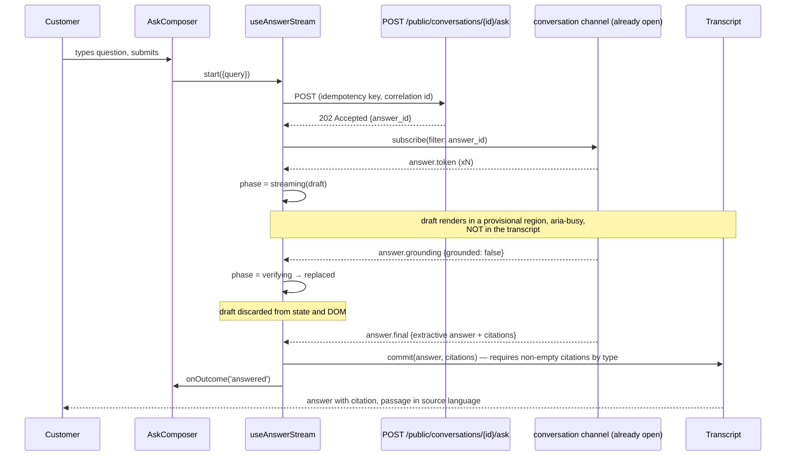

# Frontend LLD

## 0.1 Revision Note (v1.2 — Stage 6 review resolutions)

Amended against `lld-review.md` Part 2. **🔴 Cross-tab invalidation** — the previous §23 claimed two curation tabs stayed in sync through query invalidation. They do not; TanStack Query's cache is per-document. A `BroadcastChannel` mechanism is now specified (§9.1) and §23's claim corrected to describe it. **🔴 Optimistic rating rollback** — snapshot, restore on error, inline retry (§7.3). **🟡** Validation timing specified (§14); assist re-submit cancellation named (§10); the provisional-region treatment made a token (§19).

## 0. Revision Note (v1.1 — Stage 5c resolutions)

Amended against `lld.md`'s consistency findings, alongside `lld-backend-pass4-interfaces.md`:
**D-1** the ask endpoints return `202` with an `answer_id`; the client correlates events on the already-open conversation channel rather than opening one per answer (§10, §12). **D-2** SSE event names and payloads are now contract, generated from the schema (§11.1). **D-3** authentication endpoints exist; the token lifecycle is specified (§11.2). **D-4** the ISO 639-3 ↔ BCP-47 mapping is served by the API and applied in one place; **type-scale tokens key on script, not language**, because Hindi and Marathi share Devanagari (§19). **D-5** fair-use rejection is a 200 outcome, so the `not-an-error` rule has no status-code exception (§15). **D-8** `self_serve_open` arrives with the conversation, so the closed notice renders before the composer (§7). **D-10** erasure is initiated by conversation reference with the resolved scope shown before execution (§25 F12).

## 1. Executive Summary

Three browser surfaces over one API: an **agent console** (authenticated, desktop-first, all-day dense use), a **customer assistant** (public, mobile-first, occasional use by people of variable digital literacy), and a **curation + analytics console** (authenticated, document-heavy, deliberate use by domain experts). Stack is React 18 + TypeScript + Vite, three entry points in one repository, deployed as static bundles to Vercel/Netlify against a FastAPI backend on a different origin.

**Key architectural choices at a glance:** feature-based modular architecture (not clean/hexagonal — the domain logic lives in the backend by design); container/presentational split only where data-fetching and rendering would otherwise mix; TanStack Query for all server state with Zustand for the four genuinely global client fields; SSE behind a single `useAnswerStream` hook that implements the verifying-state rule; Tailwind with CSS custom properties driving a per-script type scale; WCAG 2.1 AA as a hard compliance bar, not a nice-to-have.

**The one component that carries disproportionate risk** is `AnswerStream`. It must never paint generated text that the backend later fails to ground. §7.1 and §15 specify how, and §23 lists the edge cases that break naive implementations.

**Assumptions** (carried from `hld-frontend.md`, restated because they drive concrete decisions here): agents work on desktop at 1366×768 or larger (AS-F1); customers arrive predominantly on phones (AS-F2); the public assistant needs no search-engine visibility (AS-F3); evergreen browsers, last two versions (AS-F4). New to this document: **AS-FL1** — agents handle one conversation at a time, mirroring backend AS-P2-1, so the console is a single-conversation view rather than a tabbed workspace.

## 2. Functional Requirements

Decomposed into independently-implementable sub-features, ordered by dependency:

| # | Sub-feature | Depends on | Requirements |
|---|---|---|---|
| F1 | Auth shell: sign-in, token lifecycle, role-guarded routes | — | REQ-013 |
| F2 | Shared answer primitives: citation card, confidence display, conflict display, stale badge | — | REQ-004, REQ-005, REQ-010 |
| F3 | Answer streaming with verifying state | F2 | REQ-004, REQ-006, REQ-007 |
| F4 | Customer assistant: ask, follow-up, language switch, outcomes | F2, F3 | REQ-001, REQ-007, REQ-023 |
| F5 | Handover: request, queue position, callback offer | F4 | REQ-008 |
| F6 | Agent console: conversation view, assist panel, accept-into-reply, ratings | F1, F2, F3 | REQ-006, REQ-008 |
| F7 | Presence: heartbeat, availability control, assignment notifications | F1, F6 | REQ-008 |
| F8 | Curation: item list, detail, classification editor, version history, lifecycle actions | F1 | REQ-002, REQ-003, REQ-009, REQ-010 |
| F9 | Upload and ingestion status | F8 | REQ-002 |
| F10 | Gap queue: ranked groups, detail, resolve, split | F1 | REQ-011 |
| F11 | Analytics: period figures, guardrails, comparison, drill-down, export | F1 | REQ-012 |
| F12 | Administration: thresholds, languages, coverage floor, users, deletions | F1 | REQ-013, REQ-015, REQ-023 |

**Implicit requirements surfaced** (not stated upstream but any competent user expects them): loading and empty states on every async view; optimistic feedback on ratings but never on governance actions; a visible indication of which language a conversation is in; a way to retry a failed upload without re-selecting the file; and keyboard-complete operation of the agent console, which is a handle-time requirement disguised as an accessibility one.

## 3. Non-Functional Requirements

| Dimension | Target | Source |
|---|---|---|
| Perceived answer latency | First token visible ≤ 700 ms after submit; complete ≤ 5 s p95 (agent), ≤ 8 s (self-serve) | backend LLD §4.6 |
| Bundle budget | Assistant entry ≤ 180 KB gzip JS; agent console ≤ 320 KB; curation ≤ 400 KB | Resolves hld-review Medium-11 — the mitigation now has a number |
| Font payload | ≤ 90 KB per script, loaded on demand | AS-F2 mobile connections |
| Accessibility | WCAG 2.1 AA, all three surfaces | NFR Usability; government service |
| Browser support | Evergreen Chrome/Edge/Firefox/Safari, last two versions | AS-F4 |
| Devices | Assistant 375 px up; agent console 1366 px up; curation 1024 px up | AS-F1, AS-F2 |
| Security | No token in localStorage; strict CSP; no third-party origins | hld-frontend.md §11 |
| i18n | Six locales, per-locale chunks, script-aware type scale | REQ-001 |

## 4. Architecture Decisions

| Axis | Chosen | Rejected alternative | Why, for this system |
|---|---|---|---|
| Architecture pattern | **Feature-based modular** | Clean/hexagonal | The complex domain logic — answer bar, conflict ordering, grounding, state machines — lives in the backend deliberately. A frontend domain layer here would either duplicate those rules (and drift from them) or wrap thin API calls in ceremony. Feature folders own their components, hooks and API access |
| Component pattern | **Container/presentational, applied selectively** | Atomic design throughout | Applied where data-fetching and rendering would otherwise mix (conversation view, item detail, analytics). The shared answer primitives are pure presentational by necessity — they are the components whose consistency across three surfaces is the product's central guarantee |
| Compound components | **Yes, for `CitationCard`** | Monolithic prop-driven card | The card renders differently on three surfaces (agent: compact with rank; customer: expandable with document context; curation: linked to the item editor) while its *content rules* must be identical. Compound composition shares the rules and varies the shell |
| Server state | **TanStack Query** | Redux Toolkit Query | Query-key invalidation is how a retirement propagates to every open view in one line. RTKQ would work; it loses on ceremony given the small amount of genuinely global state |
| Global client state | **Zustand, four fields** | Context | Session, roles, enabled languages, chosen language. Context re-renders every consumer on a language-set change; Zustand selectors do not, and the language set is read by nearly every component |
| Streaming | **Custom `useAnswerStream` over native EventSource** | A generic SSE library | The verifying-state rule (§7.1) is not a generic concern — it is this product's central invariant, and it belongs inside the hook that owns the stream rather than in every consumer |
| Multi-step flows | **Reducer, not a state machine library** | XState | The one branching flow (ask → below-bar → auto-offer → handover → queue → assigned) is genuinely enumerable, but the authoritative state machine is the backend's `conversation.state`. A second machine on the client would be a second source of truth about the same thing — the classic way these two drift |
| Forms | **React Hook Form + Zod** | Manual state | The classification editor and provision form are multi-field with cross-field rules; the ask box is a single field and uses local state, per the rule that tool weight matches the need |
| API layer | **Generated client from OpenAPI, wrapped per feature** | Hand-written fetch wrappers | Types derived from the contract, regenerated in CI — the mechanism that makes Stage 8 drift a build failure rather than a production bug |
| Styling | **Tailwind + CSS custom properties for tokens** | CSS Modules | Utility-first for speed and consistency; custom properties because the per-script type scale must be swappable at runtime when the interface language changes, which a build-time system cannot do |

## 5. Component Hierarchy

```mermaid
graph TD
    subgraph assistant[Assistant entry — public]
        A0["AssistantApp (C)"] --> A1["ConversationPane (C)"]
        A1 --> A2["MessageList (P)"]
        A2 --> A3["AnswerStream (C)"]
        A3 --> A4["CitationCard (P)"]
        A3 --> A5["ConflictPanel (P)"]
        A3 --> A6["NoAnswerPanel (P)"]
        A1 --> A7["AskComposer (P)"]
        A1 --> A8["LanguageSwitcher (C)"]
        A1 --> A9["HandoverBanner (C)"]
        A9 --> A10["QueuePosition (P)"]
        A9 --> A11["CallbackForm (C)"]
        A0 --> A12["CoverageClosedNotice (P)"]
    end
    subgraph agent[Agent entry — authenticated]
        G0["AgentApp (C)"] --> G1["PresenceBar (C)"]
        G0 --> G2["ConversationWorkspace (C)"]
        G2 --> G3["TranscriptPane (P)"]
        G3 --> G4["DualLanguageTurn (P)"]
        G2 --> G5["AssistPanel (C)"]
        G5 --> G6["SuggestionList (P)"]
        G6 --> G7["SuggestionCard (P)"]
        G7 --> A4
        G7 --> G8["ConfidenceMeter (P)"]
        G5 --> G9["AssistUnavailableNotice (P)"]
        G2 --> G10["ReplyComposer (C)"]
        G2 --> G11["RetiredSourceAlert (P)"]
        G0 --> G12["HandoverContextDrawer (C)"]
        G12 --> G13["AttemptedAnswerList (P)"]
    end
    subgraph curation[Curation entry — authenticated]
        C0["CurationApp (C)"] --> C1["ItemTable (C)"]
        C1 --> C2["VirtualRows (P)"]
        C0 --> C3["ItemDetail (C)"]
        C3 --> C4["ClassificationEditor (C)"]
        C3 --> C5["VersionHistory (C)"]
        C3 --> C6["LifecycleActions (C)"]
        C6 --> C7["ConfirmWithReason (P)"]
        C0 --> C8["UploadDropzone (C)"]
        C8 --> C9["IngestionStatusList (C)"]
        C9 --> C10["DuplicateDecisionPrompt (C)"]
        C0 --> C11["GapQueue (C)"]
        C11 --> C12["GapGroupCard (P)"]
        C11 --> C13["GapGroupDetail (C)"]
        C13 --> C14["ResolveDialog (C)"]
        C0 --> C15["AnalyticsDashboard (C)"]
        C15 --> C16["KpiTile (P)"]
        C15 --> C17["GuardrailTile (P)"]
        C15 --> C18["PeriodPicker (C)"]
        C15 --> C19["DrillDownTable (C)"]
        C0 --> C20["AdminPanel (C)"]
    end
    A4 -.shared.-> SH["shared/features/answer"]
    G7 -.shared.-> SH
    C13 -.shared.-> SH
```



`(C)` container — owns data-fetching or state. `(P)` presentational — pure, props only.

The dotted edges are the point of the single repository: `CitationCard` and its siblings have exactly one implementation, consumed by all three surfaces.

## 6. Folder Structure

```
src/
  entries/
    assistant.tsx              # Vite entry — public bundle, mobile-first
    agent.tsx                  # Vite entry — authenticated console
    curation.tsx               # Vite entry — knowledge + analytics + admin
  app/
    providers/                 # Query client, Zustand store, i18n, error boundaries
    routes/                    # Route trees, one per surface, with role guards
    boundaries/                # Per-surface error boundaries (§15)
  features/
    answer/
      components/              # CitationCard, ConflictPanel, NoAnswerPanel, ConfidenceMeter
      hooks/                   # useAnswerStream, useAnswer
      types.ts                 # AnswerView, CitationView — mapped from DTOs, never raw
      map.ts                   # DTO → view-model boundary (§8)
    conversation/              # Assistant + agent conversation logic, shared where identical
    handover/                  # Queue position, callback, escalation surfacing
    assist/                    # Suggestion list, accept-into-reply, ratings
    presence/                  # Heartbeat hook, availability control
    knowledge/                 # Item table, detail, classification, versions, lifecycle
    ingestion/                 # Upload, job status, duplicate decision
    gaps/                      # Queue, group detail, resolve, split
    analytics/                 # Period, guardrails, comparison, drill-down, export
    admin/                     # Thresholds, languages, coverage, users, deletions
    auth/                      # Sign-in, token refresh, revocation handling
  shared/
    api/
      generated/               # openapi-typescript output — never hand-edited
      client.ts                # openapi-fetch instance: auth, error normalisation, retry
      sse.ts                   # Typed EventSource wrapper with reconnection (§10)
      errors.ts                # ProblemDetail → ErrorCategory mapping (§15)
    ui/                        # Radix-based primitives, layout, Text (script-aware)
    i18n/                      # i18next config, per-locale chunks, script metadata
    hooks/                     # useDebounce, useVirtualList, useLiveRegion
    tokens/                    # CSS custom properties: colour, spacing, type scale per script
    observability/             # Correlation id, GlitchTip init, Web Vitals (assistant only)
  test/
    fixtures/                  # Answer/conversation/item fixtures shared across suites
    msw/                       # Mock Service Worker handlers derived from the OpenAPI schema
```

## 7. Component Specifications

### 7.1 `AnswerStream` (container) — the highest-risk component

**Purpose:** own the SSE lifecycle for one answer and enforce that no ungrounded text is ever committed to the visible transcript.

| Prop | Type | Notes |
|---|---|---|
| `conversationId` | `string` | |
| `query` | `string` | |
| `surface` | `'assistant' \| 'agent'` | Decides the endpoint and the styling shell |
| `onComplete` | `(a: AnswerView) => void` | Fires only after a terminal, verified state |
| `onOutcome` | `(o: AnswerOutcome) => void` | Lets the parent update streak/handover UI |

**State owned:** `phase: 'idle' | 'connecting' | 'streaming' | 'verifying' | 'committed' | 'replaced' | 'failed'`, the accumulating draft buffer, and the final `AnswerView`.

**The rule this component exists to enforce:** tokens arriving during `streaming` are rendered **inside a visually distinct provisional region marked `aria-busy`**, never into the transcript. On the backend's `grounding` event: if grounded, the draft is committed to the transcript with its citations; if not, the provisional region is **replaced** by the extractive answer, and the draft text is discarded from both the DOM and component state. There is no code path that commits draft text without a grounding verdict — the reducer's `commit` action requires a `citations` array of length ≥ 1 as its payload, so an uncited commit cannot be expressed.

**Events emitted:** `answer:committed`, `answer:replaced`, `answer:no_answer`, `answer:conflict`, `answer:failed`.

### 7.2 `CitationCard` (presentational, compound)

**Purpose:** the single implementation of BR-1 through BR-5 in the UI.

| Prop | Type | Notes |
|---|---|---|
| `citation` | `CitationView` | |
| `variant` | `'compact' \| 'expandable' \| 'linked'` | Agent / customer / curation shells |
| `onOpenSource` | `() => void` | Optional; absent means the passage is not openable |

Composition: `CitationCard.Passage`, `.Source`, `.StaleBadge`, `.LanguageTag`. The passage always renders in `citation.passageLanguage` with `lang={...}` set on the element — BR-3 is a DOM attribute here, not a convention, so screen readers switch voice correctly on a Tamil passage inside a Hindi answer.

`StaleBadge` renders text plus an icon, never colour alone (§16).

### 7.3 `AssistPanel` (container)

**Purpose:** in-conversation suggestions for the agent, and the degradation when assist is down.

State owned: current query, request status, selected suggestion id. Server state via `useSuggestions`. On `assist_available: false` it renders `AssistUnavailableNotice` — an inline informational panel, **not** an error toast and never a blocking overlay, because the conversation must stay fully usable (REQ-006).

**Rating mutation with rollback** (resolves the Stage 6 🔴). Ratings are the one optimistic path in the console, and an optimistic update without a rollback is a lie with a short half-life — a silently dropped negative rating removes exactly the signal the wrong-answer guardrail exists to catch:

```ts
onMutate: async (v) => { await cancel(key); const prev = get(key); set(key, v); return { prev } },
onError:   (_e, _v, ctx) => { set(key, ctx.prev); showInlineRetry() },   // recoverable-request, on the card
onSettled: () => invalidate(key),
```

Keyboard model: `Ctrl+Enter` submits the assist query from anywhere in the workspace; `Alt+1..5` accepts the nth suggestion into the composer; `Alt+C` focuses the citation of the focused suggestion. Stated because an agent using a mouse for these on every contact loses handle time — this is the performance requirement disguised as accessibility from §2.

### 7.4 `ReplyComposer` (container)

**Purpose:** compose and send the agent's reply; the client half of the REQ-014 audit trail.

Holds `body`, `fromAnswerId`, and a locally-computed `edited` flag. **It sends its `edited` claim, but the server recomputes and stores its own determination** (backend LLD pass 2 §4.3) — the client value is a UI hint only, and this comment belongs in the code so nobody "optimises" by trusting it.

### 7.5 `ClassificationEditor` (container)

Renders proposed classifications with confidence. Fields below the classification bar render as `needs_manual_classification` — an empty required field, **not** a pre-filled low-confidence guess. Pre-filling a guess would produce exactly the rubber-stamped classification REQ-003 is trying to prevent.

### 7.6 `LifecycleActions` (container)

Approve, reject, retire, supersede, reverse. Every destructive or governance action routes through `ConfirmWithReason`, which requires a non-empty reason where the backend requires one. **No optimistic UI here** — the action shows pending until the server confirms, because a governance action that appears to have succeeded and did not is the worst possible failure in this console.

### 7.7 `GuardrailTile` (presentational)

Renders a guardrail value beside its caveat and coverage. When `caveat` is present the tile **cannot** render the bare number — the component's props make `value` and `caveat` a discriminated pair, so the repeat-contact lower-bound (backend LLD pass 3 §2.3) cannot be displayed as if exact. This is a type-level enforcement of an honesty requirement.

### 7.8 `ItemTable` (container)

Virtualised, keyset-paginated, filters in URL search params. Row actions are links, not buttons with handlers, so middle-click and keyboard navigation behave natively.

## 8. Type Definitions

DTOs are generated; view models are hand-written and mapped at the boundary. Nothing raw reaches a component.

```ts
// shared/api/generated/* — produced by openapi-typescript, never edited
import type { components } from '@/shared/api/generated/schema'
type AnswerResponseDTO = components['schemas']['AnswerResponse']
type CitationDTO       = components['schemas']['Citation']

// features/answer/types.ts — the view models components actually consume
export type Lang = 'eng' | 'hin' | 'ben' | 'tam' | 'tel' | 'mar'

export interface CitationView {
  chunkId: number
  itemId: string
  itemTitle: string
  issuingAuthority: string
  issuedOn: Date              // parsed once, at the boundary
  passage: string
  passageLanguage: Lang       // drives the lang attribute (BR-3)
  headingPath: string | null
  reviewPending: boolean      // BR-5
  rank: number
}

// Discriminated union, not boolean flags — the invalid combinations become unrepresentable.
export type AnswerView =
  | { outcome: 'answered'; text: string; language: Lang
      confidence: number; citations: [CitationView, ...CitationView[]]   // non-empty by type
      staleSources: boolean }
  | { outcome: 'conflict'; sources: ConflictingSourceView[]; language: Lang }
  | { outcome: 'no_answer'; reason: NoAnswerReason; relatedReading: CitationView[]
      handoverOffered: true }
  | { outcome: 'blocked_coverage' }
  | { outcome: 'blocked_fair_use'; retryAfterSeconds: number; handoverOffered: true }

export type NoAnswerReason = 'below_bar' | 'no_match' | 'grounding_failed'

// The stream's phases, as a union — this is what makes the §7.1 rule checkable by the compiler.
export type StreamPhase =
  | { kind: 'idle' }
  | { kind: 'connecting' }
  | { kind: 'streaming'; draft: string }          // provisional only; never in the transcript
  | { kind: 'verifying'; draft: string }
  | { kind: 'committed'; answer: AnswerView }
  | { kind: 'replaced'; answer: AnswerView }      // extractive fallback took over
  | { kind: 'failed'; category: ErrorCategory }

export interface MetricView {
  value: number | null
  numerator: number
  denominator: number
  lowVolume: boolean
  caveat: string | null
}

export type ConversationState =
  | 'active_self_serve' | 'active_agent' | 'queued' | 'assigned' | 'escalated'
  | 'self_resolved' | 'agent_resolved' | 'callback_recorded' | 'abandoned'
```

The `citations: [CitationView, ...CitationView[]]` tuple type is deliberate: **an `answered` outcome with zero citations does not type-check.** BR-1 becomes a compile error rather than a runtime check.

## 9. State Management

| Slice | Classification | Owner | Mutated by | Re-renders |
|---|---|---|---|---|
| Session, roles | Global client | Zustand `authStore` | Sign-in, refresh, revocation, sign-out | Route guards, `PresenceBar` |
| Enabled languages | Global client | Zustand `configStore` | Startup fetch, admin change via query invalidation | `LanguageSwitcher` only (selector-scoped) |
| Chosen conversation language | Global client | Zustand `configStore` | `LanguageSwitcher` | `AnswerStream`, `AskComposer` |
| Conversation + messages | Server | TanStack Query `['conversation', id]` | Ask, reply, SSE events | `TranscriptPane` |
| Suggestions | Server | TanStack Query `['suggestions', convId, query]` | Assist submit | `SuggestionList` |
| Knowledge items list | Server | TanStack Query `['items', filters]` | Lifecycle actions invalidate | `ItemTable` |
| Item detail | Server | TanStack Query `['item', id]` | Edit, approve, retire; invalidated by any lifecycle mutation | `ItemDetail` |
| Gap groups | Server | TanStack Query `['gaps', filters]` | Resolve, split | `GapQueue` |
| Analytics period | Server | TanStack Query `['analytics', period]` | Period change | `AnalyticsDashboard` |
| Stream phase | Local | `AnswerStream` reducer | SSE events | `AnswerStream` subtree only |
| Composer draft | Local | `ReplyComposer` | Typing, accept-suggestion | `ReplyComposer` |
| Table filters, period selection | URL search params | Router | User interaction | Consuming container |
| Panel sizes, density | Local storage | `usePersistedPref` | User interaction | Layout |

### 9.1 Cross-tab invalidation (resolves the Stage 6 🔴)

TanStack Query's cache and its invalidation are **per-document**. A retirement in one tab leaves another tab's cache untouched, so the console must broadcast:

```ts
// shared/api/broadcast.ts — one channel, opened by the query provider
const channel = new BroadcastChannel('knowledge')

// every lifecycle mutation
onSuccess: (_, vars) => {
  const keys = [['items'], ['item', vars.itemId], ['analytics']]
  keys.forEach(k => queryClient.invalidateQueries({ queryKey: k }))
  channel.postMessage({ type: 'invalidate', keys })     // the half that was missing
}

// in the provider, once
channel.onmessage = (e) => e.data.keys
  .forEach((k: QueryKey) => queryClient.invalidateQueries({ queryKey: k }))
```

Plus `refetchOnWindowFocus: true` on the item and list queries as a second line of defence for the case where the channel is unavailable (older Safari, or a tab restored from bfcache).

This applies to the **curation surface only**. Two assistant tabs are two independent conversations, which is correct behaviour rather than divergence, and two agent consoles is not a supported pattern under AS-FL1. Project-wide rule: guardrail G15.

**The invalidation rule that matters:** any lifecycle mutation invalidates `['items']`, `['item', id]` **and** `['analytics']`. A retirement that left a stale item visible in another open tab would be a UI-level violation of BR-8, and query-key invalidation is what makes that structural rather than remembered.

## 10. Custom Hooks

| Hook | Purpose | Input | Returns | Wraps |
|---|---|---|---|---|
| `useAnswerStream` | Submit an ask, then track that `answer_id` on the shared conversation channel and enforce the verifying rule | `{conversationId, query, surface}` | `{phase, cancel}` | `useConversationChannel` |
| `useAnswer` | Non-streamed answer fetch (agent assist list). **Re-submitting while a request is in flight aborts the previous one** via the query's `signal` — named explicitly rather than left to library defaults, because an agent editing and re-submitting the same query produces two identical keys and this is the classic autocomplete race in a different costume | `{conversationId, query}` | Query result | TanStack Query |
| `useConversation` | Conversation + messages with SSE-driven updates | `conversationId` | `{conversation, messages, state}` | Query + channel |
| `useConversationChannel` | **One** SSE subscription per conversation, fanned out to every consumer by `answer_id` and event name | `conversationId` | `{subscribe, status}` | `shared/api/sse` |
| `useLanguageMap` | ISO 639-3 → BCP-47 + script, from `GET /languages` | — | `{toBcp47, scriptOf}` | Query (long cache) |
| `useAuth` | Sign-in, rotating refresh, sign-out, `me` | — | `{user, permissions, signIn, signOut}` | Mutations + `authStore` |
| `useHandover` | Request handover, track queue position, offer callback | `conversationId` | `{request, position, waitExceeded, offerCallback}` | Query + SSE |
| `usePresence` | 20 s heartbeat, availability control, pause on tab hidden | — | `{state, setState}` | Mutation + `visibilitychange` |
| `useAssignmentFeed` | Agent's SSE channel: assignments, retired-source flags | — | `{assignment, retiredSourceFlag}` | `shared/api/sse` |
| `useKnowledgeItem` | Item detail with the version token for `If-Match` | `itemId` | `{item, version, mutate}` | Query + mutation |
| `useLifecycleAction` | Approve/reject/retire/supersede with reason and invalidation | `itemId` | `{run, status, error}` | Mutation |
| `useIngestionJob` | Poll a job's stage until terminal | `jobId` | `{stage, failureReason, retry}` | Query with interval |
| `useEnabledLanguages` | Enabled set, gated per REQ-001 | — | `Lang[]` | Zustand selector |
| `useScriptScale` | Per-script type scale custom properties | `Lang` | `CSSProperties` | Token layer |
| `useLiveRegion` | Announce completed async content once | — | `announce(text)` | ARIA live region |
| `useCorrelationId` | Per-interaction id sent on every request | — | `string` | Observability |

`usePresence` pausing on `visibilitychange` is deliberate: a backgrounded tab that keeps heartbeating tells the backend an agent is available when they are not, and the assignment engine would route a conversation to a tab nobody is looking at.

## 11. API Contracts

### 11.1 SSE events consumed (D-2)

Generated from the schema like every other type — the risk in §24 is closed by these being *in* the schema.

| Event | Payload | Client obligation |
|---|---|---|
| `answer.token` | `{answer_id, seq, text}` | Render into the provisional region only. **Never** the transcript |
| `answer.grounding` | `{answer_id, grounded, coverage}` | Move to `verifying`; a false verdict means await the replacement, not show a warning |
| `answer.final` | `{answer_id, answer}` | The only event that may commit to the transcript. Always arrives on a terminal path |
| `answer.error` | `{answer_id, code, detail}` | Discard the draft; render per §15's category map |
| `conversation.state` | `{conversation_id, state}` | Update the conversation query cache |
| `queue.position` | `{conversation_id, position, estimated_wait_seconds, wait_threshold_exceeded}` | Drive `QueuePosition`; the threshold flag reveals the callback offer |
| `conversation.assigned` | `{conversation_id, agent_display_name, language_matched}` | Assistant: an agent has joined. Agent console: see below |
| `assignment.offered` | `{conversation_id, language, wait_seconds, language_matched}` | Open the workspace, move focus to the transcript heading |
| `assignment.revoked` | `{conversation_id, reason}` | Close the workspace; explain, do not silently clear |
| `knowledge.retired_source` | `{conversation_id, item_id, item_title}` | Render `RetiredSourceAlert` (BR-12) |
| `presence.expired` | `{}` | Set availability to offline in the UI and stop heartbeating until the agent re-engages |

**One channel per conversation, not per answer.** `useConversationChannel` owns the single `EventSource`; `useAnswerStream` subscribes to it filtered by its `answer_id`. Opening a channel per answer would multiply connections across a long conversation and break the `Last-Event-ID` replay contract, which is per channel.

**The obligation the frontend owes the backend:** if `answer.token` events stop and neither `answer.final` nor `answer.error` arrives within the verifying timeout, the draft is discarded — never committed. The backend guarantees a terminal event; this is the client's behaviour when that guarantee is not met.

### 11.2 Authentication (D-3)

| Step | Behaviour |
|---|---|
| Sign-in | `POST /auth/sign-in` with the identity-provider assertion; access token to memory, refresh set as an HttpOnly cookie by the server. **The client never sees the refresh token**, which is what makes §21's storage rule enforceable rather than a discipline |
| Bootstrap | `GET /auth/me` supplies roles, resolved permissions, working languages and the enabled-language set in one call, so route guards and the language switcher need no second round trip |
| Refresh | On 401: one `POST /auth/refresh`, one retry of the original request, then sign-out. **Never a loop** — the refresh mutation is keyed so concurrent 401s share one in-flight refresh rather than each firing their own |
| Rotation | Refresh rotates; a replayed token revokes the session family server-side. The client's only correct response to a failed refresh is sign-out |
| Sign-out | `POST /auth/sign-out`, clear the store, drop all channels, return to sign-in preserving the intended route |

### 11.3 Client obligations

The frontend consumes the contracts defined in backend LLD passes 1–3 and the Stage 5c amendments; they are not restated. What is specified here is the **client's obligations** against them:

| Obligation | Detail |
|---|---|
| `Idempotency-Key` | Generated per user-initiated mutation (UUID v4), reused verbatim on retry. Never regenerated by an automatic retry, which would defeat the purpose |
| `If-Match` | Every item mutation sends the version from the last read. On 409, the client re-reads and shows the diff — it never auto-merges |
| Pagination | Cursor-only; the client never constructs offsets |
| Auth | `Authorization: Bearer` from in-memory store; a 401 triggers one silent refresh, then a single retry, then sign-out |
| Correlation | `X-Correlation-Id` on every request |
| SSE | `Last-Event-ID` on reconnect; the client expects state replay, not token backlog — and specifically expects `answer.final` for anything that completed while disconnected |
| Ask | `POST .../ask` returns `202` + `answer_id`; the client correlates on the open channel. It does **not** expect an answer in the response body |
| Language codes | API values are ISO 639-3; `toBcp47` is applied at exactly one place — where `<html lang>` is set (§19) |
| Deletion | Initiated by conversation reference; the resolved scope count is shown and confirmed **before** execution |
| Errors | `ProblemDetail.code` is the branch key — never the HTTP status alone, and never the `detail` string, which is human text and may be localised |

## 12. Data Flow



**Prose walkthrough of the failure branch**, since it is the one that matters: the customer sees text appearing in a visually provisional region. The grounding verdict arrives negative. The provisional region does not turn red or gain a warning — it is *replaced* by the extractive answer, which is shorter and quotes the source more directly. The customer's experience is a brief shimmer, not an error. Crucially, at no point did the transcript contain text the backend had not verified, so a customer who screenshots mid-stream cannot capture an unverified claim presented as an answer.

## 13. User Flow

Customer, end to end: opens the assistant → sees supported languages and (if closed) the coverage notice → types in Tamil → sees the detected language confirmed → receives a cited answer, passage in English, answer in Tamil → opens the citation, sees the passage in document context → asks a follow-up → gets a below-bar response with related reading → asks again, below bar again → the handover offer appears without being requested → accepts → sees queue position → is assigned → the agent's first message arrives in the same pane, in Tamil.

Agent, end to end: signs in → sets availability → receives an assignment notification → the workspace opens with the full transcript, both attempted answers and their rejection reasons, and a language-matched badge → submits an assist query with `Ctrl+Enter` → accepts suggestion 2 with `Alt+2` → edits two words → sends → rates the suggestion helpful → closes the conversation as resolved.

## 14. Validation Rules

| Form | Rule | Where |
|---|---|---|
| Ask composer | 1–2000 chars; trimmed; empty submit disabled | Client + server |
| Reply composer | 1–8000 chars | Client + server |
| Retire / reject / reverse | Reason ≥ 5 chars, required | Client mirrors server; server is authoritative |
| Approve | Review date ≥ today; blank means default +180 days | Client hint, server default |
| Classification editor | At least one topic; below-bar fields must be filled, not skipped | Client (Zod) + server |

**Validation timing** (resolves a Stage 6 🟡), applied uniformly: field-level validation runs **on blur, and only on fields the user has touched**; form-level runs on submit; async checks are debounced at 400 ms with out-of-order responses discarded by request sequence. This matters most in the classification editor, where below-bar fields render intentionally empty and required — on-change validation would paint four errors the instant the form opens, making a correct design feel broken.
| Upload | MIME allowlist and size limit checked **before** upload starts | Client, mirroring the server limit — REQ-002's "state the limit before a long wait" |
| Callback form | Contact detail required; format hinted, not strictly enforced | Client; over-strict validation on a phone number field excludes real formats |
| Provision user | Email format, at least one role, working languages required if role includes agent | Zod cross-field |
| Period picker | End ≥ start; span ≤ max period | Client + server |

## 15. Error Handling

**Categories and treatment** — this taxonomy exists because conflating any two of the first three would be a product failure:

| Category | Example | Treatment | Recoverable |
|---|---|---|---|
| `not-an-error` | `no_answer`, `assist_available: false`, `NoAgentAvailable` | Rendered as first-class content: `NoAnswerPanel`, inline notice, callback offer. **Never** a toast, never red | n/a |
| `recoverable-request` | 5xx, network drop, timeout | Inline retry affordance on the affected region; the rest of the view stays live | Yes |
| `conflict` | 409 version, 409 already-resolved | Re-read and show what changed; user chooses | Yes |
| `permission` | 403 | Explain what is missing, do not offer retry | No |
| `auth` | 401 after refresh failed | Sign-out with an explanation, preserving the current route for return | No |
| `fatal` | Render crash, malformed contract | Per-surface error boundary with a correlation id the user can quote (echoed by the API on every problem response) | No |

**No status-code exception exists in this table.** Fair-use rejection arrives as a `200` with `outcome: "blocked_fair_use"` and `handover_offered: true` (D-5), so it renders as `not-an-error` content with a retry hint and a handover control — never as a 429 the generic error handler would style red. Coverage-closed behaves the same way.

**Error boundaries:** one per surface at the route level, plus a narrow boundary around `AnswerStream` specifically — a crash while rendering an answer must not take down a conversation the agent is mid-way through handling.

**The rule stated once, plainly:** an outcome the backend models as a legitimate result never renders in error styling. Frontend HLD §7 identified this as the failure that teaches agents to distrust the tool, and it is the single most likely thing to be got wrong by an implementer applying generic error-handling habits.

## 16. Accessibility

| Concern | Design |
|---|---|
| Landmarks | `banner`, `main`, `complementary` (assist panel), `contentinfo` on all three surfaces |
| Streaming answer | Provisional region `aria-busy="true"`, `aria-live="off"`; on commit, the final answer is announced **once** via `useLiveRegion`. Announcing per token is unusable |
| Citation | `<article>` with `aria-label="Source: {title}, {authority}, {date}"`; the passage carries `lang` for correct pronunciation |
| Confidence and staleness | Text label plus icon; colour is never the sole carrier |
| Conflict panel | `role="region"` with a heading naming that sources differ; both sources are reachable in reading order |
| Agent console keyboard map | Documented in §7.3; every action has a shortcut and a visible control |
| Focus management | On assignment, focus moves to the transcript heading; on dialog open, to the first field; on close, back to the trigger |
| Item table | `<table>` semantics with `scope` headers; virtualisation preserves `aria-rowcount` and `aria-rowindex` so position is announced correctly |
| Contrast | AA against both the light and dark token sets; the stale badge and low-confidence styles are checked explicitly, being the ones tempted toward low-contrast grey |
| Forms | Every input labelled; errors linked with `aria-describedby`; error summary focused on submit failure |
| Language switch | Announced; `<html lang>` updated, which also switches the script scale (§17) |

Compliance framing: WCAG 2.1 AA is a hard requirement for a government service (NFR Usability), not a target. Where Indian public-sector procurement references GIGW, it aligns with the same WCAG basis — noted so the bar is not re-litigated during implementation.

## 17. Responsive Design

| Surface | Strategy | Breakpoints | Pattern changes, not just resizing |
|---|---|---|---|
| Assistant | **Mobile-first** (AS-F2) | 375 / 768 / 1280 | Citations collapse to an expandable summary below 768; the language switcher becomes a sheet; the composer docks to the viewport bottom with keyboard-aware padding |
| Agent console | **Desktop-first** (AS-F1) | 1366 / 1600 | Below 1366 the assist panel becomes a drawer over the transcript rather than a side-by-side pane — the transcript is what must stay visible. Below 1024 the console shows an explicit "use a larger screen" notice rather than a broken layout, which is honest about AS-F1 |
| Curation | Desktop-first | 1024 / 1440 | The item table becomes a card list below 1024; analytics tiles reflow to one column; drill-down opens as a full-screen sheet |

## 18. Styling Strategy

Tailwind utilities over a token layer expressed as CSS custom properties. Tailwind because three surfaces built by a full engineering org need consistency without a component library negotiation; custom properties because the **type scale must change at runtime** when the interface language changes, and a purely build-time system cannot express that. Radix supplies unstyled accessible primitives; Tailwind styles them. No second styling system is introduced anywhere.

## 19. Design Tokens

| Category | Notes |
|---|---|
| Colour | Surface, content, border, and four semantic roles: `info`, `caution` (stale/review-pending), `conflict`, `success`. Deliberately no `error` red for the `not-an-error` category (§15) |
| Spacing | 4 px base scale |
| Type scale | **Per script, not per language** (D-4). A `data-script` attribute is set on `<html>` alongside `lang`, and tokens select on `[data-script="devanagari"]`, `[data-script="bengali"]`, `[data-script="tamil"]`, `[data-script="telugu"]` — larger line-height for the taller glyph boxes. Keying on language would need Hindi and Marathi listed separately and would silently miss any future Devanagari language. `scriptOf()` comes from `GET /languages`, so the mapping is served, never hard-coded |
| Language codes | The API speaks ISO 639-3 (`tam`); the DOM speaks BCP-47 (`ta`). `toBcp47` from `useLanguageMap` is applied at exactly one call site — where `<html lang>` and `data-script` are set. Applying it per component is how half the selectors silently stop matching |
| Radii, shadows | Single scale, shared |
| Provisional region | `--answer-provisional-opacity: 0.62` plus a 2 px inline-start rule in `--color-border-subtle`. **Deliberately not a semantic colour** — amber would imply an error where none exists, and a plain grey would be indistinguishable from committed text. This is the one visual treatment in the product with a correctness meaning attached, so it is a token, not a per-surface choice |
| Motion | One duration token; the provisional-to-committed transition uses it, and it is the only animation in the answer path — a flashy transition on a text replacement reads as an error |
| Logical properties | All spacing uses `inline-start`/`block-end`, so future Urdu (RTL) is a token change |

## 20. Performance Optimizations

Only the four this system's profile actually justifies:

1. **Route- and entry-level code splitting** — a customer downloads the assistant bundle only. Largest single win, tied to the mobile-first assumption and the §3 bundle budgets.
2. **Font subsetting per script, loaded on demand** — a Tamil user never downloads Bengali glyphs. This is the biggest byte-level win on the connection profile that matters most.
3. **Virtualisation on `ItemTable` and the agent queue** — the two views that meet 50,000 rows.
4. **Surgical memoisation of `CitationCard` and `SuggestionCard`** — they re-render on every streamed token otherwise, since their parent's state changes per token. Applied here specifically, not blanket.

Explicitly **not** doing: image optimisation (no media), service-worker caching (no offline requirement), prefetching routes (three separate bundles make it pointless).

## 21. Security Considerations

| Concern | Treatment |
|---|---|
| Token storage | Access token in memory (Zustand, never persisted); refresh token in an HttpOnly cookie scoped to the API origin |
| XSS | No `dangerouslySetInnerHTML` anywhere. **Knowledge content is attacker-influenced** — uploaded documents are arbitrary — so passages render as text nodes, always |
| CSP | `default-src 'self'`, `connect-src` limited to the API origin, no inline scripts. A compromised dependency cannot exfiltrate query text |
| CSRF | Bearer tokens on state-changing requests, not cookies, so the cookie-based CSRF vector does not apply to mutations; the refresh endpoint uses `SameSite=Strict` |
| Route guards | UX only — stated in code comments at each guard so nobody mistakes them for enforcement |
| PII in telemetry | GlitchTip configured with `beforeSend` stripping query and message bodies from breadcrumbs; Web Vitals carry no user content |
| Logging | No `console.log` of request or response bodies in production builds, enforced by lint rule |
| Dependencies | Lockfile-pinned; CI audit; no runtime CDN loads (CSP would block them anyway) |

## 22. Testing Strategy

| Level | What | What is deliberately not tested |
|---|---|---|
| Unit | `useAnswerStream` reducer transitions; DTO→view-model mappers; validation schemas; the metric/caveat pairing | Trivial presentational components with no logic |
| Component | `AnswerStream` phase rendering (queried by accessible role); `CitationCard` variants; `GuardrailTile` refusing a bare value; error-category rendering | Snapshot tests of markup, which break on styling and catch nothing |
| Integration (MSW) | Ask → stream → grounding failure → replacement; assist accept-and-edit; lifecycle action invalidating the item list; 409 conflict re-read; token refresh and revocation | Backend behaviour already covered by backend LLD tests |
| E2E (Playwright) | The six PRD flows, **including their error paths**: no-answer, assist-unavailable, handover with no agent, upload failure | Every permutation of every filter |
| i18n | Screenshot each surface in each enabled script; assert no overflow or clipping | Translation quality, which is a human review |
| a11y | `axe` in component tests; keyboard-path E2E for the agent console | — |

The critical assertion, stated so it cannot be dropped: **an integration test must prove that draft text from a failed grounding verdict never appears in the transcript DOM at any point.** It is the frontend's half of the product's central guarantee.

## 23. Edge Cases

| Case | Expected behaviour |
|---|---|
| SSE drops mid-stream | Reconnect with `Last-Event-ID`; server replays state; the completed answer appears once, never duplicated |
| Grounding verdict never arrives (timeout) | Provisional region is discarded, not committed; falls to `recoverable-request` with retry |
| Customer submits twice rapidly | Second submit disabled while a stream is active; the same idempotency key is reused if the first genuinely failed |
| Agent accepts a suggestion, then assist goes down | The accepted draft stays in the composer and is sendable; loss of assist never destroys composed work |
| Language disabled by an administrator mid-conversation | Switcher updates on the next config fetch; the current conversation continues in its language, and the customer is told rather than silently switched |
| Item retired while the agent is reading its citation | `RetiredSourceAlert` appears via the assignment feed; the citation stays visible marked as retired, since hiding it would confuse an agent mid-sentence |
| Two curation tabs open, one retires an item | The mutating tab broadcasts the invalidation over `BroadcastChannel`; the listening tab invalidates and refetches. `refetchOnWindowFocus` covers the case where the channel is unavailable (§9.1). Per-document invalidation alone does **not** cross tabs — assuming it does was the defect this entry previously encoded |
| Version conflict on save | 409 → re-read → show what changed → user chooses. Never auto-merge |
| Extremely long passage | Clamped with an explicit "show full passage" control; never truncated silently, since a truncated quotation is a misquotation |
| Rating mutation fails after optimistic update | Previous value restored, inline retry offered on the suggestion card; the rating is never left showing as recorded when it was not (§7.3) |
| Malformed/absent citation date | The card renders the item as incomplete and links to curation, rather than rendering an invalid date |
| Ask submitted before `self_serve_open` is known | The composer is not rendered until the start response arrives; the closed notice, if any, renders in its place (D-8). The customer never types a question into a surface that cannot answer it |
| Deletion scope larger than expected | `scope_conversation_count` is shown and confirmed before execution; a second-device conversation not covered by the browser key is stated as a known limitation, not hidden (D-10) |
| Empty gap queue / empty item table / period with no data | Distinct empty states, each naming why it is empty, not one generic "no results" |
| Clock skew on the client | All times are rendered from server timestamps; the client never computes elapsed time for anything recorded |
| Very large upload on a slow connection | Progress with a cancel; the size check runs before the transfer starts |
| Screen reader active during streaming | Only the final answer is announced; token-level updates are silenced |

## 24. Risks

| Risk | Impact | Mitigation |
|---|---|---|
| `AnswerStream` implemented naively — draft committed before verification | Breaks the product's central guarantee, invisibly in demos where everything grounds | Type-level non-empty citations; the reducer cannot express an uncited commit; the §22 assertion test |
| Indic layout breaks in a script nobody on the team reads | Ships looking broken to exactly the users the multilingual work was for | Per-script screenshot suite; the script token scale in §19 |
| Silent-refresh loop on cross-origin auth | Intermittent sign-outs, painful to reproduce | Single-refresh-then-single-retry rule (§11), plus an integration test for the revocation path |
| Bundle budgets breached over time | The CSR decision's one real cost becomes visible on low-end phones | Budgets enforced in CI as a failing check, not a warning |
| Assist-unavailable rendered as an error | Teaches agents to distrust the tool | §15's taxonomy plus a component test asserting `not-an-error` never uses error styling |
| Dependency on backend SSE event shape | A silent contract change breaks streaming | SSE payloads included in the OpenAPI schema and regenerated in CI |

**Open questions carried from the HLD, still unresolved:** F-1 (desktop-only agents), F-2 (public indexability), F-3 (font licensing — blocks §19's subsetting plan), F-4 (existing government design system).

## 25. Implementation Checklist

**F1 Auth shell** → token store, silent refresh, revocation handling, role guards, sign-in.
**F2 Answer primitives** → `CitationView` mapper, `CitationCard` compound + variants, `ConfidenceMeter`, `StaleBadge`, `ConflictPanel`, `NoAnswerPanel`; component tests including the colour-independence assertion.
**F3 Streaming** → `sse.ts` wrapper with `Last-Event-ID`; `useAnswerStream` reducer with the phase union; `AnswerStream` provisional region; **the never-commits-ungrounded test before any UI polish**.
**F4 Assistant** → `AssistantApp`, `AskComposer`, `MessageList`, `LanguageSwitcher`, coverage-closed notice, four outcome renderings.
**F5 Handover** → `useHandover`, banner, queue position, callback form, wait-threshold behaviour.
**F6 Agent console** → workspace layout, `TranscriptPane` with dual-language turns, `AssistPanel` + keyboard map, `ReplyComposer` with the edited-flag comment, ratings, `HandoverContextDrawer`.
**F7 Presence** → `usePresence` with visibility pausing, availability control, `useAssignmentFeed`, `RetiredSourceAlert`.
**F8 Curation** → `ItemTable` virtualised, `ItemDetail`, `ClassificationEditor` (below-bar as empty required), `VersionHistory`, `LifecycleActions` + `ConfirmWithReason`, 409 re-read flow.
**F9 Ingestion** → dropzone with pre-transfer limit check, job status polling, duplicate decision prompt, retry.
**F10 Gaps** → ranked queue, group detail with language spread, resolve dialog with per-type required fields, split.
**F11 Analytics** → period picker, KPI tiles, `GuardrailTile` with enforced caveat pairing, comparison, drill-down, missing-interval display, export.
**F12 Admin** → thresholds; language enablement (**acceptance score required to enable** — the UI cannot submit an enablement without one); coverage declaration; taxonomy create/rename; user provisioning; deletion by conversation reference with scope confirmation.

Cross-cutting, done alongside rather than after: i18n locale chunks and script tokens (from F2 onward), a11y assertions in every component test, bundle budget check in CI from the first bundle.

## 26. Acceptance Criteria

1. An `answered` outcome renders with at least one citation, on all three surfaces, or it does not render — verified by type and by test.
2. Draft text from a failed grounding verdict never appears in the transcript DOM.
3. A quoted passage always displays in its source language with a correct `lang` attribute, regardless of interface language.
4. `no_answer`, `assist unavailable`, and `no agent available` never render in error styling.
5. Retiring an item removes it from every open view without a manual refresh.
6. A stale citation shows its review-pending state without relying on colour.
7. The repeat-contact guardrail cannot render without its caveat and coverage.
8. The agent console is fully operable by keyboard, with every shortcut also available as a visible control.
9. Each enabled script renders without overflow or clipping on all three surfaces at every defined breakpoint.
10. Assistant, agent and curation bundles are within their §3 budgets, enforced in CI.
11. A 409 version conflict always results in a re-read and a user choice, never an auto-merge.
12. No access token is ever written to `localStorage` or `sessionStorage`, and the refresh token is never visible to JavaScript at all.
13. Exactly one SSE channel is open per conversation, regardless of how many answers it carries.
14. A language cannot be enabled from the admin UI without an acceptance score.
15. `toBcp47` has exactly one call site; every script token selects on `data-script`.
16. Retiring an item in one curation tab removes it from every other open curation tab without a manual refresh — asserted by a two-context integration test, not assumed.
17. A failed rating mutation restores the previous value and offers retry; no rating displays as recorded unless the server accepted it.
