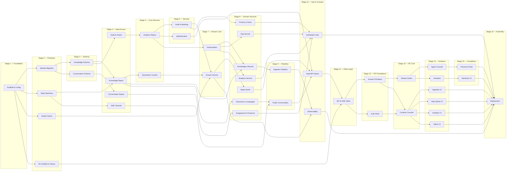

# AI Coding Execution Plan

The LLD set is the unmodifiable source of truth. This plan computes order, dependencies, stages and parallelism; it does not review or alter the design.

---

## 1. Task Breakdown

### Foundation

**TASK-01 — Repository scaffold and configuration tiers**
- *Purpose:* Python/FastAPI + Vite monorepo skeleton, settings module implementing guardrail G6's two tiers, structlog JSON logging per G10.
- *Input Dependencies:* none
- *Output:* `Settings` object, logging configured, project layout
- *Files:* `backend/app/core/config.py`, `backend/app/core/logging.py`, `backend/pyproject.toml`, `docker-compose.yml`, `frontend/package.json`, `frontend/vite.config.ts`

**TASK-02 — Migration: identity and taxonomy**
- *Purpose:* `app_user`, `user_role_grant`, `taxonomy_sector`, `taxonomy_topic`, `issuing_authority`.
- *Input Dependencies:* TASK-01
- *Output:* Alembic revision 001
- *Files:* `backend/alembic/versions/001_identity_taxonomy.py`

**TASK-03 — Migration: knowledge core**
- *Purpose:* `source_document`, `knowledge_item` (+ 4 check constraints), `knowledge_item_version`, `chunk` (+ tsvector), `chunk_embedding` (+ HNSW), `item_classification`, `ingestion_job`, `threshold`, `knowledge_generation`, all indexes from pass 1 §2.3.
- *Input Dependencies:* TASK-02
- *Output:* Alembic revision 002; pgvector extension enabled
- *Files:* `backend/alembic/versions/002_knowledge.py`

**TASK-04 — Migration: conversation, presence, assignment**
- *Purpose:* `conversation` and `message` (range-partitioned monthly), `agent_presence`, `agent_language`, `queue_entry`, `assignment`, `assist_usage`, `callback_request`, plus partition-creation helper.
- *Input Dependencies:* TASK-02
- *Output:* Alembic revision 003
- *Files:* `backend/alembic/versions/003_conversation.py`, `backend/app/db/partitions.py`

**TASK-05 — Migration: audit, analytics, gaps, privacy, grants**
- *Purpose:* `audit_record` and `answer_record`/`answer_citation` and `gap_entry` (partitioned), `gap_group`, `analytics_daily`, `analytics_gap_day`, `masking_check`, `deletion_request`; the `REVOKE UPDATE, DELETE, TRUNCATE` statements of guardrail G1; separate maintenance role.
- *Input Dependencies:* TASK-03, TASK-04
- *Output:* Alembic revision 004; append-only grants in place
- *Files:* `backend/alembic/versions/004_audit_analytics.py`, `backend/alembic/versions/005_grants.py`

**TASK-06 — Domain primitives: state machines and exception hierarchies**
- *Purpose:* `_LEGAL` transition tables for knowledge and conversation with a single `assert_transition`; the five exception hierarchies of guardrail G9.
- *Input Dependencies:* TASK-01
- *Output:* `domain/state.py`, `domain/errors.py`
- *Files:* `backend/app/domain/state.py`, `backend/app/domain/errors.py`

### Data access

**TASK-07 — Knowledge, chunk and answer repositories**
- *Purpose:* Implement pass 1 §6.3 contracts. `ChunkRepository.hybrid_search` carries the answerable-set filter with no parameter to disable it (guardrail G2).
- *Input Dependencies:* TASK-03, TASK-06
- *Output:* Three repository implementations + protocols
- *Files:* `backend/app/repositories/knowledge.py`, `chunk.py`, `answer.py`

**TASK-08 — Conversation, presence, queue, assignment, assist repositories**
- *Purpose:* Pass 2 §6.6 contracts, including `claim_next` with `FOR UPDATE SKIP LOCKED` as the only dequeue path.
- *Input Dependencies:* TASK-04, TASK-06
- *Output:* Five repository implementations
- *Files:* `backend/app/repositories/conversation.py`, `presence.py`, `queue.py`, `assignment.py`, `assist.py`

**TASK-09 — Gap, audit, analytics and user repositories**
- *Purpose:* Pass 3 §6.8 contracts. `AuditRepository` exposes no mutation method; `AnalyticsRepository.range` never fabricates zero rows.
- *Input Dependencies:* TASK-05, TASK-06
- *Output:* Four repository implementations
- *Files:* `backend/app/repositories/gap.py`, `audit.py`, `analytics.py`, `user.py`

### Model runtime

**TASK-10 — Model clients, strategies and circuit breaker**
- *Purpose:* Embedding, rerank, generation (vLLM + extractive strategies behind one interface), OCR, PII detector, language detection; circuit breaker per amendment §R.
- *Input Dependencies:* TASK-01
- *Output:* Client interfaces + implementations + breaker
- *Files:* `backend/app/models/embedding.py`, `rerank.py`, `generation.py`, `ocr.py`, `pii.py`, `langdetect.py`, `breaker.py`

### Cross-cutting services

**TASK-11 — Authentication service and endpoints**
- *Purpose:* Sign-in, rotating refresh with family revocation, sign-out, `me` (amendment §C). Refresh token as HttpOnly cookie only.
- *Input Dependencies:* TASK-09, TASK-06
- *Output:* 4 endpoints, token service, Redis revocation list
- *Files:* `backend/app/services/auth.py`, `backend/app/api/v1/auth.py`

**TASK-12 — Authorisation service and permission matrix**
- *Purpose:* Pass 3 §4.3's 17 permissions × 4 roles as a declarative matrix; `require()` writes the refusal before raising.
- *Input Dependencies:* TASK-09, TASK-13
- *Output:* `AuthorizationService`, FastAPI dependency
- *Files:* `backend/app/services/authz.py`, `backend/app/api/deps.py`

**TASK-13 — Audit writer and masker**
- *Purpose:* `AuditWriter` decorating `Masker` so no audit write can bypass masking; withholding rule with the four call-site behaviours of pass 3 §6.5.
- *Input Dependencies:* TASK-09, TASK-10
- *Output:* `AuditWriter`, `Masker`
- *Files:* `backend/app/services/audit.py`, `backend/app/services/masking.py`

### Answer path

**TASK-14 — Generation counter and answer cache**
- *Purpose:* Counter bumped inside lifecycle transactions; cache keyed on it; bypass when the counter is unreadable (amendment §M, guardrail G3).
- *Input Dependencies:* TASK-07
- *Output:* `GenerationCounter`, `AnswerCache`
- *Files:* `backend/app/services/generation_counter.py`, `backend/app/services/answer_cache.py`

**TASK-15 — Answer service orchestration**
- *Purpose:* Pass 1 §6.1's eleven steps: gates, language, cache, retrieve, rerank, **conflict before bar**, confidence, generate, ground, suppress, persist-before-return.
- *Input Dependencies:* TASK-07, TASK-10, TASK-13, TASK-14
- *Output:* `AnswerService`, `GroundingVerifier`, `ConflictDetector`
- *Files:* `backend/app/services/answer.py`, `grounding.py`, `conflict.py`

**TASK-16 — SSE channel service and event schemas**
- *Purpose:* The 11 events of amendment §B, in the OpenAPI schema; `Last-Event-ID` replays state, never token backlog.
- *Input Dependencies:* TASK-01, TASK-06
- *Output:* Channel service, event models
- *Files:* `backend/app/services/sse.py`, `backend/app/schemas/events.py`

### Knowledge domain

**TASK-17 — Knowledge lifecycle service and endpoints**
- *Purpose:* Approve/reject/retire/supersede/reverse/edit with row locks, UUID-ordered acquisition, generation bump in-transaction, BR-12 post-commit flagging; 14 endpoints.
- *Input Dependencies:* TASK-07, TASK-12, TASK-13, TASK-14
- *Output:* `KnowledgeLifecycleService`, knowledge API
- *Files:* `backend/app/services/knowledge.py`, `backend/app/api/v1/knowledge.py`

**TASK-18 — Ingestion orchestrator and stage handlers**
- *Purpose:* Six handlers, orchestrator-owned transitions, retry classes with per-stage caps, dead-lettering, resumption from the failed stage.
- *Input Dependencies:* TASK-07, TASK-10, TASK-17
- *Output:* Orchestrator, 6 handlers, Celery task
- *Files:* `backend/app/ingestion/orchestrator.py`, `backend/app/ingestion/stages/*.py`, `backend/app/api/v1/ingestion.py`

**TASK-19 — Taxonomy, languages, coverage and thresholds endpoints**
- *Purpose:* Amendments §F and §G plus `CoverageGate` and threshold CRUD. Enabling a language requires an acceptance score.
- *Input Dependencies:* TASK-07, TASK-12
- *Output:* 4 endpoint groups, `CoverageGate`
- *Files:* `backend/app/api/v1/taxonomy.py`, `languages.py`, `coverage.py`, `thresholds.py`, `backend/app/services/coverage.py`

### Conversation domain

**TASK-20 — Conversation service and public endpoints**
- *Purpose:* `ask` with streak semantics (conflict resets but still offers handover), four terminal outcomes, `self_serve_open` on start; 7 public endpoints.
- *Input Dependencies:* TASK-08, TASK-15, TASK-16, TASK-19
- *Output:* `ConversationService`, public API
- *Files:* `backend/app/services/conversation.py`, `backend/app/api/v1/public.py`

**TASK-21 — Assist service and agent endpoints**
- *Purpose:* Suggestions, accept-into-draft, `sendReply` with **server-determined** `edited` flag and the REQ-014 audit write, ratings.
- *Input Dependencies:* TASK-08, TASK-15, TASK-12, TASK-13
- *Output:* `AgentAssistService`, agent API
- *Files:* `backend/app/services/assist.py`, `backend/app/api/v1/conversations.py`

**TASK-22 — Handover, assignment engine and presence**
- *Purpose:* `assignNext` with `SKIP LOCKED`, under-lock presence re-check, escalation without loss; `buildContext` with on-demand translation; heartbeat and expiry.
- *Input Dependencies:* TASK-08, TASK-16, TASK-13
- *Output:* Three services, queue/presence API
- *Files:* `backend/app/services/handover.py`, `assignment.py`, `presence.py`, `backend/app/api/v1/queue.py`

### Analytics, gaps, privacy

**TASK-23 — Gap service and clustering job**
- *Purpose:* Entry recording from six causes, embedding-based clustering (resolved groups excluded), four resolution types with per-type required fields, split.
- *Input Dependencies:* TASK-09, TASK-10, TASK-12
- *Output:* `GapService`, clustering job, gap API
- *Files:* `backend/app/services/gaps.py`, `backend/app/jobs/clustering.py`, `backend/app/api/v1/gaps.py`

**TASK-24 — Analytics service, rollup job and guardrails**
- *Purpose:* Sums-and-counts rollup with upsert idempotence; period assembly naming missing intervals; five guardrails including the lower-bound repeat-contact metric with its caveat.
- *Input Dependencies:* TASK-09, TASK-12
- *Output:* `AnalyticsService`, rollup job, analytics API
- *Files:* `backend/app/services/analytics.py`, `backend/app/jobs/rollup.py`, `backend/app/api/v1/analytics.py`

**TASK-25 — Privacy service and admin user management**
- *Purpose:* Deletion by conversation reference with scope reported before execution; masking sample and check recording; user provisioning, role grants, deactivation with `LastAdministratorRemoval` under `SERIALIZABLE`.
- *Input Dependencies:* TASK-09, TASK-12, TASK-13
- *Output:* `PrivacyService`, `UserAdminService`, admin API
- *Files:* `backend/app/services/privacy.py`, `users.py`, `backend/app/api/v1/admin.py`

### Operational

**TASK-26 — Scheduled job runner**
- *Purpose:* All eight jobs of amendment §O with their idempotency and failure behaviour; retention runs as the maintenance role.
- *Input Dependencies:* TASK-17, TASK-22, TASK-23, TASK-24, TASK-25
- *Output:* Celery beat schedule, 8 job entry points
- *Files:* `backend/app/jobs/schedule.py`, `backend/app/jobs/*.py`

**TASK-27 — Observability**
- *Purpose:* The 13 metrics of amendment §P with stage labels matching the §4.6 budget; correlation middleware accepting, propagating and echoing `X-Correlation-Id`; six alert rules.
- *Input Dependencies:* TASK-15, TASK-18, TASK-22
- *Output:* Metrics registry, middleware, alert rules
- *Files:* `backend/app/core/metrics.py`, `backend/app/core/middleware.py`, `ops/alerts.yml`

**TASK-28 — OpenAPI export and client generation**
- *Purpose:* Emit the schema including SSE event models; wire `openapi-typescript` into CI so a contract change fails the build.
- *Input Dependencies:* TASK-17, TASK-20, TASK-21, TASK-22, TASK-23, TASK-24, TASK-25, TASK-11, TASK-19
- *Output:* `openapi.json`, generation script, CI step
- *Files:* `backend/scripts/export_openapi.py`, `.github/workflows/contract.yml`

### Frontend

**TASK-29 — Frontend scaffold, tokens and i18n**
- *Purpose:* Three Vite entries; token layer with the per-**script** type scale and the provisional-region token; i18next with per-locale chunks; `data-script` set alongside `lang` at one call site.
- *Input Dependencies:* TASK-01
- *Output:* Three bundles building, token layer, i18n
- *Files:* `frontend/src/entries/*.tsx`, `frontend/src/shared/tokens/*`, `frontend/src/shared/i18n/*`

**TASK-30 — API client, SSE wrapper, error normalisation**
- *Purpose:* Generated client; typed `EventSource` wrapper with `Last-Event-ID`; `ProblemDetail` → six error categories; `BroadcastChannel` invalidation bus (guardrail G15).
- *Input Dependencies:* TASK-28, TASK-29
- *Output:* `shared/api/*`
- *Files:* `frontend/src/shared/api/client.ts`, `sse.ts`, `errors.ts`, `broadcast.ts`

**TASK-31 — Auth shell and route guards**
- *Purpose:* Sign-in, in-memory access token, single-flight refresh, revocation handling, role guards commented as UX-only.
- *Input Dependencies:* TASK-30
- *Output:* `features/auth`, guarded route trees
- *Files:* `frontend/src/features/auth/*`, `frontend/src/app/routes/*`

**TASK-32 — Shared answer primitives**
- *Purpose:* `CitationCard` compound with three variants and the `lang` attribute on passages; `ConfidenceMeter`; `ConflictPanel`; `NoAnswerPanel`; stale badge with text, never colour alone.
- *Input Dependencies:* TASK-30
- *Output:* `features/answer/components`
- *Files:* `frontend/src/features/answer/components/*`, `frontend/src/features/answer/map.ts`

**TASK-33 — Answer streaming hooks**
- *Purpose:* `useConversationChannel` (one channel per conversation) and `useAnswerStream` with the phase union; draft never enters the transcript; commit requires non-empty citations by type.
- *Input Dependencies:* TASK-30, TASK-32
- *Output:* Two hooks + reducer
- *Files:* `frontend/src/features/answer/hooks/*`

**TASK-34 — Customer assistant surface**
- *Purpose:* Ask, follow-up, language switch, four outcomes, coverage-closed notice rendered before the composer.
- *Input Dependencies:* TASK-33, TASK-29
- *Output:* Assistant bundle
- *Files:* `frontend/src/surfaces/assistant/*`

**TASK-35 — Handover UI**
- *Purpose:* Request, auto-offer on two below-bar answers, queue position, wait threshold, callback form.
- *Input Dependencies:* TASK-34
- *Output:* `features/handover`
- *Files:* `frontend/src/features/handover/*`

**TASK-36 — Agent console**
- *Purpose:* Workspace, transcript with dual-language turns, assist panel with the keyboard map, reply composer, ratings with optimistic rollback, handover-context drawer.
- *Input Dependencies:* TASK-33, TASK-31
- *Output:* Agent bundle
- *Files:* `frontend/src/surfaces/agent/*`, `frontend/src/features/assist/*`

**TASK-37 — Presence and assignment feed**
- *Purpose:* `usePresence` with `visibilitychange` pausing; `useAssignmentFeed`; retired-source alert.
- *Input Dependencies:* TASK-36
- *Output:* `features/presence`
- *Files:* `frontend/src/features/presence/*`

**TASK-38 — Curation console**
- *Purpose:* Virtualised item table, detail, classification editor (below-bar empty and required), version history, lifecycle actions with reason and no optimistic UI, 409 re-read flow, cross-tab broadcast invalidation.
- *Input Dependencies:* TASK-31, TASK-32, TASK-30
- *Output:* Curation bundle core
- *Files:* `frontend/src/surfaces/curation/*`, `frontend/src/features/knowledge/*`

**TASK-39 — Ingestion UI**
- *Purpose:* Dropzone with pre-transfer limit check, job status polling, duplicate decision prompt, retry.
- *Input Dependencies:* TASK-38
- *Output:* `features/ingestion`
- *Files:* `frontend/src/features/ingestion/*`

**TASK-40 — Gap queue UI**
- *Purpose:* Ranked groups, language spread, resolve dialog with per-type required fields, split.
- *Input Dependencies:* TASK-38
- *Output:* `features/gaps`
- *Files:* `frontend/src/features/gaps/*`

**TASK-41 — Analytics UI**
- *Purpose:* Period picker, KPI tiles, `GuardrailTile` enforcing the value/caveat pair, comparison, drill-down, missing-interval display, export.
- *Input Dependencies:* TASK-38
- *Output:* `features/analytics`
- *Files:* `frontend/src/features/analytics/*`

**TASK-42 — Admin UI**
- *Purpose:* Thresholds, language enablement requiring an acceptance score, coverage declaration, taxonomy rename, user provisioning, deletion with scope confirmation.
- *Input Dependencies:* TASK-38
- *Output:* `features/admin`
- *Files:* `frontend/src/features/admin/*`

**TASK-43 — Deployment assembly**
- *Purpose:* Compose file for all processes, systemd units, Caddy origin allowlist, expand/contract migration ordering, bundle-budget CI check, backup configuration.
- *Input Dependencies:* TASK-26, TASK-27, TASK-34, TASK-36, TASK-39, TASK-40, TASK-41, TASK-42, TASK-35, TASK-37
- *Output:* Deployable stack
- *Files:* `docker-compose.prod.yml`, `ops/systemd/*`, `ops/Caddyfile`, `.github/workflows/deploy.yml`

---

## 2. Dependency Matrix

| Task | Depends On | Unlocks | Dependency Type |
|---|---|---|---|
| TASK-01 | — | 02, 06, 10, 29 | Independent |
| TASK-02 | 01 | 03, 04 | Hard Dependency |
| TASK-03 | 02 | 05, 07 | Hard Dependency |
| TASK-04 | 02 | 05, 08 | Hard Dependency |
| TASK-05 | 03, 04 | 09 | Hard Dependency |
| TASK-06 | 01 | 07, 08, 09, 16 | Hard Dependency |
| TASK-07 | 03, 06 | 14, 15, 17, 18, 19 | Hard Dependency |
| TASK-08 | 04, 06 | 20, 21, 22 | Hard Dependency |
| TASK-09 | 05, 06 | 11, 12, 13, 23, 24, 25 | Hard Dependency |
| TASK-10 | 01 | 13, 15, 18, 23 | Hard Dependency |
| TASK-11 | 09, 06 | 28, 31 | Hard Dependency |
| TASK-12 | 09, 13 | 17, 19, 21, 23, 24, 25 | Hard Dependency |
| TASK-13 | 09, 10 | 12, 15, 17, 21, 22, 25 | Hard Dependency |
| TASK-14 | 07 | 15, 17 | Hard Dependency |
| TASK-15 | 07, 10, 13, 14 | 20, 21, 27 | Hard Dependency |
| TASK-16 | 01, 06 | 20, 22 | Hard Dependency |
| TASK-17 | 07, 12, 13, 14 | 18, 26, 28 | Hard Dependency |
| TASK-18 | 07, 10, 17 | 26, 27 | Hard Dependency |
| TASK-19 | 07, 12 | 20, 28 | Hard Dependency |
| TASK-20 | 08, 15, 16, 19 | 28 | Hard Dependency |
| TASK-21 | 08, 15, 12, 13 | 28 | Hard Dependency |
| TASK-22 | 08, 16, 13 | 26, 27, 28 | Hard Dependency |
| TASK-23 | 09, 10, 12 | 26, 28 | Hard Dependency |
| TASK-24 | 09, 12 | 26, 28 | Hard Dependency |
| TASK-25 | 09, 12, 13 | 26, 28 | Hard Dependency |
| TASK-26 | 17, 22, 23, 24, 25 | 43 | Hard Dependency |
| TASK-27 | 15, 18, 22 | 43 | Hard Dependency |
| TASK-28 | 11, 17, 19, 20, 21, 22, 23, 24, 25 | 30 | Hard Dependency |
| TASK-29 | 01 | 30, 34 | Hard Dependency |
| TASK-30 | 28, 29 | 31, 32, 33, 38 | Hard Dependency |
| TASK-31 | 30 | 36, 38 | Hard Dependency |
| TASK-32 | 30 | 33, 38 | Hard Dependency |
| TASK-33 | 30, 32 | 34, 36 | Hard Dependency |
| TASK-34 | 33, 29 | 35, 43 | Hard Dependency |
| TASK-35 | 34 | 43 | Hard Dependency |
| TASK-36 | 33, 31 | 37, 43 | Hard Dependency |
| TASK-37 | 36 | 43 | Hard Dependency |
| TASK-38 | 31, 32, 30 | 39, 40, 41, 42 | Hard Dependency |
| TASK-39 | 38 | 43 | Hard Dependency |
| TASK-40 | 38 | 43 | Hard Dependency |
| TASK-41 | 38 | 43 | Hard Dependency |
| TASK-42 | 38 | 43 | Hard Dependency |
| TASK-43 | 26, 27, 34, 35, 36, 37, 39, 40, 41, 42 | — | Hard Dependency |

---

## 3. Execution Stages (Topological Layering)

| Stage | Tasks | Parallel width |
|---|---|---|
| **Stage 1** | TASK-01 | 1 |
| **Stage 2** | TASK-02, TASK-06, TASK-10, TASK-29 | 4 |
| **Stage 3** | TASK-03, TASK-04 | 2 |
| **Stage 4** | TASK-05, TASK-07, TASK-08, TASK-16 | 4 |
| **Stage 5** | TASK-09, TASK-14 | 2 |
| **Stage 6** | TASK-11, TASK-13 | 2 |
| **Stage 7** | TASK-12, TASK-15 | 2 |
| **Stage 8** | TASK-17, TASK-19, TASK-21, TASK-23, TASK-24, TASK-25, TASK-22 | 7 |
| **Stage 9** | TASK-18, TASK-20 | 2 |
| **Stage 10** | TASK-26, TASK-27, TASK-28 | 3 |
| **Stage 11** | TASK-30 | 1 |
| **Stage 12** | TASK-31, TASK-32 | 2 |
| **Stage 13** | TASK-33, TASK-38 | 2 |
| **Stage 14** | TASK-34, TASK-36, TASK-39, TASK-40, TASK-41, TASK-42 | 6 |
| **Stage 15** | TASK-35, TASK-37 | 2 |
| **Stage 16** | TASK-43 | 1 |

Every task belongs to exactly one stage; no task appears twice.

---

## 4. Critical Path

```
TASK-01 → TASK-02 → TASK-03 → TASK-07 → TASK-14 → TASK-15 → TASK-21 →
TASK-28 → TASK-30 → TASK-32 → TASK-33 → TASK-36 → TASK-37 → TASK-43
```

**Fourteen tasks.** It is the critical path because it threads the four things that cannot be parallelised away:

1. **The schema must exist before repositories** (01→02→03→07), and the knowledge schema is the widest one.
2. **The answer path is serial by construction** (07→14→15): the cache depends on the counter, the counter on the knowledge repository, and the answer orchestration on all three.
3. **The OpenAPI export is a genuine convergence point** (→28): it cannot run until every endpoint group exists, and the entire frontend depends on the generated client. This single node is the plan's narrowest waist — **any backend endpoint slipping delays all 14 frontend tasks.**
4. **The frontend's own chain is unavoidable** (30→32→33→36): primitives before the stream hook, the stream hook before the console that consumes it.

**Blocked by delay on this path:** a slip at TASK-15 blocks every conversation and assist task, the OpenAPI export, and the whole frontend. A slip at TASK-28 blocks 14 frontend tasks with no workaround short of hand-writing types, which guardrail-wise is not a workaround at all.

**The one lever that shortens it:** TASK-28 can be run early against a partial schema to unblock TASK-30's scaffolding, then re-run. That converts a hard convergence into two passes and is the only optimisation available on this path.

---

## 5. Optimized Execution Plan

### Sequential Execution Path (critical path — strict order)

`01 → 02 → 03 → 07 → 14 → 15 → 21 → 28 → 30 → 32 → 33 → 36 → 37 → 43`

### Parallel Execution Sets

| Stage | Runs simultaneously | No conflict because |
|---|---|---|
| 2 | 02 · 06 · 10 · 29 | Different subsystems: migrations, pure domain code, model clients, frontend scaffold |
| 3 | 03 · 04 | Separate migration revisions on disjoint tables |
| 4 | 05 · 07 · 08 · 16 | 05 is migrations; 07/08 are disjoint repository sets; 16 depends only on primitives |
| 5 | 09 · 14 | Different repositories, different services |
| 6 | 11 · 13 | Auth and audit share only the user repository, read-only |
| 7 | 12 · 15 | Authorisation and answer orchestration are independent |
| 8 | 17 · 19 · 21 · 22 · 23 · 24 · 25 | **Widest parallel set in the plan** — seven independent service+endpoint groups over disjoint files |
| 9 | 18 · 20 | Ingestion and public conversation endpoints |
| 10 | 26 · 27 · 28 | Jobs, observability, schema export |
| 12 | 31 · 32 | Auth shell and answer primitives |
| 13 | 33 · 38 | Stream hooks and curation console |
| 14 | 34 · 36 · 39 · 40 · 41 · 42 | Six surface/feature bundles over disjoint directories |
| 15 | 35 · 37 | Handover UI and presence |

---

## 6. Layered Mermaid DAG



---

## 7. Professional Dependency Graph

```
ROOT (no dependencies)
  TASK-01 ─┬─ TASK-02 ─┬─ TASK-03 ─┬─ TASK-05 ─── TASK-09 ─┬─ TASK-11 ─┐
           │           │           │                       ├─ TASK-13 ─┤
           │           │           └─ TASK-07 ─┬─ TASK-14 ─┴─ TASK-15 ─┤
           │           │                       ├─ TASK-17 ─── TASK-18 ─┤
           │           │                       └─ TASK-19 ─┐           │
           │           └─ TASK-04 ─── TASK-08 ─┬─ TASK-20 ─┤           │
           │                                   ├─ TASK-21 ─┤           │
           │                                   └─ TASK-22 ─┤           │
           ├─ TASK-06 ─── TASK-16 ─────────────────────────┤           │
           ├─ TASK-10 ─────────────────────────────────────┤           │
           │                          TASK-12 ─┬─ TASK-23 ─┤           │
           │                                   ├─ TASK-24 ─┤           │
           │                                   └─ TASK-25 ─┤           │
           │                                               ▼           ▼
           │                                   TASK-26  TASK-27  TASK-28
           │                                       │        │        │
           └─ TASK-29 ─────────────────────────────┼────────┼── TASK-30
                                                   │        │        │
                                                   │        │   ┌────┴────┐
                                                   │        │  T31       T32
                                                   │        │   │         │
                                                   │        │   └──┬──────┘
                                                   │        │      │
                                                   │        │  ┌───┴───┐
                                                   │        │ T33     T38
                                                   │        │  │       │
                                                   │        │ T34   T39/40/41/42
                                                   │        │  │       │
                                                   │        │ T35     │
                                                   │        │ T36─T37 │
                                                   ▼        ▼  ▼      ▼
                                              TERMINAL:  TASK-43
```

Root node: TASK-01. Terminal node: TASK-43. Principal convergence: TASK-28 (nine parents, gateway to the entire frontend).

---

## 8. Visual Execution Flow

```text
🚀 Stage 1 (Start)
└── Scaffold & Configuration

        │
        ▼

⚙️ Stage 2 — Primitives (4 parallel)
├── Identity & Taxonomy Migration
├── State Machines & Errors
├── Model Clients & Breaker
└── Frontend Scaffold & Tokens

        │
        ▼

⚙️ Stage 3 — Schema (2 parallel)
├── Knowledge Schema
└── Conversation Schema

        │
        ▼

⚙️ Stage 4 — Data Access (4 parallel)
├── Audit Schema & Grants
├── Knowledge Repositories
├── Conversation Repositories
└── SSE Channel

        │
        ▼

⚙️ Stage 5–7 — Core Services
├── Analytics Repositories · Generation Counter
├── Authentication · Audit & Masking
└── Authorisation · Answer Service

        │
        ▼

⚙️ Stage 8 — Domain Services (7 parallel — widest set)
├── Knowledge Lifecycle      ├── Gap Service
├── Taxonomy & Languages     ├── Analytics Service
├── Agent Assist             └── Privacy & Users
└── Assignment & Presence

        │
        ▼

⚙️ Stage 9–10 — Pipelines, Ops & Contract
├── Ingestion Pipeline · Public Conversation
└── Scheduled Jobs · Observability · OpenAPI Export ◄── narrowest waist

        │
        ▼

⚙️ Stage 11–13 — Client Layer
├── API & SSE Client
├── Auth Shell · Answer Primitives
└── Stream Hooks · Curation Console

        │
        ▼

⚙️ Stage 14–15 — Surfaces (6 then 2 parallel)
├── Assistant · Agent Console
├── Ingestion · Gaps · Analytics · Admin UI
└── Handover UI · Presence Feed

        │
        ▼

✅ Stage 16 (Final Assembly)
└── Deployment Assembly
```

---

## 9. Structured Architecture Execution Graph (Spark DAG)

```text
                              +------------------------------+
                              | TASK-01                      |
                              | Scaffold & Configuration     |
                              +------------------------------+
                                             │
        ┌────────────────┬───────────────────┼───────────────────┬────────────────┐
        │                │                   │                   │                │
+------------------+ +------------------+ +------------------+ +------------------+
| TASK-02          | | TASK-06          | | TASK-10          | | TASK-29          |
| Identity Schema  | | State Machines   | | Model Clients    | | FE Scaffold      |
+------------------+ +------------------+ +------------------+ +------------------+
        │                │                   │                   │
   ┌────┴────┐           │                   │                   │
   │         │           │                   │                   │
+------------------+ +------------------+    │                   │
| TASK-03          | | TASK-04          |    │                   │
| Knowledge Schema | | Conversation DB  |    │                   │
+------------------+ +------------------+    │                   │
   │         │           │                   │                   │
   │         └─────┬─────┘                   │                   │
   │               │                         │                   │
+------------------+ +------------------+ +------------------+   │
| TASK-07          | | TASK-05          | | TASK-16          |   │
| Knowledge Repos  | | Audit & Grants   | | SSE Channel      |   │
+------------------+ +------------------+ +------------------+   │
   │                       │                     │               │
   │              +------------------+           │               │
   │              | TASK-09          |           │               │
   │              | Analytics Repos  |           │               │
   │              +------------------+           │               │
   │                 │          │                │               │
+------------------+ │  +------------------+     │               │
| TASK-14          | │  | TASK-13          |     │               │
| Generation Count | │  | Audit & Masking  |     │               │
+------------------+ │  +------------------+     │               │
   │                 │          │                │               │
   └────────┬────────┴──────────┘                │               │
            │                                    │               │
  +------------------+                           │               │
  | TASK-15          |                           │               │
  | Answer Service   |                           │               │
  +------------------+                           │               │
            │                                    │               │
  ┌─────────┼──────────┬──────────┬──────────┬───┴──────┐        │
  │         │          │          │          │          │        │
+------------------+ +------------------+ +------------------+   │
| TASK-17          | | TASK-21          | | TASK-22          |   │
| Knowledge Cycle  | | Agent Assist     | | Assignment       |   │
+------------------+ +------------------+ +------------------+   │
  │         │          │          │          │                   │
  │  +------------------+  +------------------+                  │
  │  | TASK-18          |  | TASK-20          |                  │
  │  | Ingestion        |  | Public Conv.     |                  │
  │  +------------------+  +------------------+                  │
  │         │                     │                              │
  └─────────┴──────────┬──────────┘                              │
                       │                                         │
             +------------------------------+                    │
             | TASK-28                      |                    │
             | OpenAPI Export (waist)       |◄───────────────────┘
             +------------------------------+
                             │
                 +------------------------------+
                 | TASK-30                      |
                 | API & SSE Client             |
                 +------------------------------+
                             │
              ┌──────────────┴──────────────┐
              │                             │
    +------------------+          +------------------+
    | TASK-31          |          | TASK-32          |
    | Auth Shell       |          | Answer Primitive |
    +------------------+          +------------------+
              │                             │
              └──────────────┬──────────────┘
                             │
              ┌──────────────┴──────────────┐
              │                             │
    +------------------+          +------------------+
    | TASK-33          |          | TASK-38          |
    | Stream Hooks     |          | Curation Console |
    +------------------+          +------------------+
              │                             │
     ┌────────┴────────┐      ┌─────────────┼─────────────┐
     │                 │      │             │             │
+------------------+ +------------------+ +------------------+
| TASK-34          | | TASK-36          | | TASK-39/40/41/42 |
| Assistant        | | Agent Console    | | Curation Feature |
+------------------+ +------------------+ +------------------+
     │                 │                        │
+------------------+ +------------------+       │
| TASK-35          | | TASK-37          |       │
| Handover UI      | | Presence Feed    |       │
+------------------+ +------------------+       │
     │                 │                        │
     └─────────────────┴────────────┬───────────┘
                                    │
                      +------------------------------+
                      | TASK-43                      |
                      | Deployment Assembly          |
                      +------------------------------+
```

---

## Self-Validation

- [x] Task Breakdown — 43 tasks, each with purpose, dependencies, outputs and file targets
- [x] Dependency Matrix — all 43 rows, valid dependency types
- [x] Execution Stages — 16 stages, every task in exactly one, no duplicates
- [x] Critical Path — 14 tasks, ordered, with blocked-downstream analysis
- [x] Optimized Execution Plan — sequential path and 13 parallel sets
- [x] Structured Architecture Execution Graph — ASCII DAG in a `text` block
